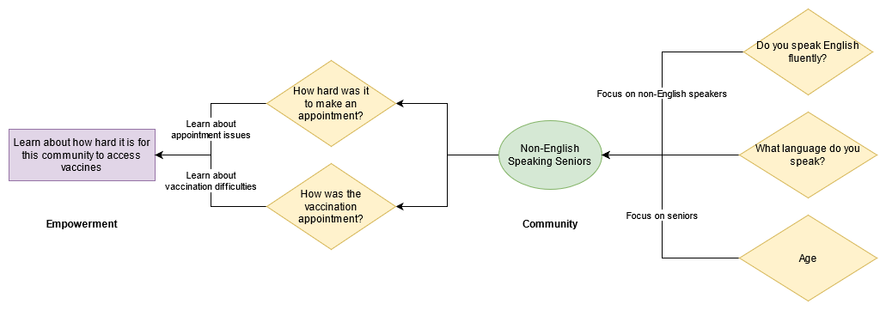
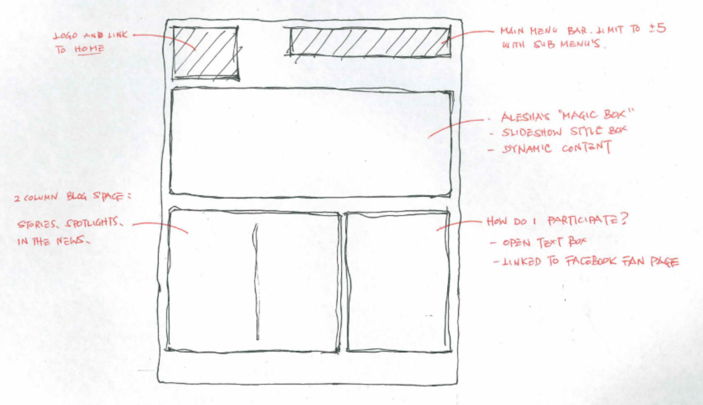

# Group Assignment 4 - Survey Diagram and Wireframe

## Due 5/18

With the survey and memo drafted, we can now make sure that our survey fits our goals set out in the memo and think about how the final application will look. Revising your survey is also an optional part of this assignment.

There are two seperate parts to this assignment. Both deliverables can use the following tools or anything else your group is comfortable with:

- Pen and paper
- [Draw.io](https://draw.io)
- [Google Slides](https://docs.google.com/presentation/u/0/)
- [Figma](https://www.figma.com/)

## Part 1: Survey Diagram

Generate a diagram that explains how your survey questions and objectives in the memo are connected to goal of empowering the community. 

Your diagram must have these components:

   1. Represent the specific community are you trying to uplift.
   2. Represent the survey/project goal.
   3. Represent each question in your survey and draw lines connecting them to either the community representation or the survey/project goal. 
   4. As you draw the lines from each question, explain what connection is being made.

Feel free to get creative, but be sure to emphasis how your questions are related to the objective of the survey.

See below for an example using [Draw.io](https://draw.io):

https://drive.google.com/file/d/12UbBhuXm28RAhgFo5nLiVZ9cmtzNecwi/view?usp=sharing

## Part 2: Simple wireframe

Imagine how the results of the survey and develop a VERY simple wireframe on what your web application would look like.

The wireframe must include the following:
   1. A map (e.g. a panel that says `map` is fine)
   2. Interaction that shows the community empowerment in action (e.g. `pop-up on the map` or `panel to the left with stories`)
   3. An interaction to fill out the survey (e.g. a button for `taking the survey`)

## Select examples

### Survey Diagram

- [Reimagining 6th Street Survey Diagram](https://github.com/albertkun/21S-ASIAAM-191A/files/6431769/Diagram.pdf)
- [Bruins Mental Health Project](https://github.com/albertkun/21S-ASIAAM-191A/files/6436337/surveydiagram.pdf)
- [Migrant Justice](https://github.com/albertkun/21S-ASIAAM-191A/files/6436697/Migrant.Justice.Wireframe.pdf)
- [UCLA Health](https://github.com/albertkun/22S-ASIAAM-191A/files/8675478/Untitled_Artwork.pdf)

### Wireframe

- [Reimagining 6th Wireframe.pdf](https://github.com/albertkun/21S-ASIAAM-191A/files/6431766/Reimagining.6th.Wireframe.pdf)
- [Bruins Mental Health Project](https://github.com/albertkun/21S-ASIAAM-191A/files/6436340/wireframe.pdf)
- [Migrant Justice](https://github.com/albertkun/21S-ASIAAM-191A/files/6436698/Migrant.Justice.Diagram.pdf)
- [UCLA Health](https://github.com/albertkun/22S-ASIAAM-191A/files/8675475/Note.May.11.2022.pdf)

## Submission

Have a group member comment on the following thread with links to the diagrams/photos:
https://github.com/albertkun/23S-ASIAAM-191A/discussions/21
