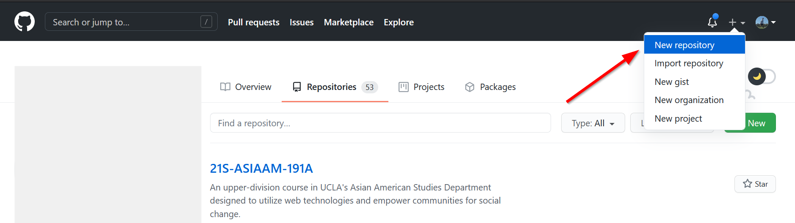
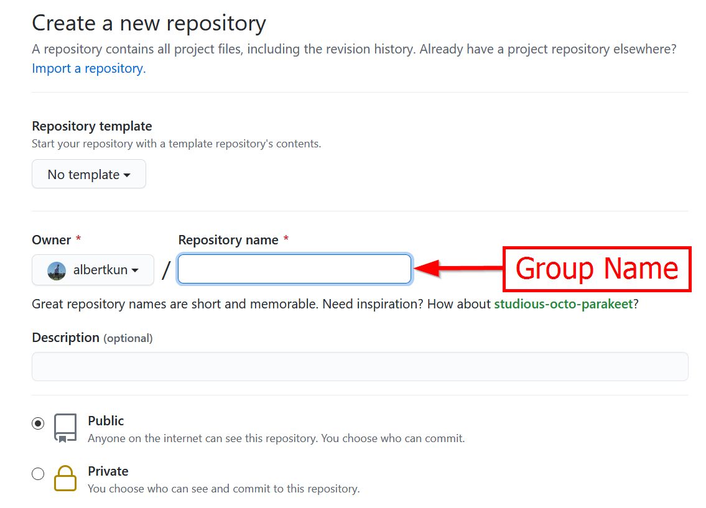
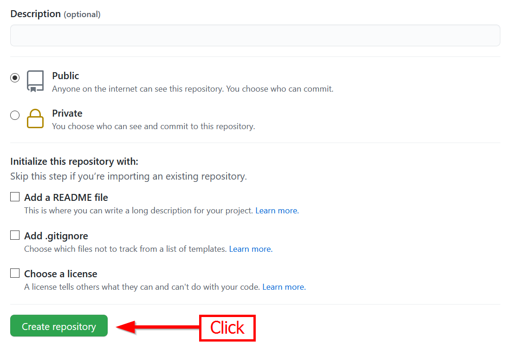
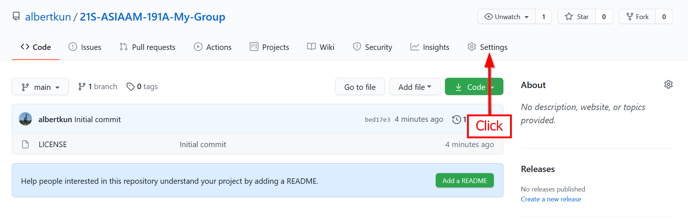
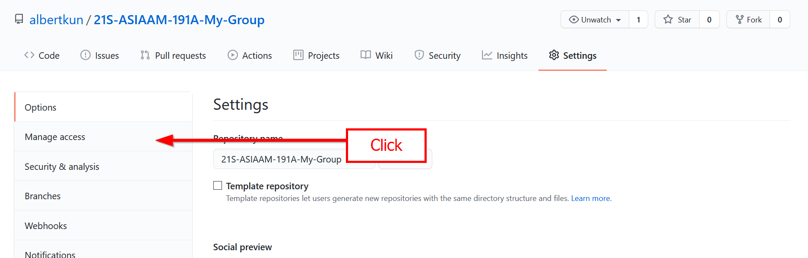
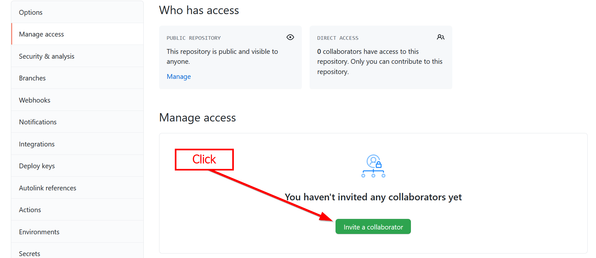
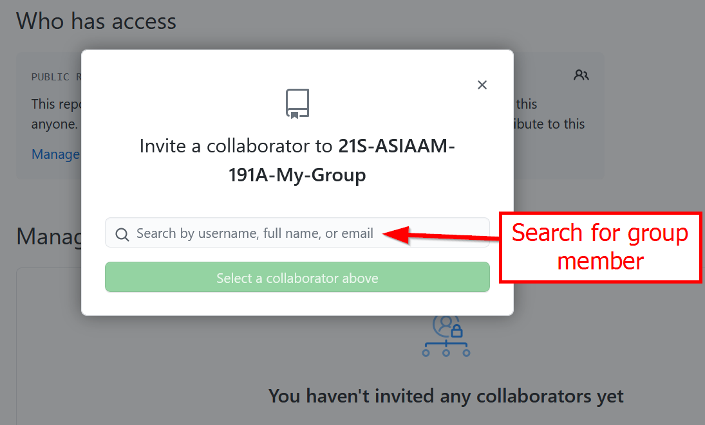
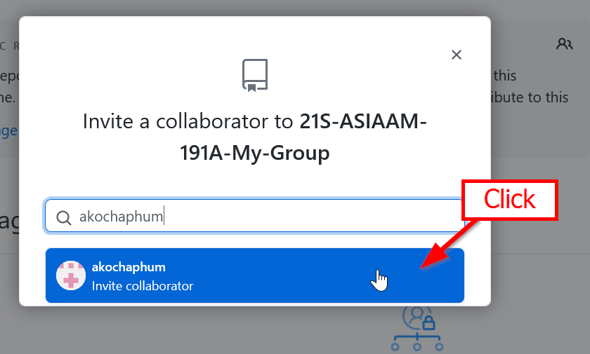
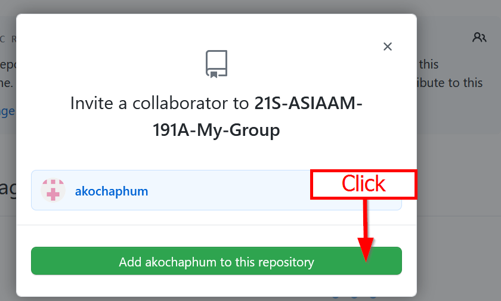

# Guide for creating a repository and inviting group members
This guide is designed to show you how to create a repository and add group members.

1.  After logging in to GitHub click the plus icon and choose `New
    repository`:

{: style="max-width:500px"}

1.  Input your group name:

{: style="max-width:500px"}

3.  Click `Create Repository`:

{: style="max-width:500px"}

## Adding your partners as collaborators

4.  Go to settings:

{: style="max-width:500px"}

5.  Click manage access:

{: style="max-width:500px"}

6.  Click invite a collaborator:

{: style="max-width:500px"}

7.  Search for your teammate’s email or username:

{: style="max-width:500px"}

8.  Click:

{: style="max-width:500px"}

9.  And add:

{: style="max-width:500px"}

10. Remember to clone the repository locally and start collaborating!

## Warnings about "Merge Conflicts"
11. If you do not use `git pull` to update periodically update repository and/or push
    your changes, you may run into `merge conflicts` when two files are being edited at the same time.

12. If you do run into a `merge conflict`, someone should merge the
    conflicting files. Please or check out this article on merge conflicts:

<https://docs.github.com/en/github/collaborating-with-issues-and-pull-requests/addressing-merge-conflicts>

13. We will be covering merge conflicts in detail a little later.
