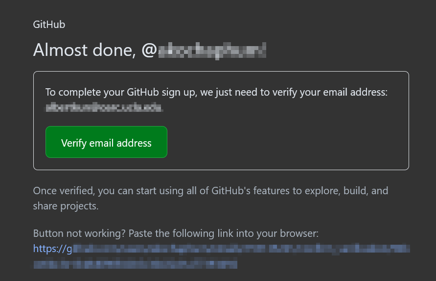

# Guide for signing up to GitHub

1.  Go to GitHub.com

1.  Click on Sign-up

3.  Create an account:

4.  Check your email to verify:

5.  Remember your username and email! It will be necessary for setting up [GitSCM](gitscm.md)!
