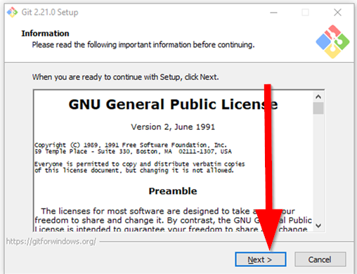
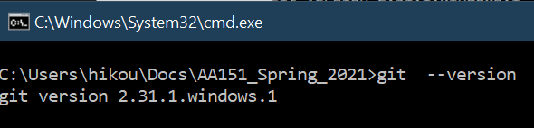
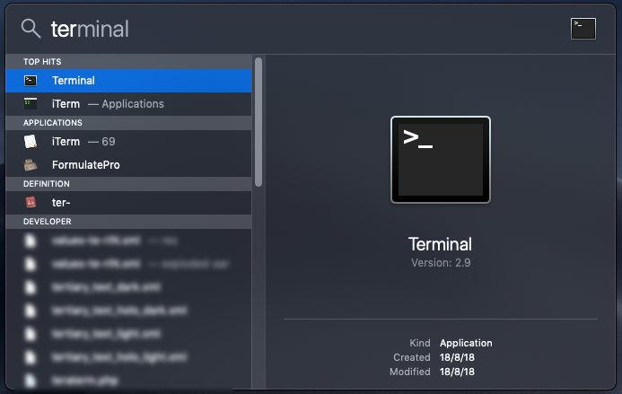
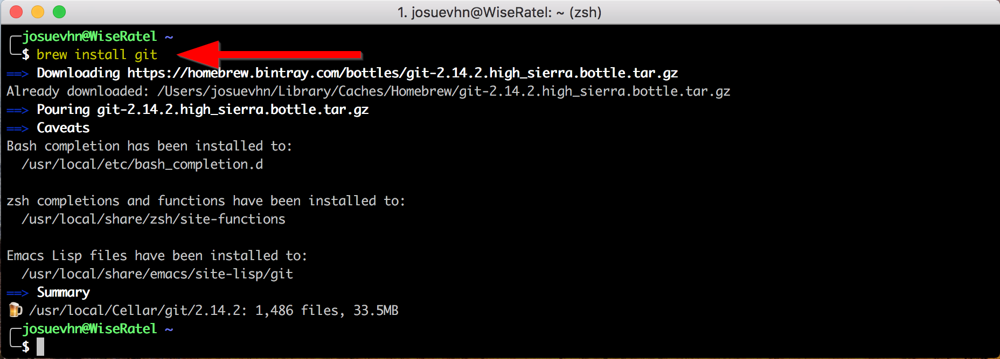
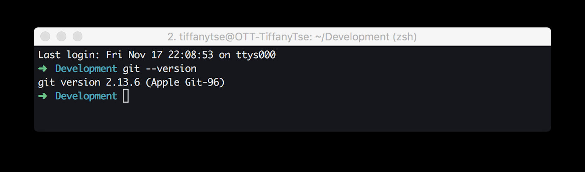

# Guide for installing Git SCM

1.  Go to: <https://git-scm.com/>

2.  Download and install, based on your operating system below: 
=== "PC"

    3. Run the [installer](https://git-scm.com/download/win) and go through the installation wizard.

    {: style="max-width:500px"}

    4. Launch the command prompt when done by pressing the `Windows` key and typing in `cmd`
    5. In the command prompt run the command to test your installation:

    ```bash
    git --version
    ```

    This tests the installation: 

    {: style="max-width:500px"}

    - If it is working, move to **step 6**
    - If it is not working, send an email or post on the GitHub discussion board.

=== "Mac"
    !!! note
        Make sure you have [Homebrew installed](https://brew.sh/). If you can run the command 'brew' then you are good to go.

     3. Open launcher and search 'Terminal':
     {: style="max-width:500px"}

     4. In the terminal then type `brew install git`:
     {: style="max-width:500px"}

     5. In the terminal run the command to test your installation:

     ```bash
     git --version
     ```

     This tests the installation: 
          {: style="max-width:500px"}

          - If it is working, move to **step 6**
          - If it is not working, send an email or post on the GitHub discussion board.

6.  Set our identity to our GitHub username for Git by running:  

```bash
git config --global user.name "YOUR_GITHUB_USERNAME"
```

!!! important
    Remember to change `"YOUR_GITHUB_USERNAME"` to your actual GitHub Username and include the double quotes `" "`

7.  Now set your email to the email you signed up with GitHub by running :

```bash
git config --global user.email YOUR@EMAIL.COM
```

!!! important
    Remember to change `YOUR@EMAIL.COM` to your actual GitHub email


1.  Once finished, run the following to check your email and username:
`git config --list`

1.  If you had any issues, please check this documentation for more
    details or reach out for help.

2.   Now you are ready to [clone a repository](git_cloning.md) in [VS Code](https://code.visualstudio.com/)!
