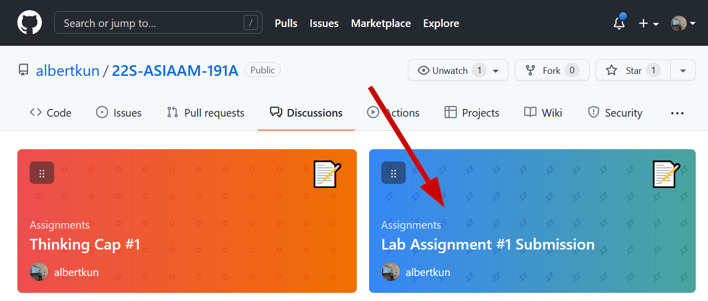
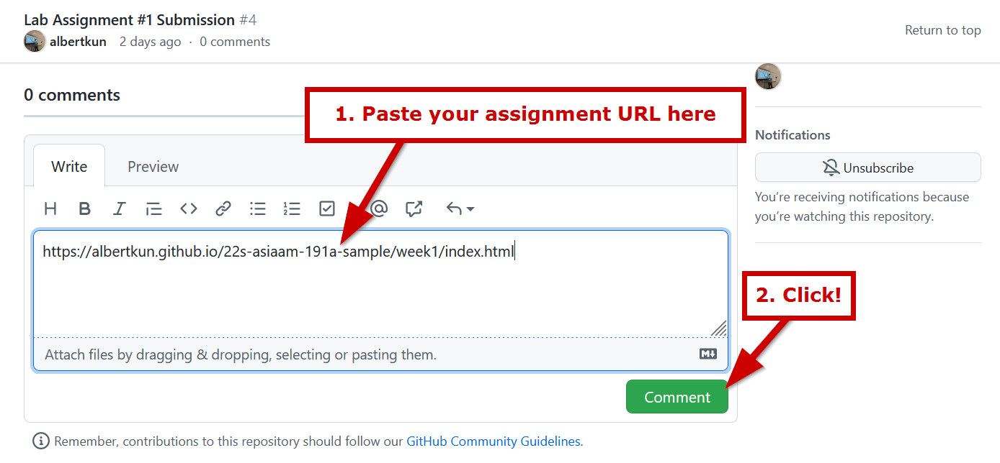

# How to submit Lab assignments

!!! warning "Pre-requisites"
    :white_check_mark: You have committed your code to GitHub
    
    :white_check_mark: You enabled GitHub pages
  
    Please refer to [lab #1](../../labs/week1/5/) if you have not done these steps yet.

## Go to the Discussion board
[https://github.com/albertkun/23S-ASIAAM-191A/discussions/](https://github.com/albertkun/23S-ASIAAM-191A/discussions/){target="_blank"}
## Click on the assignment you are submitting

## Paste the link as a comment and reply

