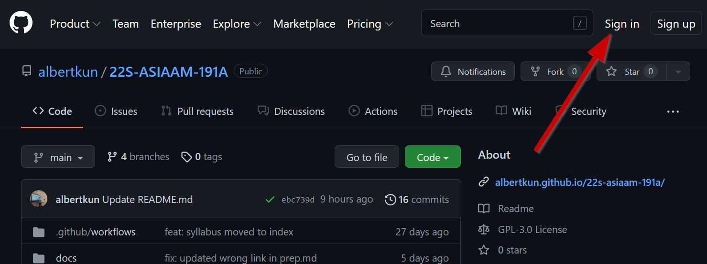
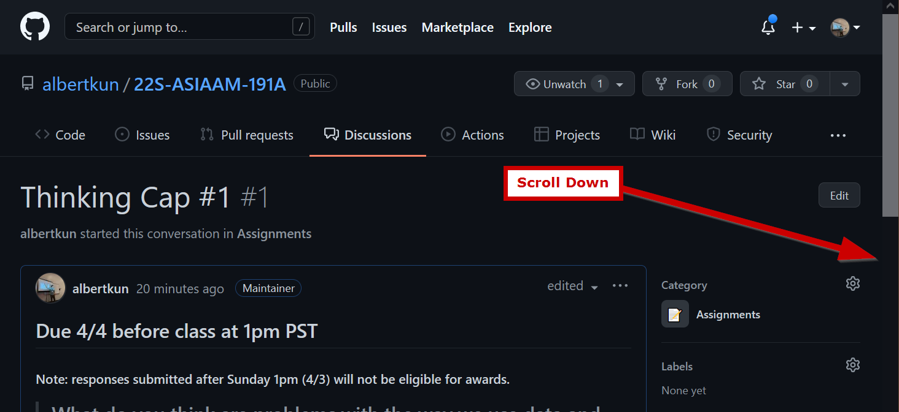

# How to Submit a Thinking Cap Discussion

## Part 1: Posting your own discussion

!!! warning
    Due at 2pm PST on Mondays, but to be eligible for extra credit you must submit at **2pm PST on Sundays**.

1. Make sure you are signed into your GitHub account. 
2. Go to the [course website](https://albertkun.github.io/23S-ASIAAM-191A/)
3. Click on "**Discussions**" 
4. Click on the "**Thinking Cap**" you are posting for 
5. Scroll down to find the comment box: 
6. Respond to the prompt for the week. 
7. Click ==Comment== to submit: 
8. The first part of assignment is now complete!

## Part 2: Responding to discussions

9. Go to the discussion page on the GitHub repository

10. Try to look for student posts with no replies. 

11. Type a thoughtful reply and click ==Comment== .

12. Repeat **Steps #8 - #10** for another student.

13. Congratulations on finishing the assignment!
