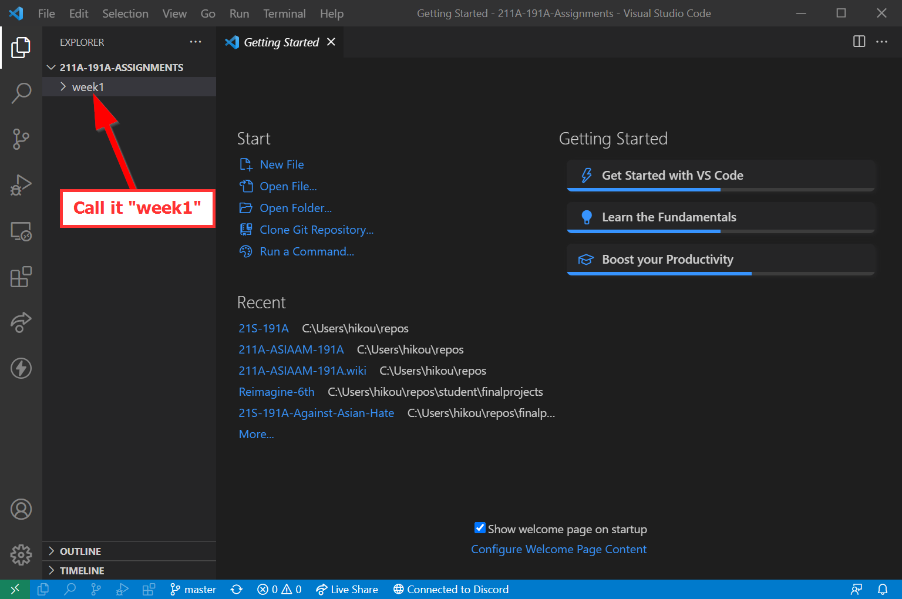
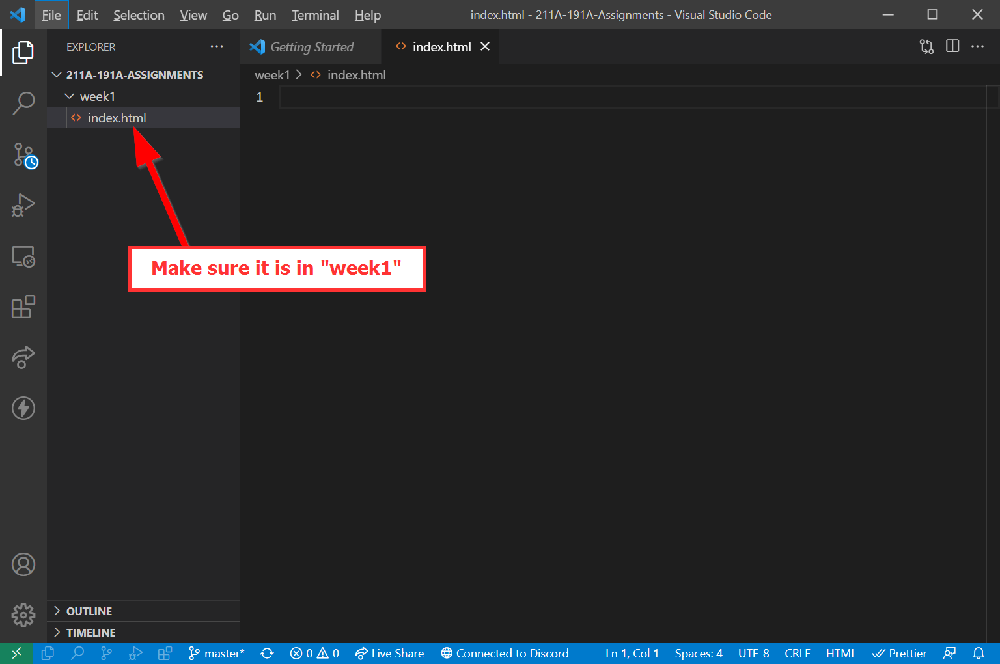

# Let's get VS Coding!

Go to https://www.github.com  and make sure you are logged in.

Create a new repository by clicking on the ==:octicons-plus-16:== button next to your profile picture:

Click ==New repository==:

Give it a name that indicates these will be the assignments for the class:

!!! info
    Repository names should be self explanatory, and they are unique to your account, so don't worry about having the same name as someone else!
    
    Here are some example repository names: 

    - `23s-asiaam-191a-labs`
    
    - `23s-191a-assignments`
    
    - `aa191-assignments`

Keep the repository ==Public==, which is in the spirit of sharing, collaboration, and allows anyone to see and improve the code:

Scroll down to ==Create Repository==:

Click the ==**Clipboard** :octicons-copy-16:== button:

In ==**VS Code** :material-microsoft-visual-studio-code:== click on: ==Clone Git Repository==

==Paste== (**PC:** ++ctrl+v++ or **Mac:** ++cmd+v++) your copied link in the panel above:

Click on ==Clone from URL== or press ++enter++ :

Choose a folder to save your files locally to:

Click on ==Open== this new repository:

Make sure ==:material-file-multiple: **Explorer**== is open in the ==Activity Bar== by clicking on it:

The open ==:material-file-multiple: **Explorer**== should look like this with space to show the files:

Click the `Folder` icon to make a new folder:

Title it `week1`:

With the folder selected, click the `New file` icon and give it the title `index.html`:

Make sure `index.html` is within `week1`:

