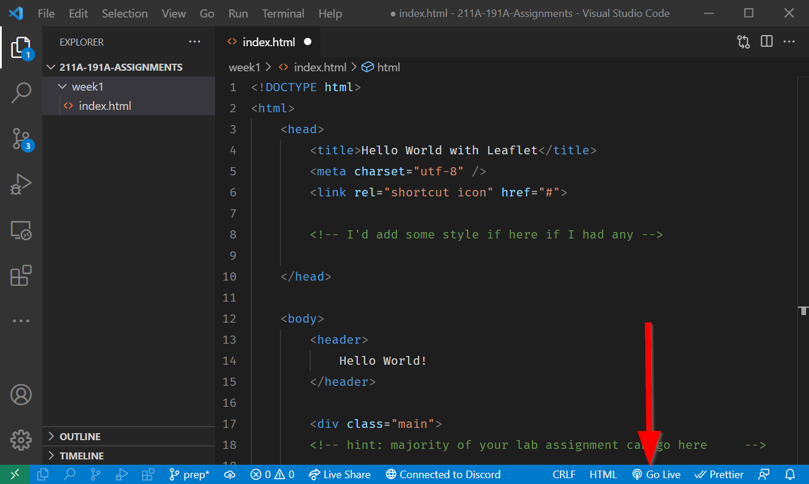
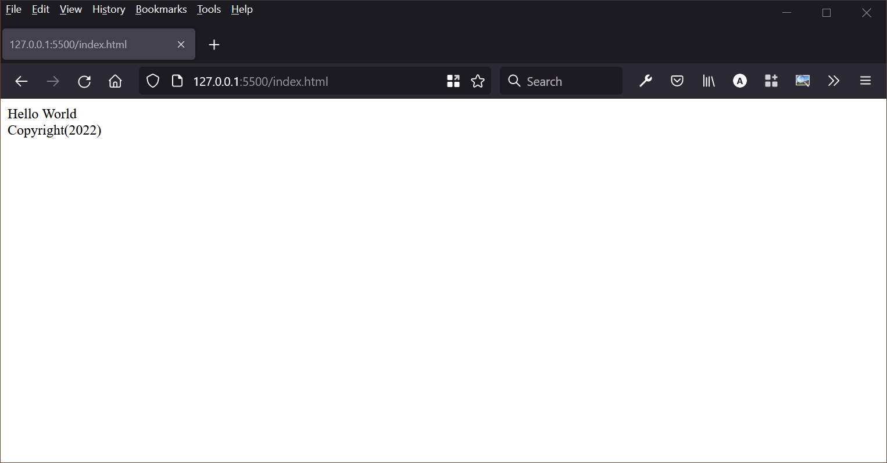

# HTML?! Oh what `tag`gony!

HTML is what makes up the house for websites. Without it, the CSS and JavaScript cannot function. 

When HTML is surrounded by opening and closing tags, it is called an **Element**:

`<tag> Look Ma'! I'm in a tag element! </tag>`

Always be sure to close tags! Leaving them open will break your page. Do note that some tags don't need to be closed.

## Attributes in tags

We can also decorate tags with attributes to make them unique. 

You put a keyword declaration inside the `tag` like so: `attribute="some value"`

For example, we can name a tag something:

`<tag name="something"></tag>`

But typically, we assign unique names with the `id` attribute, like so:

`<name id="Albert">Haha!</name>`

Wow, that's my correct *name* tag! :man_facepalming_tone1:

## Boilerplate vs. Template Code

In coding, boilerplate code is ready to use code that people can freely copy and use with no changes. Think of them as ready-to-eat microwave dinners.

``` html linenums="1"
<!DOCTYPE html>
<html lang="en">
<head>
  <meta charset="UTF-8"/>
  <title></title>
</head>
<body>

</body>
</html>
```

Template code refers to sample code that can be copied and pasted, but requires modifications in order for it to work.

Here is our template code:

```html title="index.html"
<!DOCTYPE html><!--(1)! -->
<html><!--(2)! -->
    <head><!--(3)! -->
        <title>Hello World with Leaflet</title><!--(4)! -->
        <meta charset="utf-8" />
        <link rel="shortcut icon" href="#">

        <!-- I'd add some style if here if I had any -->

    </head>
    
    <body><!--(5)! -->
        <header>
            Hello World! <!--(6)! -->
        </header>
        
        <div class="main">
        <!-- hint: majority of your lab assignment can go here     -->
        
        </div>


        <div id="footer">
Copyright(2023)
        </div>
        
    </body>
</html><!--(7)! -->
```

1.       This tells a web browser what type of file this `document` is.
2.       The `HTML` code begins here.
3.       Content in the `head` tag is not displayed on the page. 
4.       The `title` is shown in the browser's title bar or in the page's tab.
5.       Content in the `body` contains most of what needs to be displayed.
6.       This content in `body` is what is actually being showed!
7.       The `HTML` code ends here. 

!!! help "Lab Questions"
    What do you observe in the code?

    1. How does this code differ from the boilerplate code?

    2. Why should everything be enclosed in the `html` tag?

    3. Do empty spaces matter in HTML?

    4. What is a comment and how do you write one?

    5. Is there a difference between the `class` and `id` attributes?

## Preview our file

Install the ==Live Server :octicons-broadcast-16:==  extension by clicking this link:

- [https://marketplace.visualstudio.com/items?itemName=ritwickdey.LiveServer](https://marketplace.visualstudio.com/items?itemName=ritwickdey.LiveServer)

After you install the extension, click on ==:octicons-broadcast-16: Go Live==.


Your default browser should automatically pop-up, if your default browser is not [Firefox :fontawesome-brands-firefox-browser:](https://www.mozilla.org/en-US/firefox/new/), you will need to copy and paste the link over to view it there.



!!! info "Not using the Live Server extension"
    If you cannot or do not want to use live server then you will need to right click on your `index.html` file and `reveal in file explorer`. Then, double click on the file. Be aware that checking your code in this is not as efficient because there is no auto-reloading feature.

# ⚽ In-Class Exercise #1

!!! help "Tasks"
    1. Let's fix our code so that it actually looks presentable. 
    2. Look for the errors in the template code.
    3. Add a `<div>` for a with an `id` of `the_map`! 
    4. Save the file and name it `index.html` and open it in [Firefox](https://www.mozilla.org/en-US/firefox/new/).
    
    Extra: If you finish early, try to add your own spin to the HTML file!


??? done "Answer"
    The new div should look like:

    ```html
        <div id="the_map"></div>
    ```

## 🏁Checkpoint

!!! info
    Checkpoints are parts if the lab where you should check your work to that point!

Check to see if your code looks likes the following before moving on:

```html title="index.html" linenums="1" hl_lines="17"
<!DOCTYPE html>
<html>
    <head>
        <title>Hello World</title>
        <!-- hint: remember to change your page title! -->
        <meta charset="utf-8" />
        <link rel="shortcut icon" href="#">
    </head>
    
    <body>
        <header>
            Hello World <!-- hint: you can make a menu with other links here if you'd like -->
        </header>
        
        <div class="main">
            <!-- hint: majority of your lab assignment can go here     -->
            <div id="the_map"></div>
        </div>
        <div id="footer">
            Copyright(2022)
        </div>
    </body>
</html>
```