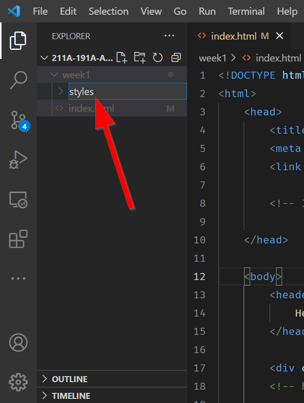
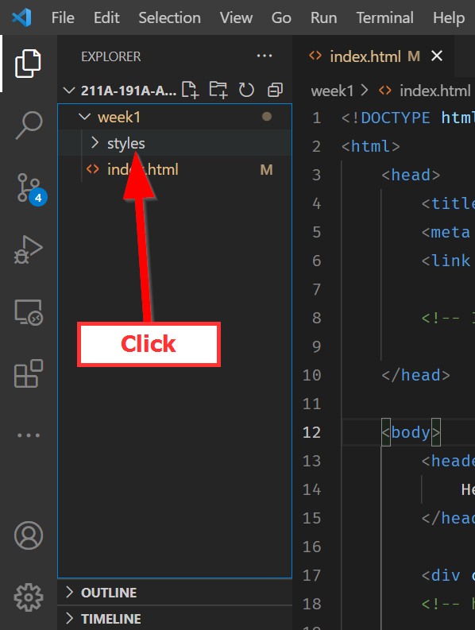
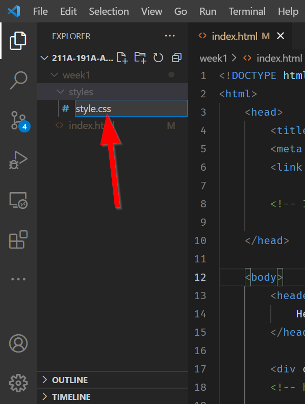

# Cool Stylin' Sheets

Let's add some Cascading Style Sheets (CSS) to visualize our page better.

Insert the following code in the `<head>` right before the closing tag (i.e. `</head>`):

``` html title="index.html"
<style>
    html { /* (1)! */
        background-color: azure;/* (2)! */
    }
</style>
```

1.  `html` is the `CSS` selector, basically saying, "get anything in the `html` tags!
2.  `background-color` is the key, and then `azure` is the color we are setting it to.

What happened to the page?

??? check "Answer"

    It became `Azure`!

That's cool! But this way of using CSS, called inline CSS, can make your HTML file long and cumbersome. So the better practice is to have a separate file for CSS and bring that whole file in as a linked source.

## Adding linked CSS
Click the ==New Folder :material-folder-plus:== button:

{: style="max-width:300px"}

Type in ==styles== to name the folder `styles`:

{: style="max-width:300px"}

Highlight the `styles` folder by clicking on it:

{: style="max-width:300px"}

Then click on the ==New file :material-file-plus:== button:

{: style="max-width:300px"}

Name the file ==style.css==:

{: style="max-width:300px"}

Double click to open the new file. Then copy and paste the following CSS:

``` css title="styles/style.css"

body{
    display: grid;
    /* grid-template-columns: 1fr;  */
    grid-auto-rows: auto 1fr;
    grid-template-areas: "header" "main_content" "footer";
    background-color: aqua;
    /* height: 100vh; */
}

header{
    grid-area: header;
}

#footer{
    grid-area: footer;
}

.main{
    grid-area: main_content;
    grid-template-areas: "content";
}

#contents{
    grid-area: content;
}

```

!!! important "Reminder!"
    Remember to save the `style.css` file (**PC:**++ctrl+s++ | **Mac:**++cmd+s++!

Next, go back to the ==index.html== file and replace your entire ==`<style> </style>`== content and tags with this code:

``` html title="index.html"
<link rel="stylesheet" href="styles/style.css">
```

This code tells the HTML file to use all of the CSS styles linked in the `href` attribute.

!!! note "More external CSS files?"
    You can have as many external references as you'd like, as long as you link them in this way. The bottom most CSS file has the most priority because it is the last CSS read and applied!

We will go into CSS in more detail later, but what you need to know is that CSS has `HTML element selectors` which are then followed by the styles in `{ }`.
