# Let's Git to Committing!

**Commits** are the basis of `Git` and `GitHub`.

!!! danger "Do not upload manually!"
    While it may be tempting to manually upload files through GitHub, for the purposes of this class, this will cause many headaches. For this class you should **only** commit through VS Code!!!

In a nutshell, **Committing** is `Git` speak for **saving files**. However, these saves come with a note so that you can refer back to save later!

It's better than autosaving because you have a description of what that save is!

Let's make our first commit:

Click on the `Source Control` icon in the activity bar in VS Code:

{: style="max-width:300px"}

Enter a note for your commit:

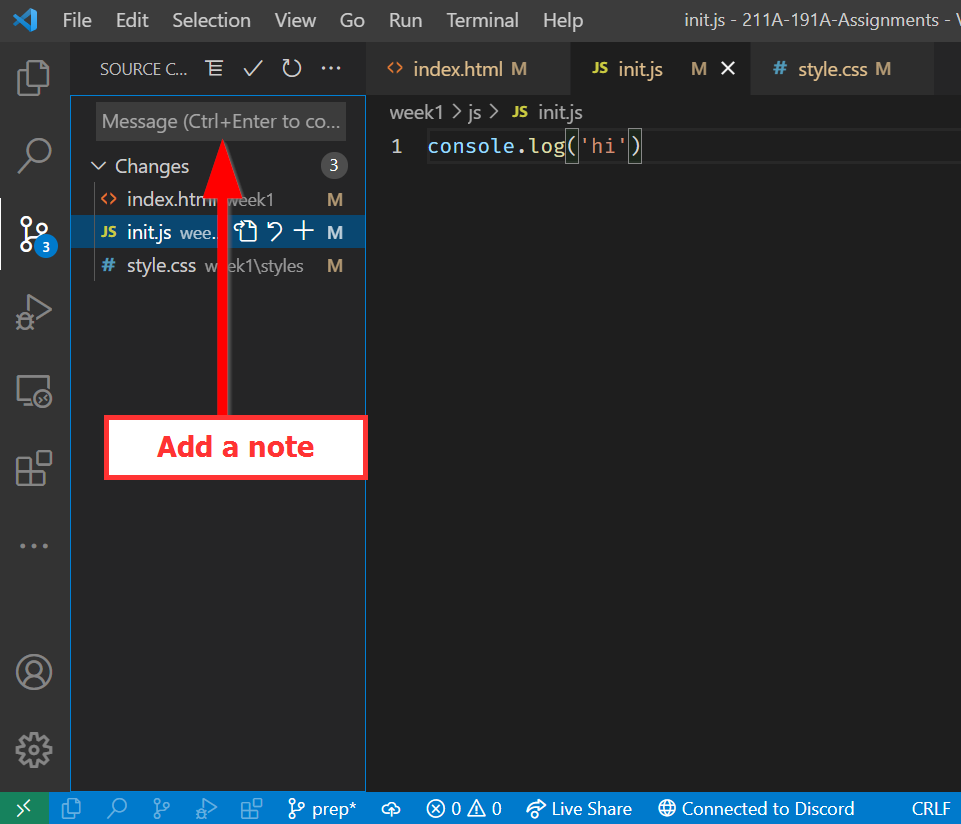{: style="max-width:300px"}

Click the `checkmark` OR use the following shortcut:

 - **PC:** ++ctrl+enter++

 - **MAC:** ++cmd+enter++

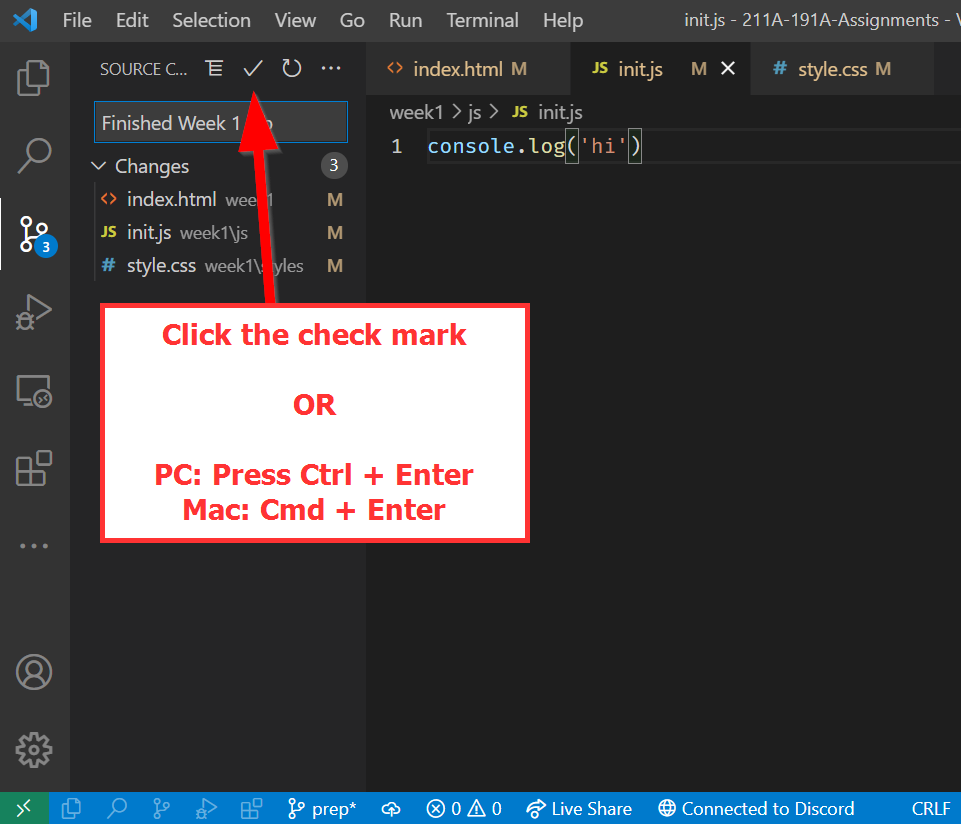{: style="max-width:300px"}

Next, click on the `...` for expanding the menu items:

{: style="max-width:300px"}

Finally, click on `Push` to upload your changes to GitHub:

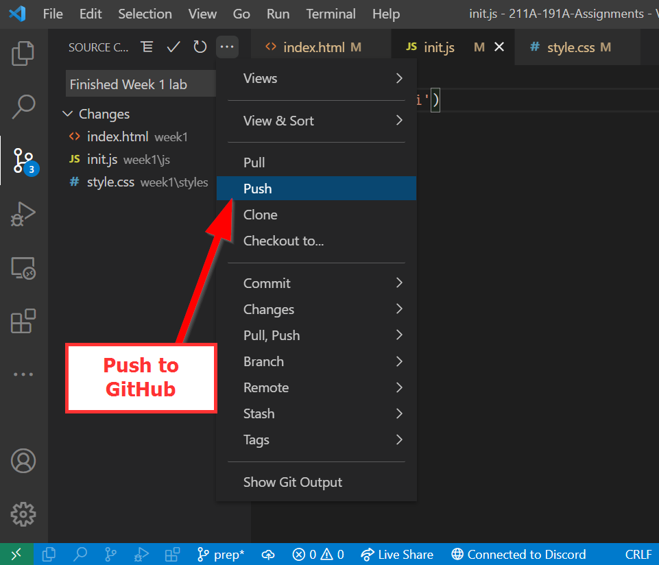{: style="max-width:300px"}

If you see the `VS Code periodically wants to run fetch` dialogue, click `Yes` to allow it to randomly update your repository.

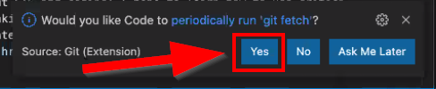{: style="max-width:300px"}

### Optional: Easier Commits

!!! success "Timesaving Tip!"
    You can avoid having to do the extra steps of clicking `...` then `push` by turning on a setting to `push` after each commit!

    Here's how to do so:

    - Go to `File` -> `Prefences` -> ==Settings==
    
    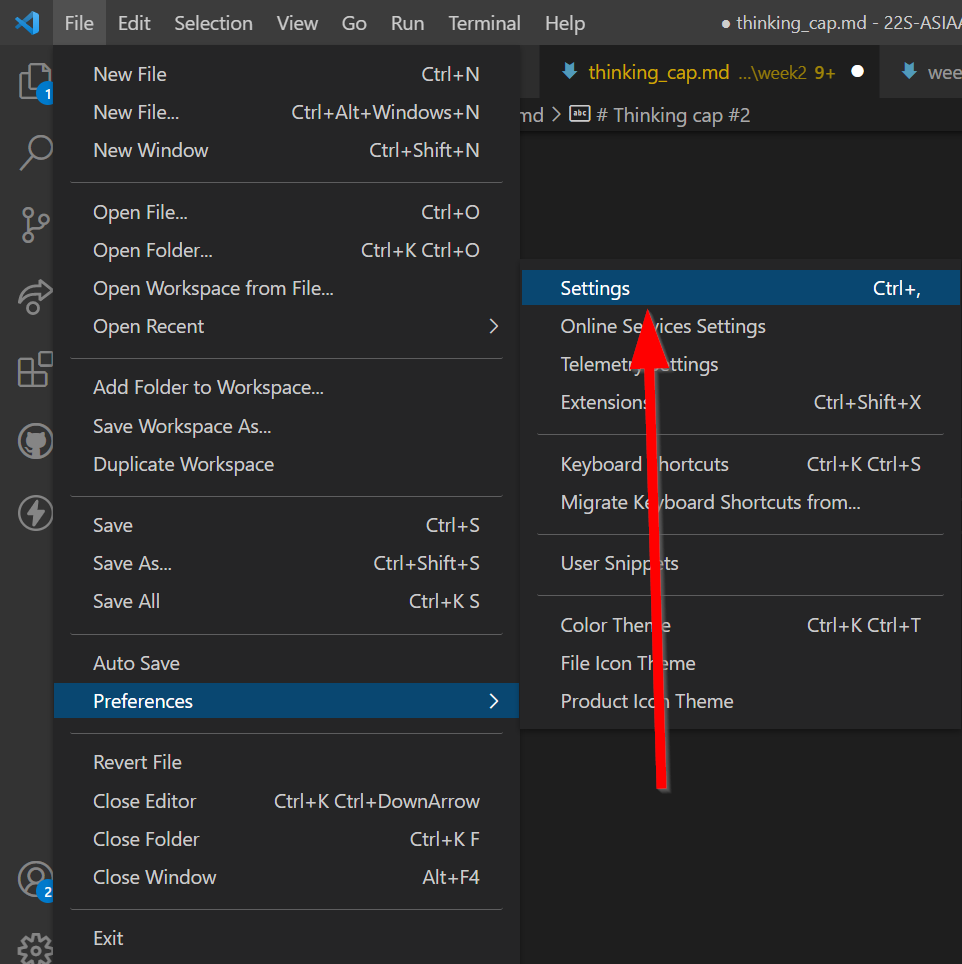{: style="max-width:300px"}

    - Search ==post commit== in the text box at the top
    
    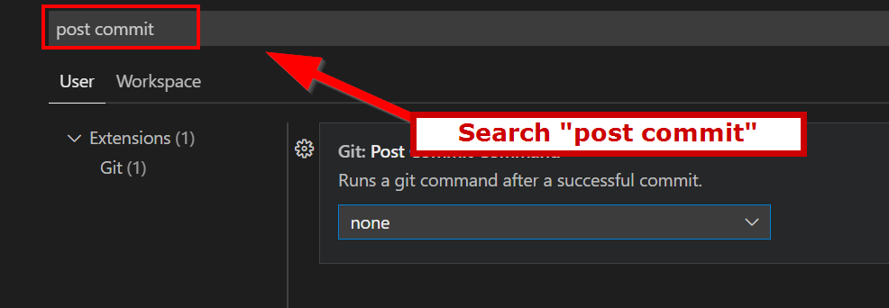{: style="max-width:300px"}

    - Change the setting from `none` to ==push==

    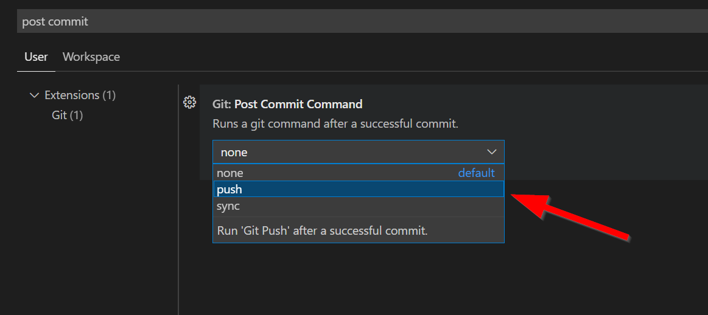{: style="max-width:300px"}

    - Now the next time you commit by pressing the following shortcut, it will push automatically!
       - **PC:** ++ctrl+enter++
       - **MAC:** ++cmd+enter++
    
    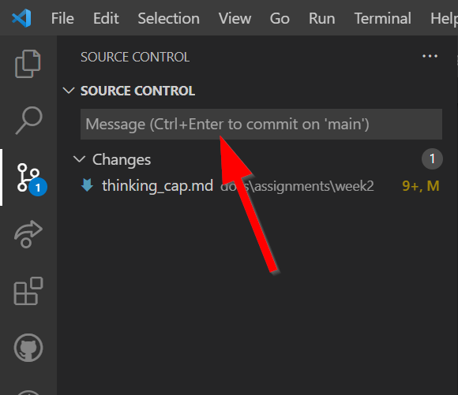{: style="max-width:300px"}

## Using GitHub Pages

After you have saved and committed your files to GitHub visit your repository on https://www.github.com.

!!! info "What is a repository?"

    A repository is GitHub speak for location for a specific project and/or bunch of files. You can think of it as `folder`. For this class, instead of making a new repository for each week we will have just one lab assignment repository with **different** folders for the weeks. Learn more about repositories here: [About repositories (GitHub.com)](https://docs.github.com/en/repositories/creating-and-managing-repositories/about-repositories).

You can find your repositories by clicking on your profile picture:

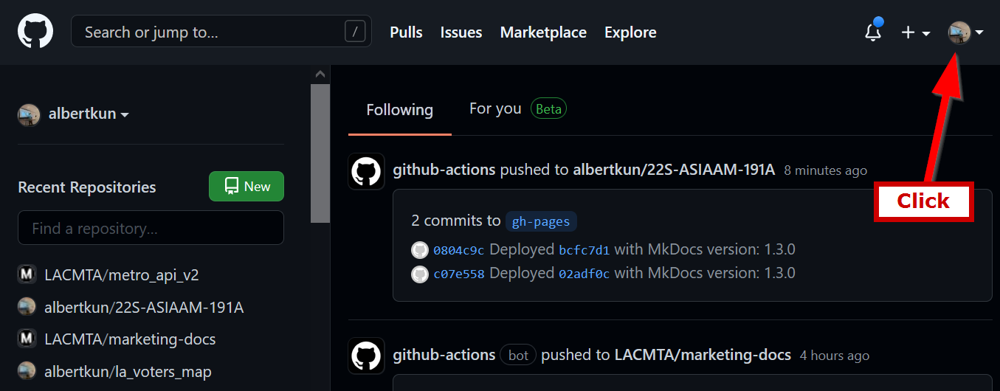{: style="max-width:500px"}

Then click on ==Your repositories==

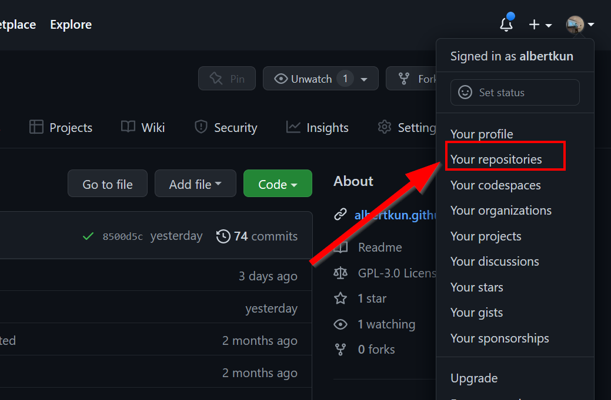{: style="max-width:500px"}

Find ==your assignment== repository and click on it:

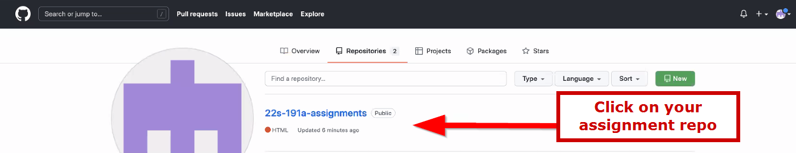{: style="max-width:500px"}

 
Click on ==Settings==:

{: style="max-width:500px"}

Click on ==Pages==:

{: style="max-width:500px"}

and under **Source** , click on the ==main== branch [^1]:

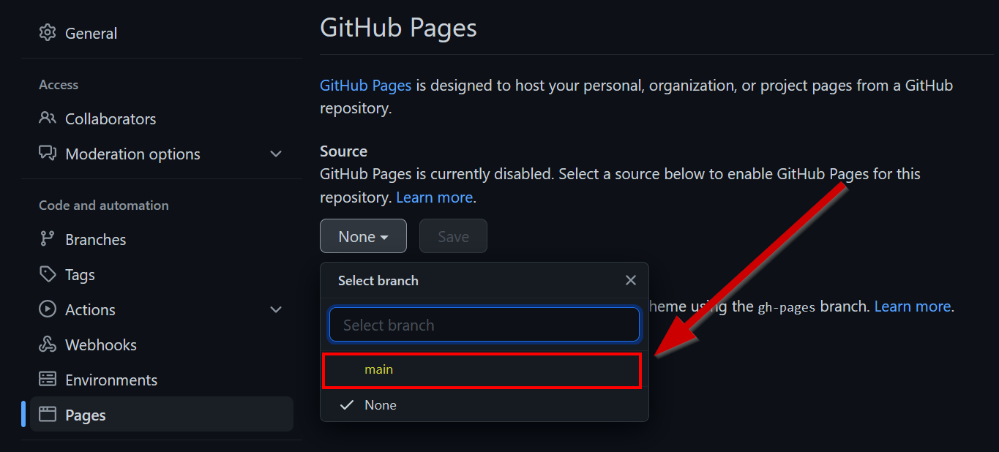{: style="max-width:500px"}

Choose ==root==:

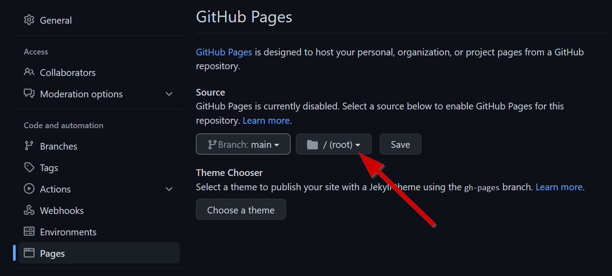{: style="max-width:500px"}

Click on ==Save==:

{: style="max-width:500px"}

Copy this link:

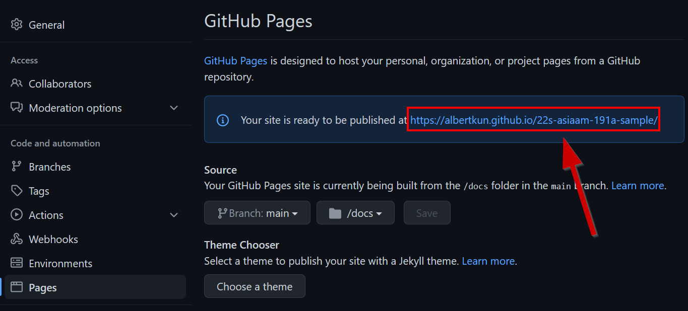{: style="max-width:500px"}

!!! warning "Nothing shows up?!😱"

    If you navigate to `https://YOUR_GITHUB_ACCOUNT.github.io/23s-asiaam-191a-assignments/` it will be blank because there's nothing in the `root`.

    You have to add `/YOUR_WEEK_1_FOLDER_NAME/index.html` to access the contents of the lab!

    For example, `https://albertkun.github.io/23s-asiaam-191a-assignments/week1/index.html`

Post it in the Discussion forum for the appropriate lab:

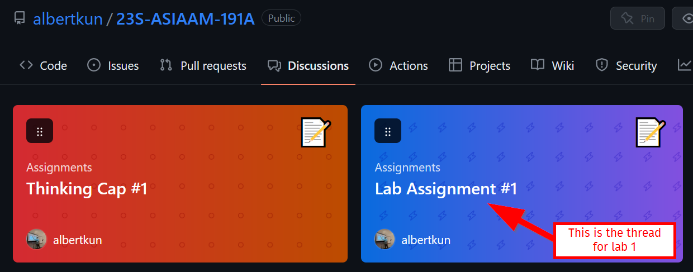{: style="max-width:500px"}

Paste your link in the comment box at the bottom

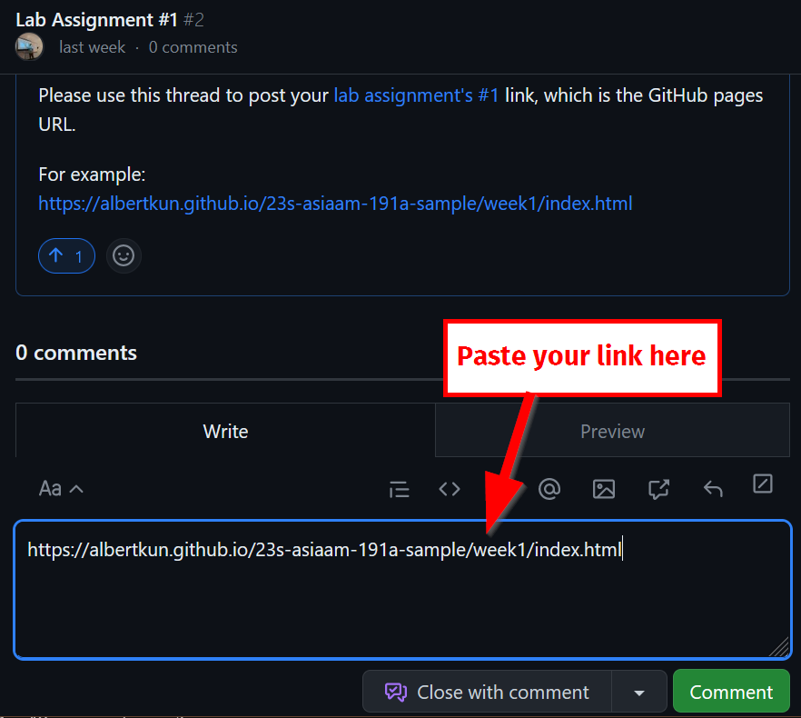{: style="max-width:500px"}

Click on ==Comment== to submit the lab:

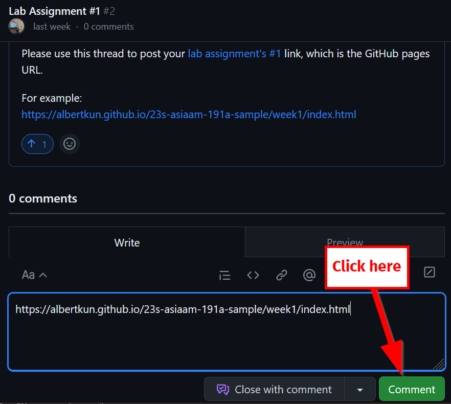{: style="max-width:500px"}

[^1]: Your branch may be called master if your repo was created in VS Code. Read more about why [here](https://www.jumpingrivers.com/blog/git-moving-master-to-main/).