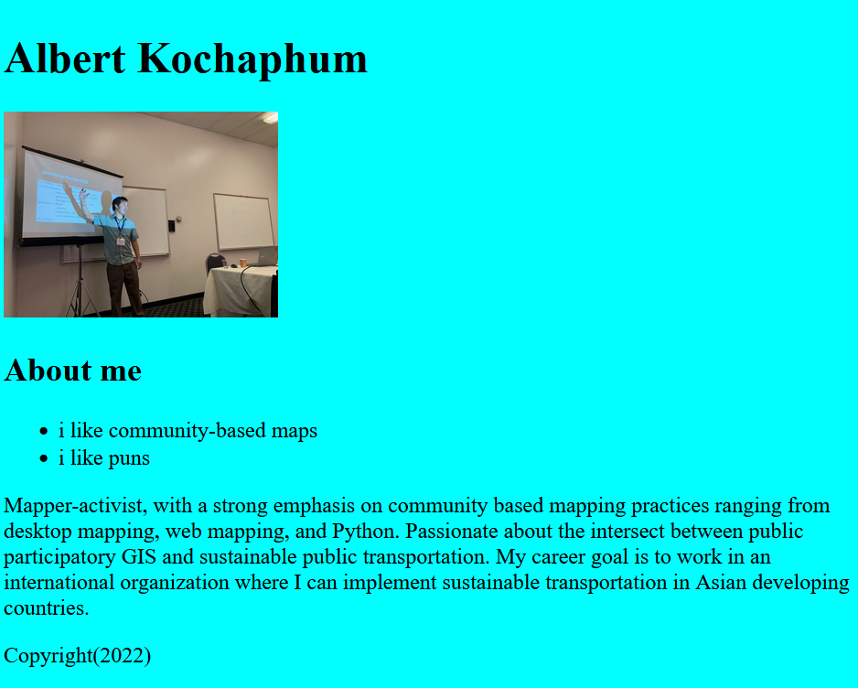

# GITting down with labs and code

{: style="max-width:300px"}
## Objectives

!!! tldr "Goals"
    - Create a basic webpage
    - Publish your page onto GitHub pages

!!! caution "Reminder"
    The [pre-lab](../../assignments/week1/prelab) must completed before attempting this lab.

This lab will walk you through the process of creating a static web page in HTML with some additional style elements using CSS. Then you will be tasked to add a map using the [Leaflet JS library](https://www.leafletjs.com/) and host it using GitHub pages.

>Note: I highly recommend checking out the [Leaflet documentation](https://leafletjs.com/reference.html). Looking at any documentation before choosing any software is important, because badly documented libraries can make tools difficult to use. 
