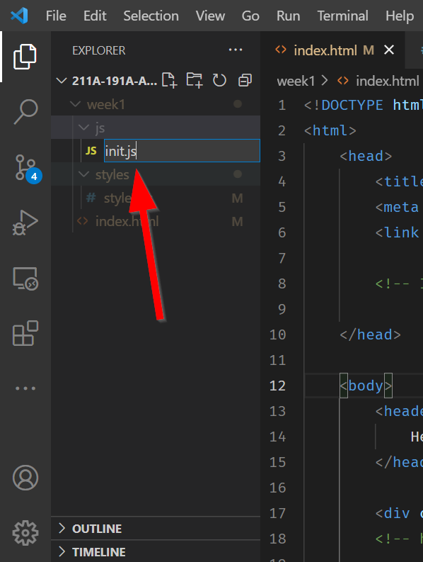

# Basics of JavaScript

JavaScript makes sure our page knows how to function and react. There are different frameworks for JavaScript, like React.js and vue.js, but this class will be focusing on vanilla JavaScript with ES6+ standards.[Read more about the standards here](https://www.tutorialspoint.com/es6/es6_quick_guide.htm).

In `HTML`, `JavaScript` must be contained within a script tag. In our `<head>` tag, let's add a `<script></script>` tag.

Any Javascript that is in the `<head>` tag will load first. 

Any JavaScript that is in the `<body>` tag will load later.

JavaScript functions to run after the `HTML body` loads, so putting the `<script>` after the `</body>` becomes necessary. 

This will be relevant when we bring in `Leaflet.js` because the `Leaflet` library needs to be loaded first! That means it should go in the header, while our own custom `JavaScript` comes after, preferrably later in the `<body>` tag, you can even kick our JavaScript file out of the body and put it into a `<footer>` tag!

## It's a me Lego `Var`-io

Variables are like **boxes** that hold information, try to think of them as the building blocks of the instructions.

Variables are the Lego blocks of programming and can be **numbers**, **text**, or even collections of other variables! In programming languages we call variables can be classified into ==**types**==. In order to use a variable, you have to ==**declare**== variables. With JavaScript, variables are automatically assigned **types** based on their declaration. 

In JavaScript all declarations and lines should end with a semicolon `;`, which is like a `. (period)` in English that says, my statement is done.

These are examples of a ==declaration==:

```js
var day = 8;
var name = "Albert";
```

In front you see the `var` **keyword** that tells the web browser, "Hey this is a variable!". In this example, `day` is a **numeric** type with a value of `8` and `name` is a **string** type. Each type has certain properties and uses, for example you can add **numbers** together using something like `day + day`, but you adding strings will simply concatenate and not total them.

!!! info "What is a keyword?"
    In most coding languages, a **keyword** is a word that tells a program to treat the following text, numbers, or characters in a specific way. For example, `var myName` says treat `myName` as a variable.  This means you **CANNOT** name a variable `var`, Jar Jar Binks cousin Var Var Binks is **VARy** bad for JavaScript to see! i.e. `var var` Also note, you cannot use `spaces` in variable names!

### LET's a go!

With JavaScript ES6, `let` and `const` keywords were introduced to declare variables. This change means that the recommend practice is to no longer use the `var` keyword. `let` and `const` variables get declared in the same way:

```js
let day = 8; //(1)!
const name = "Albert"; // (2)!
```

1. The `let` keyword **LETS** a variable CHANGE! :smile:
2. The `const` keyword declaration keeps a variable **CONST**ant!

## Let vs Const vs Var

!!! important "What is the difference?"

    1. The `let` keyword declaration ==LETS== a variable change
    2. The `const` keyword delcaration a variable **CONSTant** and will never change.
    3. The `var` allows varaibles to change or never change depending on **where** it was declared! VERY PROBLEMATIC!

Because `var` can be changing (mutable) and unchanging at the same time, so `var` was changed into off into two different variable types, `let` and `const`.

!!! important "Scopes: Local vs. Global"
    **Where** you `declare` a variable sets the scope to either a local one (limited to a function or area in the code) or global (can be accessed by anything/anywhere else in the code).

So, bye bye `var` and `LET` us welcome our new `CONST` variables to the JavaScript programming world.

!!! warning "TLDR"
    **DO NOT USE** `var` unless you need to code for Internet Explorer.

### Console.log()
By itself, our script tag does nothing. So, one VERY helpful JavaScript tool (method) that we should familarize ourself with is `console.log()`, because it allows us to test our code.

Add the following script:
```html
<script>
    console.log('Hello Asian Am 191! :)');
</script>
```

#### Nothing happened?! What!?
Actually, you are about to unlock your full web developer potential! 

In Firefox, right click anywhere on the page and the click `Inspect Element`:


This opens the ==Developer Toolbar==!! 🎉🎉 You can also find it by going to the **Menu** and going to **Web Developer** and then **Web Developer Tools**.

Click on the ==:material-console: Console== button:


Yay! Our message is there!


### Linking to another JavaScript file

Similar to the CSS files, we should move the JavaScript file into its own file (and folder) to avoid cluttering the HTML file with JavaScript. 

Importing different libraries, whether it it `CSS` or `JavaScript` is the main way unlock skills and level up our webpage.

**BUT!!!** Instead of the `<link>` that we use with `CSS` we use the `<script>` tag:

=== "Linking JavaScript"
	```html
	<script src="YOUR_SCRIPT_NAME.js"></script> 
	```

	The `src` attribute is location of your file.

=== "Linking CSS"
	```html
	<link src="SOME_CSS_FILE.css"> 
	```

    Notice that when you use `<link>` there is no `</link>`, but with `<script>` you must close the tag with `</script>`.

## ⚽ In-class Exercise #1 - JuSt link your JS file

!!! tldr "Tasks"
    1. Create a new folder called `js`
    2. Add a `JavaScript` file in there called `init.js`
    3. Add JavaScript method: `console.log()` with a message of your choosing
    4. Get your message to show up in the console

??? check "Answer"
    1. Click on the ==`New Folder` :material-folder-plus:== button:

    {: style="max-width:400px"}

    2. Type in `js`:

    {: style="max-width:400px"}

    3. Click on the ==New File :material-file-plus:== button:

    {: style="max-width:400px"}

    4. Give it a name, like `init.js`, which in this case stands for the `initial JavaScript file of our page`

    {: style="max-width:400px"}

    5. In the `index.html` file and before the end of the `<body>` element include the following:

    ```js hl_lines="4" title="index.html"
            //
            // ... HTML Truncated for brevity ...
            // 
            <script src="./js/init.js"></script>
        </body>
    <html>
    ```
    ```js hl_lines="4" title="/js/init.js"
    console.log("Hello Asia-Am 191A! :)")
    ```

!!! warning "Important!"
    Never include `<script></script>` tags inside of a Javascript file, those are `HTML tags`!!! Do so will break your page, because you are mixing two different languages: `HTML` with `JavaScript`. :cry:

## 🏁Checkpoint

Check to see if your code looks likes the following before moving on:

```html title="index.html" linenums="1" hl_lines="24"
<!DOCTYPE html>
<html>
    <head>
        <title>Hello World</title>
        <!-- hint: remember to change your page title! -->
        <meta charset="utf-8" />
        <link rel="shortcut icon" href="#">
        <link rel="stylesheet" href="styles/style.css">
    </head>
    
    <body>
        <header>
            <!-- hint: you can make a menu with other links here if you'd like -->
        </header>
        
        <div class="main">
            <div id="contents">
                <!-- hint: the majority of your assignment can go here -->
            </div>
        </div>
        <div id="footer">
            Copyright(2022)
        </div>
        <script src="js/init.js"></script>
    </body>
</html>
```

```js title="js/init.js" linenums="1"
console.log("Hello Asia-Am 191A! :)")
```