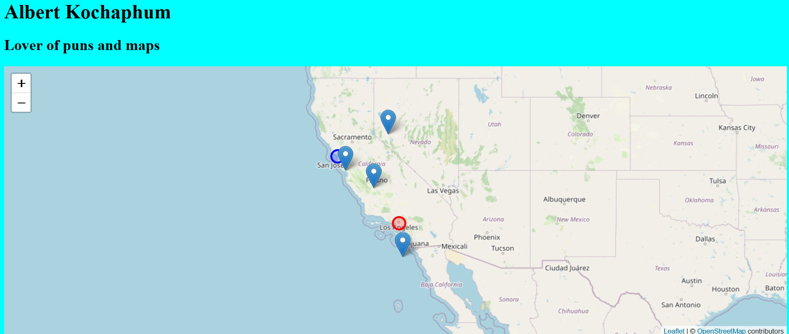

---
hide:
  - tags
tags:
  - Lab 2
---
# JavaSCrypt of the Necrodancer and FUNctions

Creating our first map with [Leaflet.js](https://www.leaflet.js) and learning to use JavaScript!

{: style="max-width:300px"}

!!! tldr "Goals"
    - Add a Leaflet map
    - Understand how JavaScript works with HTML and CSS
    - Understand how JavaScript variables, functions, methods work together

## Starting Template Code for lab #2

Use the following template code or your lab assignment #1:

```html title="index.html" linenums="1"
<!DOCTYPE html>
<html>
    <head>
        <title>Hello World</title>
        <!-- hint: remember to change your page title! -->
        <meta charset="utf-8" />
        <link rel="shortcut icon" href="#">
        <link rel="stylesheet" href="styles/style.css">
    </head>
    
    <body>
        <header>
            <!-- hint: you can make a menu with other links here if you'd like -->
        </header>
        
        <div class="main">
            <!-- hint: the majority of lab 1 assignment can go here -->
        </div>
        <div id="footer">
            Copyright(2022)
        </div>
    </body>
</html>
```

```css title="/styles/style.css" linenums="1"


body{
    display: grid;
    /* grid-template-columns: 1fr;  */
    grid-auto-rows: auto 1fr;
    grid-template-areas: "header" "main_content" "footer";
    background-color: aqua;
    /* height: 100vh; */
}

header{
    grid-area: header;
}

#footer{
    grid-area: footer;
}

.main{
    grid-area: main_content;
    grid-template-areas: "content";
}

#contents{
    grid-area: content;
}
```
