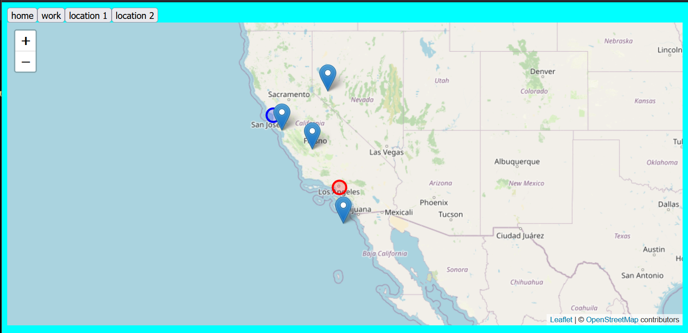

---
hide:
  - tags
tags:
  - Lab 3
  - GeoJSON
  - Buttons
  - Event Listeners
---
# A little UX/I(e) and Geo-J-cieON

Adding functionality to our [Leaflet.js](https://www.leaflet.js) map!

{: style="max-width:300px"}

!!! tldr "Goals"
    - Create a GeoJSON online and it to the map with JavaScript
    - Understand how JavaScript works with HTML and CSS
    - Understand how JavaScript variables, functions, methods work together

## Starting Template Code for lab #3

Use the following template code or your lab assignment #2:

!!! caution "2 Labs, 2 day!"
    Because we will be doing 2 labs today, we will making two copies of this code.
    You can save yourself time by doing the following:

    - Make a copy of `index.html` as  `part1.html`
    
    - Make a copy of `js/init.js` to `js/part1.js` 


```html title="index.html" linenums="1"
<!DOCTYPE html>
<html>
    <head>
        <title>Hello World</title>
        <!-- hint: remember to change your page title! -->
        <meta charset="utf-8" />
        <link rel="shortcut icon" href="#">
        <link rel="stylesheet" href="styles/style.css">
        
        <!-- Leaflet's css-->
        <link rel="stylesheet" href="https://unpkg.com/leaflet@1.7.1/dist/leaflet.css" />

        <!-- Leaflet's JavaScript-->
        <script src="https://unpkg.com/leaflet@1.7.1/dist/leaflet.js"></script>
    </head>
    
    <body>
        <header>
            <!-- space for a menu -->
        </header>
        
        <div class="main">
            <div id="contents">
                <!-- page contents can go here -->
            </div>
            <div id="the_map"></div>
        </div>
        <div id="footer">
            Copyright(2023)
        </div>
        <script src="js/init.js"></script>
    </body>
</html>
```

```css title="styles/style.css" linenums="1"

body{
    display: grid;
    /* grid-template-columns: 1fr;  */
    grid-auto-rows: auto 1fr;
    grid-template-areas: "header" "main_content" "footer";
    background-color: aqua;
    /* height: 100vh; */
}

header{
    grid-area: header;
}

#footer{
    grid-area: footer;
}

.main{
    grid-area: main_content;
    grid-template-areas: "content" "main_map";
    display: grid;
}

#contents{
    grid-area: content;
}

#the_map{
    height:80vh;
    grid-area: main_map;
}

```

```js title="js/init.js" linenums="1"
// declare the map
const map = L.map('the_map').setView([34.0709,-118.444], 5);

L.tileLayer('https://{s}.tile.openstreetmap.org/{z}/{x}/{y}.png', {
    attribution: '&copy; <a href="https://www.openstreetmap.org/copyright">OpenStreetMap</a> contributors'
}).addTo(map);

addMarker(37,-122,'home','home land!')
addMarker(32,-118,'work','where i work land!')
addMarker(39,-119,'location 1','random location')
addMarker(36,-120,'location 2','another random location')

// create a function to add markers
function addMarker(lat,lng,title,message){
    console.log(message)
    L.marker([lat,lng]).addTo(map).bindPopup(`<h2>${title}</h2> <h3>${message}</h3>`)
    return message
}

```
