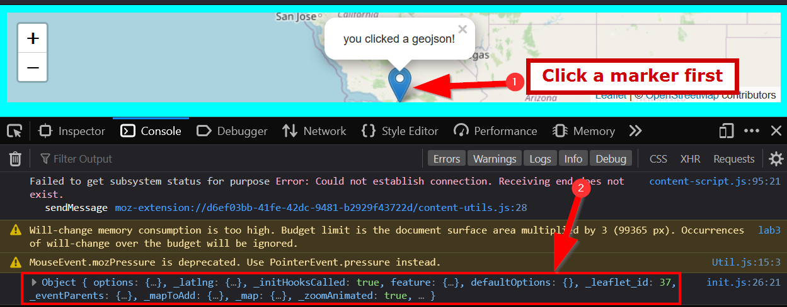
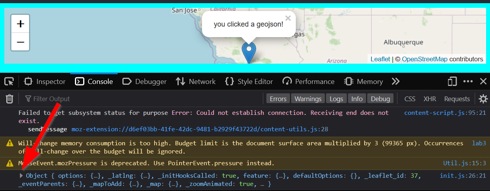
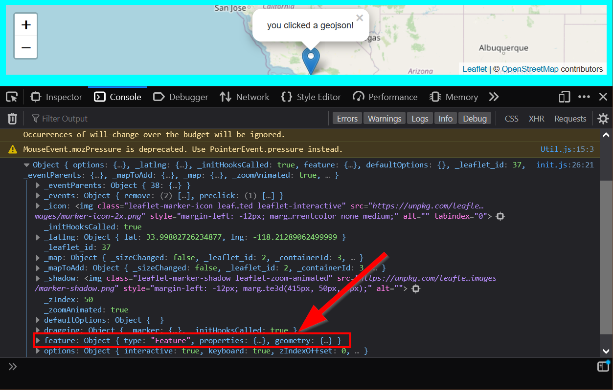
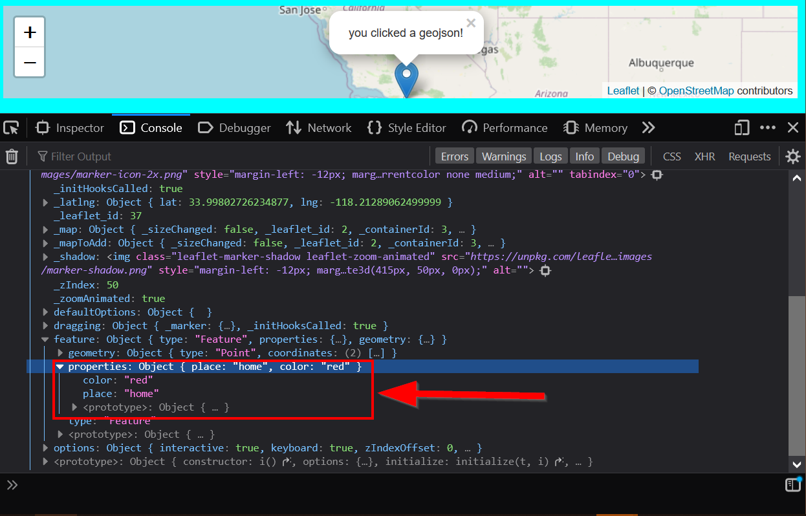
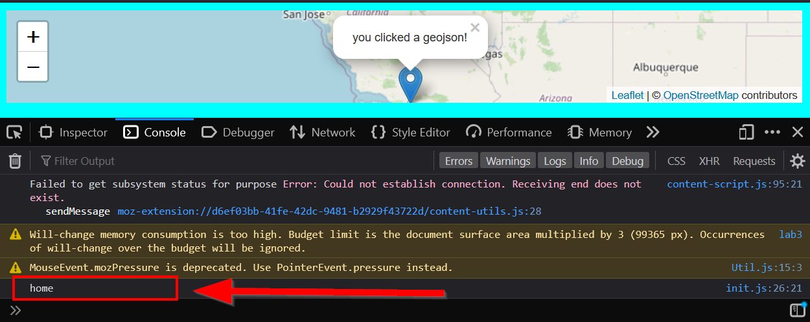

---
hide:
  - tags
tags:
  - Lab 4
  - Styling GeoJSON
  - GeoJSONs
---
# Adding more to our `L.GeoJSON`

Remember that putting a variable into a `type` gives you access to different methods?

Rather than just stopping at `L.geoJSON(data).addTo(map)` we are going to expand that part of the code to style the GeoJSON when we add it!

### Clickable GeoJSON recipe
This is the basic Leaflet recipe for a clickable geojson:

```javascript
// the leaflet method for adding a geojson
L.geoJSON(data)
    .bindPopup(layer => {
        return "you clicked a geojson!";
    }).addTo(map);
```

### Adding GeoJSON functionality

Now that we have that recipe, we need to put it somewhere... Where is the best place for it?

??? done "Answer"

    ```js linenums="1" hl_lines="7-10"
    fetch("map.geojson") 
        .then(response => { 
            return response.json();
        })
        .then(data =>{
            // Basic Leaflet method to add GeoJSON data
            L.geoJSON(data) //(1)!
            .bindPopup(layer => {
                return "you clicked a geojson!"; //(2)!
            }).addTo(map); //(3)!
        });
    ```

    1.     This is where we added the clickable geoJSON recipe!!
    2.     Notice we are going to a generic `you clicked a geojson` message here!
    3.     This is where we add the `GeoJSON` to the map.

Rather than just simply returning the `popup` as a generic `you clicked a geojson`, let's use our GeoJSON's `place` property that we created in the first part of the lab!

### Checking our logs!

Let's `#!js console.log()` our layer to see how it looks:

??? question "Where should the `console.log()` go?"

    Correct, line 3!
    
    ```js hl_lines="3"
    L.geoJSON(data,
        }).bindPopup(layer => {
                console.log(layer)
                return "you clicked a geojson!"
        }).addTo(map);
    ```

Now when you click the marker, this should pop-up in the console:

{: style="max-width:300"}

```js
Object { options: {…}, _latlng: {…}, _initHooksCalled: true, feature: {…}, defaultOptions: {}, _leaflet_id: 37, _eventParents: {…}, _mapToAdd: {…}, _map: {…}, _zoomAnimated: true, … }
```

We can drill down into our GeoJSON by clicking on the arrows:

{: style="max-width:300"}

Find the `feature` property and click the arrow to expand it:

{: style="max-width:300"}

Look at the `properties` and notice what is in there!

{: style="max-width:300"}

**Right! Those are the columns and values we created from the first part of the lab 3b!**

This is called `traversing` the `object` path, and it works the same way when we linked our `photos` or `.css`. The key difference is that it is within one file!

Recapping how we got here, we:
1. Went into the object (`layer`)
2. Clicked on `feature`
3. Clicked on `properties`.

To access the place name, we will need to specify that with `place`.

As a result, our path should look like this:

```js
layer.feature.properties.place;
```

!!! note "OMG!! The `.` returns?!"
    Aha, very observant! Similar to `chaining` methods, we use the `.` to chain going down an `object` path. Why is that?! Well.. It has something to do with `classes`, but thats out of the `scope` of this class. (multiple coding puns intended.) If you really want to learn more, click here to read about Object-Oriented Programming and JavaScript: [click if you dare!](https://developer.mozilla.org/en-US/docs/Learn/JavaScript/Objects/Classes_in_JavaScript).

Let's ==`console.log()`== the result to make sure we have the right path down:

```js hl_lines="3"
    L.geoJSON(data
        ).bindPopup(layer => {
                console.log(layer.feature.properties.place)
                return "you clicked a geojson!"
        }).addTo(map);
```

When you click a point, the correct `value` should show up:

{: style="max-width:300"}

Woo!! Now let's `return` this value instead of the generic message:

```js hl_lines="4"
    L.geoJSON(data
        ).bindPopup(layer => {
                console.log(layer.feature.properties.place)
                return layer.feature.properties.place
        }).addTo(map);
```

Now when you click on the map, the `place` values shows up!

## Utilizing our GeoJSON's `color` property

Before we finish this module, let's take what we learned one step further and use our `color` property too.

While `bindPopUp()` was nice and an outside method, changing the color ==needs to be inside== of the `L.geoJSON()` call. So we have to attach it to an object inside as follows:

``` js
            L.geoJSON(data, { // (1)!
                style: layer => { //(2)!
                    return {color: layer.feature.properties.color}; //(3)!
                }
            }).bindPopup(layer => {
                return layer.feature.properties.place;
            }).addTo(map);
```

1.      Here we add a `,` to add a new value, and then a `{` to start our new object
2.      `style` is what Leaflet's `L.GeoJSON()` needs, so we have to use that
3.      We are assigning our `layer.feature.properties.color` here!

!!! fail "YOU LIE!!! THIS DOES NOT WORK"
    Correct! This code will not work because... A GeoJSON's color property can only be set for `L.CircleMarkers`, `lines`, or `polygons` but **not** regular `L.markers`.

### Converting our GeoJSON to `CircleMarkers`

Since `{style: "red"}` or any color won't work for our marker, we need to convert it into a circle marker using the `pointToLayer()` method! Again, this ==has to be inside== the `L.geoJSON()` because that is where **Leaflet** must know what color to make the features.

We will use the `arrow-function` so we can type fewer characters:

```javascript
        L.geoJSON(data, {
            pointToLayer: (feature, latlng) => { //(1)!
                return L.circleMarker(latlng, {color: feature.properties.color}); //(2)!
            }
            // ... other code here
```

1.      Here we pass in our `feature` and `latlng` into the simplified `=> function`
2.      Now we convert it to a `L.circleMarker()`, with `latlng` being the first parameter, then 
        setting `color` to the `feature.properties.color`. 

The `fetch`'s final `.then` should now look like the following:

```javascript hl_lines="7-12"
fetch("map.geojson")
    .then(response => {
        return response.json()
    })
    .then(data =>{
        // Basic Leaflet method to add GeoJSON data
        L.geoJSON(data, {
                pointToLayer: (feature, latlng) => { 
                    return L.circleMarker(latlng, {color: feature.properties.color})
                }
            }).bindPopup(layer => {
                return layer.feature.properties.place;
            }).addTo(map);
    })
```

## Checkpoint

Our current `init.js` JavaScript file should look like this:

```js title="js/init.js" linenums="1" hl_lines="25-29"
// declare variables
let mapOptions = {'center': [34.0709,-118.444],'zoom':5}

// use the variables
const map = L.map('the_map').setView(mapOptions.center, mapOptions.zoom);

L.tileLayer('https://{s}.tile.openstreetmap.org/{z}/{x}/{y}.png', {
    attribution: '&copy; <a href="https://www.openstreetmap.org/copyright">OpenStreetMap</a> contributors'
}).addTo(map);

// create a function to add markers
function addMarker(lat,lng,title,message){
    console.log(message)
    L.marker([lat,lng]).addTo(map).bindPopup(`<h2>${title}</h2> <h3>${message}</h3>`)
    return message
}

fetch("map.geojson")
    .then(response => {
        return response.json()
    })
    .then(data =>{
        // Basic Leaflet method to add GeoJSON data
        L.geoJSON(data, {
                pointToLayer: (feature, latlng) => { 
                    return L.circleMarker(latlng, {color: feature.properties.color})
                }
            }).bindPopup(layer => {
                return layer.feature.properties.place;
            }).addTo(map);
    })
```

Your final `init.js` should look like this:

```js title="js/init.js" linenums="1"
// declare variables
let mapOptions = {'center': [34.0709,-118.444],'zoom':5}

// use the variables
const map = L.map('the_map').setView(mapOptions.center, mapOptions.zoom);

L.tileLayer('https://{s}.tile.openstreetmap.org/{z}/{x}/{y}.png', {
    attribution: '&copy; <a href="https://www.openstreetmap.org/copyright">OpenStreetMap</a> contributors'
}).addTo(map);

// create a function to add markers
function addMarker(lat,lng,title,message){
    console.log(message)
    L.marker([lat,lng]).addTo(map).bindPopup(`<h2>${title}</h2> <h3>${message}</h3>`)
    return message
}

fetch("map.geojson")
    .then(response => {
        return response.json()
    })
    .then(data =>{
        // Basic Leaflet method to add GeoJSON data
        L.geoJSON(data, {
                pointToLayer: (feature, latlng) => { 
                    return L.circleMarker(latlng, {color: feature.properties.color})
                }
            }).bindPopup(layer => {
                return layer.feature.properties.place;
            }).addTo(map);
    })

```
