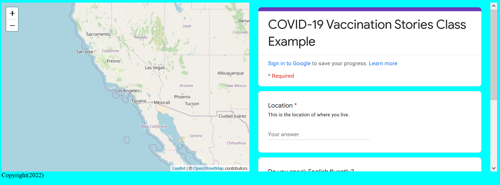

---
hide:
  - tags
tags:
  - Lab 4
---

# Google FORMulating Community-Based Empowerment

Adding a Google Form to our mapplication!

{: style="max-width:300px"}

!!! tldr "Goals"
    - Create a Google Form with meaningful questions
    - Embed a Google Form into a website using an iFrame
    - Implement a trigger for geocoding "location" data in Google Sheets

## Starting template code for lab #4

Use the following template code or your lab assignment #3a or #3b:

```html title="index.html" linenums="1"
<!DOCTYPE html>
<html>
    <head>
        <title>Hello World</title>
        <!-- hint: remember to change your page title! -->
        <meta charset="utf-8" />
        <link rel="shortcut icon" href="#">
        <link rel="stylesheet" href="styles/style.css">
        
        <!-- Leaflet's css-->
        <link rel="stylesheet" href="https://unpkg.com/leaflet@1.7.1/dist/leaflet.css" />

        <!-- Leaflet's JavaScript-->
        <script src="https://unpkg.com/leaflet@1.7.1/dist/leaflet.js"></script>
    </head>
    
    <body>
        <header>
            <!-- space for a menu -->
        </header>
        
        <div class="main">
            <div id="contents">
                <!-- page contents can go here -->
            </div>
            <div id="the_map"></div>
        </div>
        <div id="footer">
            Copyright(2023)
        </div>
        <script src="js/init.js"></script>
    </body>
</html>
```

```css title="styles/style.css"
body{
    display: grid;
    grid-auto-rows: auto 1fr;
    grid-template-areas: "header" "main_content" "footer";
    background-color: aqua;
}

header{
    grid-area: header;
}

#footer{
    grid-area: footer;
}

.main{
    grid-area: main_content;
    grid-template-areas: "content" "main_map";
    display: grid;
}

#contents{
    grid-area: content;
}

#the_map{
    height:80vh;
    grid-area: main_map;
}
```

```js title="js/init.js" linenums="1"
// declare variables
let mapOptions = {'center': [34.0709,-118.444],'zoom':5}

// use the variables
const map = L.map('the_map').setView(mapOptions.center, mapOptions.zoom);

L.tileLayer('https://{s}.tile.openstreetmap.org/{z}/{x}/{y}.png', {
    attribution: '&copy; <a href="https://www.openstreetmap.org/copyright">OpenStreetMap</a> contributors'
}).addTo(map);

// create a function to add markers
function addMarker(lat,lng,title,message){
    console.log(message)
    L.marker([lat,lng]).addTo(map).bindPopup(`<h2>${title}</h2> <h3>${message}</h3>`)
    return message
}

fetch(`map.geojson`)
    .then(response => {
        console.log(response)
        return response
    })
    .then(data =>{
        // do something with the data
    })

```
