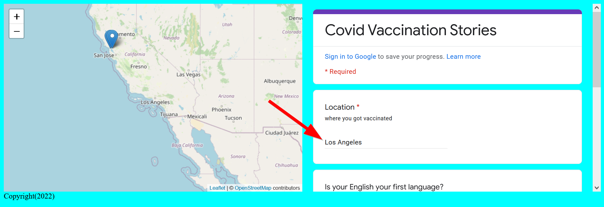
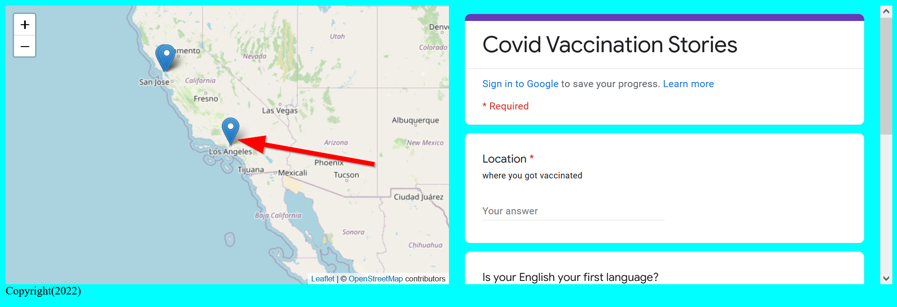

# Time for-loops, but are they FOReign?

## ⚽ Warm-up: New Keywords?

Last week in the Google Script Editor, we copy and pasted a large chunk of code without going into much detail about it. As a warm-up, let's take sometime to analyze it.

```js title="Google's Script Editor" linenums="1"
function myFunction() {
    let sheet = SpreadsheetApp.getActiveSheet();
    
    let range = sheet.getDataRange();
    let cells = range.getValues();
    
    let latitudes = [['lat']]; //(1)!
    let longitudes = [['lng']]; //(2)!
    
    for (let i = 0; i < cells.length; i++) {
        // change cells[i][2] if your address is not in column 'C', for example cells[i][1] for column 'B' or cells[i][3] for column D
        
        addressColumn = cells[i][2] //(3)!
        let lat = lng = 0;

        if (i > 0) {
            if (addressColumn){
                let address = addressColumn;
                console.log(address)
                if(address){
                    let geocoder = Maps.newGeocoder().geocode(address);
                    let res = geocoder.results[0];
                        if(res){
                            lat = res.geometry.location.lat;
                            lng = res.geometry.location.lng;
                            }
                        }
                    }
                latitudes.push([lat]);
                longitudes.push([lng]);
            }
    }
    sheet.getRange('D1') // this is your latitude column //(4)!
    .offset(0, 0, latitudes.length)
    .setValues(latitudes);
    sheet.getRange('E1') // this is your longitude column //(5)!
    .offset(0, 0, longitudes.length)
    .setValues(longitudes);
    Utilities.sleep(5000)
}
```

!!! tldr "Questions"
    1. What language is the Google Script Editor using? HTML? CSS? JavaScript?
    2. Were there any new built-in JavaScript methods?
    3. What new keywords (if any) did you see?
    4. If there were new keywords, do you think they do?


??? done "Answers"
    1. It is written in JavaScript
    2. There were quite a few, like `cells.length` and `Utilities.sleep(5000)` but these are all a part of Google Apps script. A built-in JavaScript method that is important to recognize was `latitudes.push([lat]);` and `longitudes.push([lng]);` which allows us to add content to a list to variables we created called `latitude` and `longitude`! Very useful and we will use this again soon!
    3. Two new keywords were: `if` and `for`
    4. 
       a. `if` checks for a conditional statement
       b. `for` allows you to loop through a list of things

    ```js title="Google's Script Editor" linenums="1" hl_lines="10 16 17 20 23"

    function myFunction() {
        let sheet = SpreadsheetApp.getActiveSheet();
        
        let range = sheet.getDataRange();
        let cells = range.getValues();
        
        let latitudes = [['lat']]; //(1)!
        let longitudes = [['lng']]; //(2)!
        
        for (let i = 0; i < cells.length; i++) {
            // change cells[i][2] if your address is not in column 'C', for example cells[i][1] for column 'B' or cells[i][3] for column D
            
            addressColumn = cells[i][2] //(3)!
            let lat = lng = 0;

            if (i > 0) {
                if (addressColumn){
                    let address = addressColumn;
                    console.log(address)
                    if(address){
                        let geocoder = Maps.newGeocoder().geocode(address);
                        let res = geocoder.results[0];
                            if(res){
                                lat = res.geometry.location.lat;
                                lng = res.geometry.location.lng;
                                }
                            }
                        }
                    latitudes.push([lat]);
                    longitudes.push([lng]);
                }
        }
        sheet.getRange('D1') // this is your latitude column //(4)!
        .offset(0, 0, latitudes.length)
        .setValues(latitudes);
        sheet.getRange('E1') // this is your longitude column //(5)!
        .offset(0, 0, longitudes.length)
        .setValues(longitudes);
        Utilities.sleep(5000)
    }
    ```

With this warm-up compelte, let's start today's focus on loops. But first off...

## What the F-or loop?!

A `for-loop` means is to `go through the items and do something each time`. Loops are one of the most critical tool for programmers for automating tasks.

### Detailed analyis of a `for-loop` for you

Let's look at the Google Script's App section with the `for-loop` in more detail:

```js  hl_lines="1"
  for (let i = 0 ; i < cells.length; i++) { 
     addressColumn = cells[i][2] 
     let lat = lng = 0;
    if (i > 0) {
      if (addressColumn){
    let address = addressColumn;
    console.log(address)
```

We will be looking at just the first line in that except.

!!! warning "Note!!"
    The following `for-loop` is visualized for demonstration purposes only, please keep the **beginning** your loops to one single line for easier readability. Start a line break after the first `{`.
    
    For example:

    ```js
    for (let i = 0; i < cells.length; i++) {
        // do your loop here
    }
    ```

```js title="Example for-loop for demo ONLY!"
  for ( //(1)!
        let i = 0; //(2)!
        i < cells.length; //(3)!
        i++){ //(4)!
          // loop through something 
        } //(5)!
```


1.         `for` is a keyword for starting the `for loop`
2.         `(let i = 0;` is a placeholder variable for counting, `i` can be anything, but it has be consistent in the `for loop`.
3.         `i < cells.length` basically says, "run this loop as long as it is less than the total number of cells."
4.         `i++` means keep adding while the loop is able to run
5.         `{}` and finally the brackets are the code block to execute while the loop runs.

This is the basic example of a `for` loop. 

When the loop ends, we say that the loop is broken out of:


## Iterable Items
Loops can ONLY occur over iterable items, meaning stuff that you can count or go through, such as numbers, lists, objects, and arrays. 

In the technical schematic diagram above, notice that the items is a [JavaScript array](https://developer.mozilla.org/en-US/docs/Web/JavaScript/Reference/Global_Objects/Array). When the array hits the last item, the loop stops. 

### ⚽In-class Exercise #1 - Our First Loop

```js title="Sample array for exercise"

const sampleDataArray = [[37,-122],[32,-118],[39,-119],[36,-120]]

```

!!! tldr "Tasks"
    1. Using the array above, make a `for-loop` that creates markers!  

??? done "Answer"
    ```js
        const sampleDataArray = [[37,-122],[32,-118],[39,-119],[36,-120]]

        for (let i = 0; i < sampleDataArray.length; i++) { //(1)!
            console.log(sampleDataArray[i]) //(2)!
            addMarker(sampleDataArray[i][0],sampleDataArray[i][1],`Marker ${i}`,`This is marker ${i}`) //(3)!
        }
    ```
    1.      This starts the loop by saying, `for the total length in our sampleDataArray` do something
    2.      The `console.log()` checks our loop results. Warning, doing this for large datasets will slow down your website, so use this mainly for debugging purposes.
    3.      We call the `addMarker()` function with the `sampleDataArray[i]` being the number that the loop is currently on. We use `sampleDataArray[i][0]` to get `latitude` and `sampleDataArray[i][1]` for longitude.

## `For...of` loop

The [for of](https://developer.mozilla.org/en-US/docs/Web/JavaScript/Reference/Statements/for...of) loop is identical in function to the `for-loop` except that it does not have an automatically `iterating` variable. Since it has less variables, I think it is much easier to understand than the basic `for` loop.

Here is the `for-of` loop in action:

```js
const longString = 'hellooooooooooooo'
const array1 = ['a', 'b', 'c'];

// this loops through an array
for (const stuff of array1){
    console.log(stuff)
}

// this loops through a string!
for (const letter in longstring){
    console.log(letter)
}
```

You can use any variable in place of `letter` or `stuff` and it is quite clear what is being looped over inside the scope brackets.

### ⚽In-class Exercise #2 - `For-of` Loop

```js title="Sample array for exercise"

const sampleDataArray = [[37,-122],[32,-118],[39,-119],[36,-120]]

```

!!! tldr "Tasks"
    1. Re-write our first `for-loop`, with a`for-of` loop that also creates markers!  

??? done "Answer"
    ```js
        const sampleDataArray = [[37,-122],[32,-118],[39,-119],[36,-120]]

        for (const item of sampleDataArray){
            addMarker(item[0],item[1],`Marker ${item}`,`This is marker ${item}`)
        }
    ```

Notice in the answer, there is no `automatic` increasing value, so we need to pass the `item` in as the value for the pop-up message! 

I think FOR ease of understanding the code, not having that auto-increment is a worthwhile trade-off!!!

## `For Each` loop

Out of `each` of the loops, the `for each` loop is the final and most important loop we will cover today. It is similar to the loops above, but there are two key differences:
1. **`.forEach`** requires a function
2. **`.forEach`**is an ==`array` method== or ==built-in function== for arrays.

Those differences are important because when this loop executes a function for each array element. Also, since this `loop` is an array method, it doesn't start with a keyword!!

Instead `.forEach()` follows the array that you want to call the loop on.

Here is an example of the `forEach` loop:

```js hl_lines="3"
let myArray = ['hello','this','is','an','array']

myArray.forEach(justChecking);

function justChecking(data){
    console.log(data)
}
```

The `.forEach` method might be the easiest loop to understand because of the grammar implications:

`For Each`->`item in the array`-> `do this function!`

Additionally, the `.forEach()` loop is important because it streamlines the process of applying a function to a list of items. This is a common scenario with **arrays** (lists) in the first place, since no one wants to program things by manually applying a function to hundres of items!!

One draw back of using `.forEach()` in this way is that you can't isolate the data paramaters in a function.

For example, this code will not work!

!!! error "forEach broken"
    ```js 
    let myArray = [{'message':'hello','lat':37,'lng':-122},{'message':'this','lat':35,'lng':-119}]

    myArray.forEach(justChecking(lat,lng));
    
    function justChecking(lat,lng){
        console.log(lat,lng)
    }
    ```
You would have to write the code this way:

!!! done "forEach fixed" hl_lines="3 5-6"
    ```js 
    let myArray = [{'message':'hello','lat':37,'lng':-122},{'message':'this','lat':35,'lng':-119}]

    myArray.forEach(justChecking);
    
    function justChecking(data){
        console.log(data.lat,data.lng)
    }
    ```

One way to be able to specify data values with **`.forEach()`** is to use the arrow functions!!

### `.forEach()` and arrow (=>) functions

Since a `.forEach()` loop requires a function, if the function is not needed anywhere else, it is recommended to simplify the loop with an arrow/anonymous function, which we covered last week.

Of course, always stick with what you think makes the most sense to you as a coder!

Remember, an anonymous function is a function without a name and uses the `arrow` syntax.

Here is how the same `forEach()` loop looks like with an arrow function:

```js
let myArray = ['hello','this','is','an','array']
myArray.forEach(data=>{justChecking(data)});

function justChecking(data){
    console.log(data)
}
```

Adding the arrow function allows you to use multiple parameters in the function call to explicitly call different aspects of the `data` from `myArray` if it were an object, like `myArray.lat`, or `myArray.lng`

```js
let myArray = ['hello','this','is','an','array']
myArray.forEach(data=>{addSimpleMarker(data.lat,data.lng)});

function addSimpleMarker(lat,lng){
    L.marker([lat,lng]).addTo(map)
}
```

## Class Exercise #3 - Your first `forEach` loop


```js title="Sample array of objects for exercise"
let simpleArray = ['hello','this','is','an','array']
let arrayOfObjects = [{'name':'hello','lat':37,'lng':-122},{'name':'world','lat':35,'lng':-119},{'name':'aa191','lat':36,'lng':-120}]


```

!!! tldr "Tasks"
    1. Create an [array](https://developer.mozilla.org/en-US/docs/Web/JavaScript/Reference/Global_Objects/Array) of objects 3 or more items
    2. Use a `.forEach()` loop on one of the arrays above.
    3. `console.log()` the result.
    4. Use a more complicated array of objects and use the `forEach` loop to create markers!  

??? done "Answer"
    ```js
        let simpleArray = ['hello','this','is','an','array']

        simpleArray.forEach(checking)

        function checking(aParameter){
            console.log(aParameter)
        }

        let arrayOfObjects = [{'name':'hello','lat':37,'lng':-122},{'name':'world','lat':35,'lng':-119},{'name':'aa191','lat':36,'lng':-120}]

        for (const item of sampleDataArray){
            addMarker(item[0],item[1],`Marker ${item}`,`This is marker ${item}`)
        }
    ```

### `.` notation vs. `[]` notation

Remember to access an object you typically would use the `.nameOfField` notation like so:

`arrayOfObjects.forEach(data => {data.name})`

But if there are spaces in the field name, you will have to use the `['name of field']` notation.

In the above example we can call `arrayOfObjects.forEach(data => {data['name']})` to access all of the name values in our data.

## Class Exercise #4 - Practing Loops with our data

!!! tldr "Tasks"
    1. Access your [array](https://developer.mozilla.org/en-US/docs/Web/JavaScript/Reference/Global_Objects/Array) of objects from the Google Survey
    2. Loop through an array of objects with [.forEach](https://developer.mozilla.org/en-US/docs/Web/JavaScript/Reference/Global_Objects/Array/forEach)
    3. Use the `add marker` function to add your array to the map


??? done "Answer"

    ```js
    let myArray = [{'name':'hello','lat':37,'lng':-122},{'name':'this','lat':35,'lng':-119},{'name':'is','lat':36,'lng':-120}]
    myArray.forEach(addMarker);


    function loadData(url){
        Papa.parse(dataUrl, {
            header: true,
            download: true,
            complete: results => processData(results)
        })
    }

    function processData(results){
        console.log(results)
        results.data.forEach(data => {
            console.log(data)
            addMarker(data.lat,data.lng,data['OpenEnded'],data['Is your English your first language?'])
        })
    }
    ```

## Turning our survey data into markers

There are numerous approaches that one can take using any of the loop methods described above, we will just focus on the `.forEach()` and `=>` implmenetion.

### Create a function to `processData()`

This function will loop through each of the data and apply various functions to it, such as adding markers or buttons. A function like this is useful as a `helper` function because it can separate what we want the website to do from the immediate data processing.

```js
function processData(results){
    console.log(results) //for debugging: this can help us see if the results are what we want
    results.data.forEach(data => {
        console.log(data) // for debugging: are we seeing each data correctly?
    })
}
```

### Call the `addMarker()` function in a loop

!!! important "Remember! `console.log()` is your life boat! :fontawesome-solid-life-ring:"
    Always check the console to see if our data and code is function properly!

Click into the array to see if our data looks right:

{: style="max-width:500px"}

If the console logs are good, then we can add the call to the `addMarker()` function in the `.forEach()` loop like so:

```js
function processData(results){
    //console.log(results) //for debugging: this can help us see if the results are what we want
    results.data.forEach(data => {
        console.log(data) // for debugging: are we seeing each data correctly?
        // the console log can make sure we have the right field names selected!
        addMarker(data.lat,data.lng,data['OpenEnded'],data['Is your English your first language?'])
    })
}
```

And viola! Your map should now be populated with the points on the survey!

### 🏁Final check point

Test it out your map by filling out the survey:

{: style="max-width:500px"}

Then you should magically see a point appear!

{: style="max-width:500px"}

Now you are ready for the [lab assignment](../../assignments/week5/lab_assignment.md)!