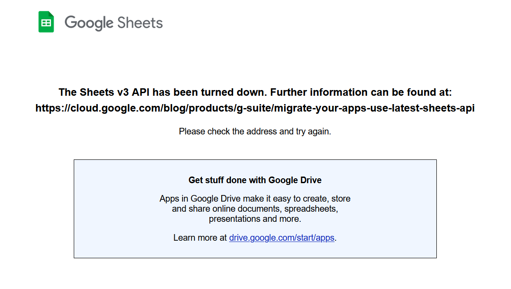
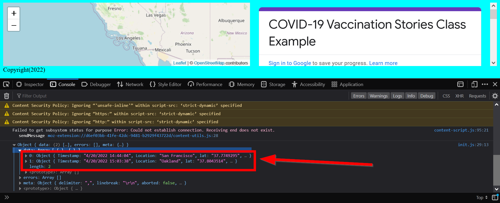

# Connecting to APIs and Loops

Before we talk about loops, we need to have some data to loop over, so let's get our data from Google Sheets using their Application Programming Interface (API).

## What's an API?

An [API](https://developer.mozilla.org/en-US/docs/Learn/JavaScript/Client-side_web_APIs/Introduction) can be really thought of as an external appliance we are borrowing. In that sense, we are just plugging into it so we can access the data it provides.

Basically, an API allows different websites, computer devices, and data talk to each other.

{: style="max-width:500px"}

### Boo!!! Google's API Depreciation!

Unforunately, in 2021 Google Depreciated the API for connecting to their files directly.

So we will have to do a work around, which means we won't be using the built-in JavaScript `fetch API`.

Instead we will use an open-source library called...

## Sweet, (beard) `papa-parse`!

{: style="max-width:500px"}

[**`papa parse`**](https://www.papaparse.com/)

### Adding `papa parse` to our html

We want to bring the library of sweet pastries into our site, so let's bring in `papa parse` directly online like we did with Leaflet.js.

Copy the following code and paste it into your `<head>` tag in your `index.html` file:

```js
<script src="https://cdnjs.cloudflare.com/ajax/libs/PapaParse/5.3.0/papaparse.min.js"></script>
```

Your `index.html` should look like this:

```html linenums="10" hl_lines="6"
        <!-- Leaflet's css-->
        <link rel="stylesheet" href="https://unpkg.com/leaflet@1.7.1/dist/leaflet.css" />

        <!-- Leaflet's JavaScript-->
        <script src="https://unpkg.com/leaflet@1.7.1/dist/leaflet.js"></script>
        <script src="https://cdnjs.cloudflare.com/ajax/libs/PapaParse/5.3.0/papaparse.min.js"></script>
    </head>
```

With `papa parse` added to our site, we can now use it to connect to our Google Sheet.

### Connecting to our Google Sheet with `papa parse`

Go into our `init.js` and change out the `fetch` in the `loadData()` function to the following:

```js 
function loadData(url){
    Papa.parse(dataUrl, {
        header: true,
        download: true,
        complete: function(results) {
            console.log(results)
        }
    })
}
```

Let's open up our console and see if our data is loaded!

If you see this:

{: style="max-width:500px"}

Then you are in good shape for the next part of the lab!

### ⚽ Warm-up: Arrow Functions!

!!! tldr "Can you convert the function?"
    Arrow functions help to cut down our code and make it easier to read. Are you able to convert the function below to an `arrow =>` function?

```js 
function loadData(url){
    Papa.parse(dataUrl, {
        header: true,
        download: true,
        complete: function(results) {
            console.log(results)
        }
    })
}
```

??? done "Answer"

    ```js 
    function loadData(url){
        Papa.parse(dataUrl, {
            header: true,
            download: true,
            complete: results => console.log(results)
        })
    }
    ```

Since our data is showing up in our console, we can now start our loopy lab!

## 🏁Checkpoint

Check to see if your code is like the following before moving on:

```html title="index.html" linenums="1" hl_lines="15"
<!DOCTYPE html>
<html>
    <head>
        <title>Hello World</title>
        <!-- hint: remember to change your page title! -->
        <meta charset="utf-8" />
        <link rel="shortcut icon" href="#">
        <link rel="stylesheet" href="styles/style.css">

        <!-- Leaflet's css-->
        <link rel="stylesheet" href="https://unpkg.com/leaflet@1.7.1/dist/leaflet.css" />

        <!-- Leaflet's JavaScript-->
        <script src="https://unpkg.com/leaflet@1.7.1/dist/leaflet.js"></script>
        <script src="js/papaparse.min.js"></script>
    </head>

    <body>
        <header>
            <!-- space for a menu -->
        </header>

        <div class="main">
            <div id="contents">
                <!-- Be sure to use your own survey here!!!!!!! -->
                <iframe src="https://docs.google.com/forms/d/e/1FAIpQLScD0IOr_U4r0q4HlBkZ7olkA5OJpgInePF8DQbIrIWDeTm1jw/viewform?embedded=true" width="100%" height="100%" frameborder="0" marginheight="0" marginwidth="0">Loading…</iframe>

            </div>
            <div id="the_map"></div>
        </div>
        <div id="footer">
            Copyright(2022)
        </div>
        <script src="js/init.js"></script>
    </body>
</html>
```

```js title="js/init.js" linenums="1" hl_lines="21-27"

// declare variables
let mapOptions = {'center': [34.0709,-118.444],'zoom':5}

// use the variables
const map = L.map('the_map').setView(mapOptions.center, mapOptions.zoom);

L.tileLayer('https://{s}.tile.openstreetmap.org/{z}/{x}/{y}.png', {
    attribution: '&copy; <a href="https://www.openstreetmap.org/copyright">OpenStreetMap</a> contributors'
}).addTo(map);

// create a function to add markers
function addMarker(lat,lng,title,message){
    console.log(message)
    L.marker([lat,lng]).addTo(map).bindPopup(`<h2>${title}</h2> <h3>${message}</h3>`)
    return message
}

const dataUrl = "https://docs.google.com/spreadsheets/d/e/2PACX-1vS2WyfKTyZJ-_ja3GGrxoAXwranavyDGXYsxeFUO4nvHpCJrkKhChymXQqUEyhdGLnz9VN6BJv5tOjp/pub?gid=1560504149&single=true&output=csv"

function loadData(url){
    Papa.parse(dataUrl, {
        header: true,
        download: true,
        complete: results => console.log(results)
    })
}
// this is our function call to get the data
loadData(dataUrl)
```
