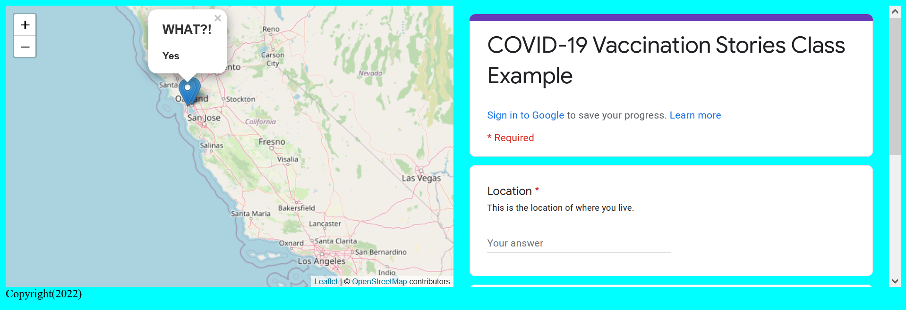

# Overview - Google Forms, Loops, and APIs

Adding the data from our survey into our mapplication!

{: style="max-width:300px"}

!!! tldr "Goals"
    - Create a Google Form with meaningful questions
    - Embed a Google Form into a website using an iFrame
    - Implement a trigger for geocoding "location" data in Google Sheets
    - Replace our `fetch` GeoJSON with data from a Google Sheet using `papa parse`
    - Be able to use loops and conditional statements in JavaScript
    - Understand what an API is
    - Add data from a Google Sheet into a website

## Lab outline

1. [Creating a Google Form](./1.md)
2. [Refactoring our JavaScript and CSS](./2.md)
3. [Geocoding with Google Sheets](./3.md)
4. [Connecting to our Google Sheet with `papa parse`](./4.md)
5. [Looping through our data and adding it to our map](./5.md)

Start by creating a `week5` folder in your lab assignments repo.

!!! done "Get ahead start"
    You can also copy the contents of your Lab Assignment's `week3` folder and skip the following setup section.

## Starting template code for lab #5

```html title="index.html" linenums="1"
<!DOCTYPE html>
<html>
    <head>
        <title>Hello World</title>
        <!-- hint: remember to change your page title! -->
        <meta charset="utf-8" />
        <link rel="shortcut icon" href="#">
        <link rel="stylesheet" href="styles/style.css">

        <!-- Leaflet's css-->
        <link rel="stylesheet" href="https://unpkg.com/leaflet@1.7.1/dist/leaflet.css" />

        <!-- Leaflet's JavaScript-->
        <script src="https://unpkg.com/leaflet@1.7.1/dist/leaflet.js"></script>
    </head>

    <body>
        <header>
            <!-- space for a menu -->
        </header>

        <div class="main">
            <div id="contents">
            </div>
            <div id="the_map"></div>
        </div>
        <div id="footer">
            Copyright(2023)
        </div>
        <script src="js/init.js"></script>
    </body>
</html>
```

```js title="js/init.js" linenums="1"
// declare variables
let mapOptions = {'center': [34.0709,-118.444],'zoom':5}

// use the variables
const map = L.map('the_map').setView(mapOptions.center, mapOptions.zoom);

L.tileLayer('https://{s}.tile.openstreetmap.org/{z}/{x}/{y}.png', {
    attribution: '&copy; <a href="https://www.openstreetmap.org/copyright">OpenStreetMap</a> contributors'
}).addTo(map);

// create a function to add markers
function addMarker(lat,lng,title,message){
    console.log(message)
    L.marker([lat,lng]).addTo(map).bindPopup(`<h2>${title}</h2> <h3>${message}</h3>`)
    return message
}

fetch("map.geojson")
    .then(response => {
        return response.json()
    })
    .then(data =>{
        // Basic Leaflet method to add GeoJSON data
        L.geoJSON(data, {
                pointToLayer: (feature, latlng) => { 
                    return L.circleMarker(latlng, {color: feature.properties.color})
                }
            }).bindPopup(layer => {
                return layer.feature.properties.place;
            }).addTo(map);
    })
```

```css title="styles/style.css" linenums="1"
body{
    display: grid;
    grid-auto-rows: auto 1fr;
    grid-template-areas: "header" "main_content" "footer";
    background-color: aqua;
}

header{
    grid-area: header;
}

#footer{
    grid-area: footer;
}

.main{
    grid-area: main_content;
    grid-template-columns: 1fr 1fr;
    grid-template-areas: "main_map content";
    display: grid;
}

#contents{
    grid-area: content;
}

#the_map{
    height:80vh;
    grid-area: main_map;
}
```


```js title="map.geojson" linenums="1"
{
  "type": "FeatureCollection",
  "features": [
    {
      "type": "Feature",
      "properties": {
        "place": "home",
        "color": "red"
      },
      "geometry": {
        "coordinates": [
          -118.29687953814576,
          34.061455838557535
        ],
        "type": "Point"
      }
    },
    {
      "type": "Feature",
      "properties": {
        "place": "work",
        "color": "blue"
      },
      "geometry": {
        "coordinates": [
          -118.43969437158387,
          34.07271277905194
        ],
        "type": "Point"
      }
    },
    {
      "type": "Feature",
      "properties": {
        "place": "old home",
        "color": "red"
      },
      "geometry": {
        "coordinates": [
          -118.43848986633458,
          34.05513005654072
        ],
        "type": "Point"
      }
    },
    {
      "type": "Feature",
      "properties": {
        "place": "metro work",
        "color": "blue"
      },
      "geometry": {
        "coordinates": [
          -118.23503623440803,
          34.055738694402294
        ],
        "type": "Point"
      }
    }
  ]
}
```