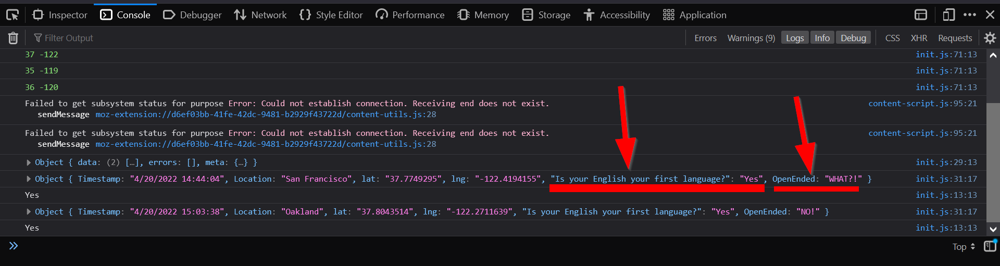
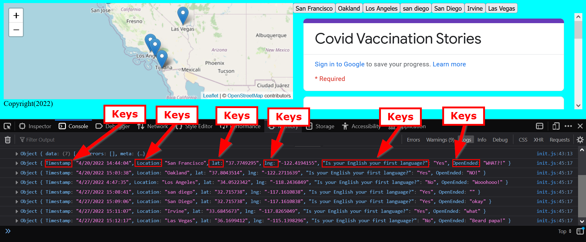
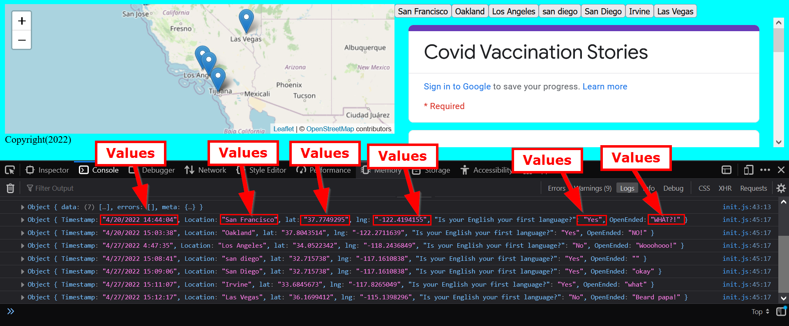

# Getting our data in place!

Go ahead and start the live server to make sure that the code is up and running. In Firefox, open up the `Debug Console` (++right-button++ then click ==inspect element== OR press ++f12++) and click on the array from last week:

{: style="max-width:500px"}

Remember that in an JSON object, `keys` are essentially the **field names**:
{: style="max-width:500px"}

And `values` are the **contents**:
{: style="max-width:500px"}

Remember to access a value, you have to access the `object` and then the `key` using `.` **dot notation** or the `['name of field']` **bracket notation**.

For example, last lab when we wanted the `lat` data, we used `data.lat`:

`#!js addMarker(data.lat,data.lng,data['What zip code do you live in?'],data['Have you been vaccinated?'])`

## Prepping the `div`s

## 🏃Warm-up: Add a `div` for the survey

Before we do anything to new, let's move our survey into its own `div`!

??? done "Answer"
    ```html title="index.html" hl_lines="2 4"
        <div id="contents">
            <div id="theSurvey">
                <iframe src="https://docs.google.com/forms/d/e/1FAIpQLScD0IOr_U4r0q4HlBkZ7olkA5OJpgInePF8DQbIrIWDeTm1jw/viewform?embedded=true" width="640" height="720" frameborder="0" marginheight="0" marginwidth="0">Loading…</iframe> 
            </div>
        </div>
    ```

Let's also change the `height` and `width` to `100%` so the `iframe` can finally follow our CSS rules!

```html 

<iframe src="https://docs.google.com/forms/d/e/1FAIpQLScD0IOr_U4r0q4HlBkZ7olkA5OJpgInePF8DQbIrIWDeTm1jw/viewform?embedded=true" width="100%" height="100%" frameborder="0" marginheight="0" marginwidth="0">Loading…</iframe>

```

With the survey in its own `div` now, we can then add a `<div>` for our new content:

```html title="index.html" hl_lines="2"
        <div id="contents">
            <div id="placeForButtons">
            <div id="theSurvey">
                <iframe src="https://docs.google.com/forms/d/e/1FAIpQLScD0IOr_U4r0q4HlBkZ7olkA5OJpgInePF8DQbIrIWDeTm1jw/viewform?embedded=true" width="100%" height="100%" frameborder="0" marginheight="0" marginwidth="0">Loading…</iframe>
            </div>
        </div>
```

## Adding a `function` again?

Now, let's look at the `location` key. We probably want to add the locations to our contents to see what locations or showing up, as some people might put the same location more than twice! 

We probably want to make buttons from these locations soooo....

### Warm-up question: Create buttons (call-back to lab #2)!!

!!! question "Question"
    Which line should we put this create buttons function:
    `createButtons(lat,lng,location);`

??? done "Answers"
    It should go in our `addMarker()` function! So that when we add markers, the `buttons` are added afterwards!

Add the line for the `createButton()` function in our JavaScript file:

```js title="js/init.js"
function addMarker(lat,lng,title,message){
    // console.log(message)
    L.marker([lat,lng]).addTo(map).bindPopup(`<h2>${title}</h2> <h3>${message}</h3>`)
    createButtons(lat,lng,location)
    return message
}
```

## Refactor the `addMarker()`

Notice how the `addMarker()` has a lot of parameters now? Like, 4? That's quite a lot, and will be harder to manage if we want to add more. 

So, let's pass in the whole `Object` instead of pieces of the object like so:
`addMarker(data)`

Before proceeding to the exercise make sure your `addMarker()` call looks like the following inside the `processData()` function:

```js title="js/init.js" hl_lines="5"
function processData(results){
    console.log(results)
    results.data.forEach(data => {
        console.log(data)
        addMarker(data)
    })
}
```

### ⚽In-class Exercise #1 - Refactor the `addMarker()` function

We are refactoring the `addMarker()` function during our loop to take in the whole object as a parameter. How might we re-write our `addMaker()` function to take in the object? 

!!! tldr "Tasks"
    1. Re-write the `addMarker()` function to take in the data object from the `forEach()` loop.

??? done "Answer"
    ```js title="js/init.js"
    function addMarker(data){
        // console.log(data['What zip code do you live in?'])
        L.marker([data.lat,data.lng]).addTo(map).bindPopup(`<h2>${data['What zip code do you live in?']}</h2> <h3>${data['Have you been vaccinated?']}</h3>`)
        createButtons(data.lat,data.lng,data['What zip code do you live in?'])
        return data['What zip code do you live in?']
    }
    ```

!!! danger "Important note!"
    
    1. Make sure you changed the `return message` line in the end of the function, otherwise it will break since it `message` is not defined anywhere!

    2. Make sure we use `data` object! Which means making sure we use the `object` + `.` + `key` format.

### Reminder about accessing `object-keys` again

Remember, since our data is being stored in an object, the `createButton()` function should look like this:

```js
createButtons(data.lat,data.lng,data['What zip code do you live in?'])
```

> - Where we are accessing the `data` `object`'s `lat`, `lng`, and `location`. 

!!! danger "Note"
    Your ==`keys==` **MUST** always match your data ==`object`==, you can use the console to check!!
    
    For example: If your survey spreadsheet has `latitude` instead of `lat` then the you MUST use `data.latitude`

And now, just like in lab 3, we are going to add buttons!

Here's the `createButton()` from lab 3:

``` js
function createButtons(lat,lng,title){
    const newButton = document.createElement("button"); // adds a new button
    newButton.id = "button"+title; // gives the button a unique id
    newButton.innerHTML = title; // gives the button a title
    newButton.setAttribute("lat",lat); // sets the latitude 
    newButton.setAttribute("lng",lng); // sets the longitude 
    newButton.addEventListener('click', function(){
        map.flyTo([lat,lng]); //this is the flyTo from Leaflet
    })
    document.body.appendChild(newButton); //this adds the button to our page.
}
```

Wait.. it didn't work? Well, that's because we have to tweak a few things...

 1. Next we need to change the `document.body.appendChild(newButton)` to use the `div` that we created earlier!


## Adding buttons to our `div`

To address the second issue of targeting our `div`, we need to utilize the JavaScript method of selecting Elements called:

`getElementById()`

[Learn more about `getElementById()`](https://developer.mozilla.org/en-US/docs/Web/API/Document/getElementById)

Just running the method doesn't do anything, so we need to store it in a variable:

```js
const spaceForButtons = document.getElementById('placeForButtons')
```

Remember the `appendChild()` that adds content?
We will use that method to add our button to our `spaceForButtons` variable that specifies the `div`:

```js
spaceForButtons.appendChild(newButton);
```

The final `createButtons()` and `addMarker()` functions should look like this:


``` js
function addMarker(data){
        // console.log(data)
        // these are the names of our lat/long fields in the google sheets:

        
        L.marker([data.lat,data.lng]).addTo(map).bindPopup(`<h2>${data['What zip code do you live in?']}</h2> <h3>${data['Have you been vaccinated?']}</h3>`)
        // adding our create button function
        createButtons(data.lat,data.lng,data['What zip code do you live in?'])
        return data['What zip code do you live in?']
}

function createButtons(lat,lng,title){
    const newButton = document.createElement("button"); // adds a new button
    newButton.id = "button"+title; // gives the button a unique id
    newButton.innerHTML = title; // gives the button a title
    newButton.setAttribute("lat",lat); // sets the latitude 
    newButton.setAttribute("lng",lng); // sets the longitude 
    newButton.addEventListener('click', function(){
        map.flyTo([lat,lng]); //this is the flyTo from Leaflet
    })
    const spaceForButtons = document.getElementById('placeForButtons')
    spaceForButtons.appendChild(newButton);//this adds the button to our page.
}
```

Horrah!! 

### Our current HTML structure

Here's a quick schematic of our HTML and CSS:

``` ascii
HTML
  └BODY
     └.main
        ├#contents
        │    ├#placeForButtons
        │    └#survey
        └#the_map
```

Check to see if your JavaScript and HTML code is similar to the following before moving on.

### 🏁Check point

```js title="js/init.js" linenums="1" hl_lines="14 15 19-30 46"
// declare variables
let mapOptions = {'center': [34.0709,-118.444],'zoom':5}

// use the variables
const map = L.map('the_map').setView(mapOptions.center, mapOptions.zoom);

L.tileLayer('https://{s}.tile.openstreetmap.org/{z}/{x}/{y}.png', {
    attribution: '&copy; <a href="https://www.openstreetmap.org/copyright">OpenStreetMap</a> contributors'
}).addTo(map);

function addMarker(data){
    // console.log(data)
    // these are the names of our lat/long fields in the google sheets:
    L.marker([data.lat,data.lng]).addTo(map).bindPopup(`<h2>${data['What zip code do you live in?']}</h2> <h3>${data['Have you been vaccinated?']}</h3>`)
    createButtons(data.lat,data.lng,data['What zip code do you live in?'])
    return
}

function createButtons(lat,lng,title){
    const newButton = document.createElement("button"); // adds a new button
    newButton.id = "button"+title; // gives the button a unique id
    newButton.innerHTML = title; // gives the button a title
    newButton.setAttribute("lat",lat); // sets the latitude 
    newButton.setAttribute("lng",lng); // sets the longitude 
    newButton.addEventListener('click', function(){
        map.flyTo([lat,lng]); //this is the flyTo from Leaflet
    })
    const spaceForButtons = document.getElementById('placeForButtons')
    spaceForButtons.appendChild(newButton);//this adds the button to our page.
}

const dataUrl = "https://docs.google.com/spreadsheets/d/e/2PACX-1vSNq8_prhrSwK3CnY2pPptqMyGvc23Ckc5MCuGMMKljW-dDy6yq6j7XAT4m6GG69CISbD6kfBF0-ypS/pub?output=csv"

function loadData(url){
    Papa.parse(url, {
        header: true,
        download: true,
        complete: results => processData(results)
    })
}

function processData(results){
    console.log(results)
    results.data.forEach(data => {
        console.log(data)
        addMarker(data)
    })
}

loadData(dataUrl)
```

```html title="index.html" linenums="1" hl_lines="25"
<!DOCTYPE html>
<html>
    <head>
        <title>Lab 6</title>
        <!-- hint: remember to change your page title! -->
        <meta charset="utf-8" />
        <link rel="shortcut icon" href="#">
        <link rel="stylesheet" href="styles/style.css">

        <!-- Leaflet's css-->
        <link rel="stylesheet" href="https://unpkg.com/leaflet@1.7.1/dist/leaflet.css" />

        <!-- Leaflet's JavaScript-->
        <script src="https://unpkg.com/leaflet@1.7.1/dist/leaflet.js"></script>

        <!-- Papa Parse -->
        <script src="https://cdnjs.cloudflare.com/ajax/libs/PapaParse/5.3.0/papaparse.min.js"></script>
    </head>

    <body>
        <header>
            <!-- space for a menu -->
        </header>

        <div class="main">
            <div id="contents">
                <div id="placeForButtons">
                <div id="theSurvey">
                    <iframe src="https://docs.google.com/forms/d/e/1FAIpQLScD0IOr_U4r0q4HlBkZ7olkA5OJpgInePF8DQbIrIWDeTm1jw/viewform?embedded=true" width="100%" height="100%" frameborder="0" marginheight="0" marginwidth="0">Loading…</iframe>
                </div>
            </div>
            <div id="the_map"></div>
        </div>
        <div id="footer">
            Copyright(2022)
        </div>
        <script src="js/init.js"></script>
    </body>
</html>
```