# CSS Grid time!

Ok, now that we got the buttons working, notice how they appear at the top?

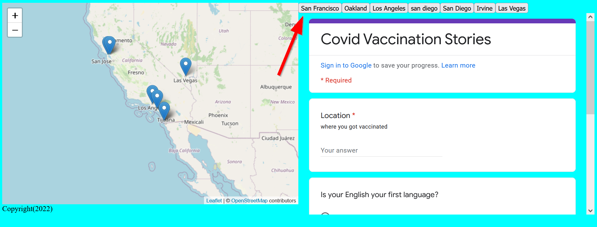{: style="max-width:500px"}

This is because we don't have a place for them in our CSS Grid yet!

So time to style our page and make it more presentable!

Open up our `style.css` and find the `main` **class** selector, `.main`:

```css title="styles/style.css"
.main{
    grid-area: main_content;
    grid-template-columns: 1fr 1fr;
    grid-template-areas: "main_map content";
    display: grid;
}    
```

Because our `div` sits within the `content` area we should find the the `grid-area` named ==`content`==. 

Notice that we  `#contents` only has one property, which is the `grid-area: content;`

```css title="styles/style.css" hl_lines="3"
#contents{
    grid-area: content;
}
```

!!! info "Who defines `grid-area` names?"
    We do! `grid-areas` are just names for areas we decided for ourselves. If you don't use `grid-areas`, you can also reference grids by row and column, like `grid-area: 1/2` would be grid row #1 and column #2. If 4 grid line values are provided, then `grid-area` treats them as the following: 
        1. the first value is `grid-row-start`, what row should this `grid-area` start in
        2. the second value is `grid-column-start`, what column should this `grid-area` start in
        3. the third value is `grid-row-end`, when should this row end.
        4. the fourth value is `grid-column-end`, when should this column end.

    Ex: grid-area: 2 / 1 / 2 / 1

Now that we found the parent box, `contents`, we need to enable the power of CSS grid in this `div`, so we have to add the `display: grid;` css property:

```css title="styles/style.css" hl_lines="3"
#contents{
    grid-area: content;
    display: grid;
}
```

Take note of the `theSurvey` selector, which is within the `.main` class but not affected by the `contents` div, since it sits above it:

```css
#theSurvey{
    height:80vh;
    grid-area: main_map;
}
```

Recall the schematic of our HTML and CSS:

``` ascii
HTML
  └BODY
     └.main
        ├#contents
        │    ├#placeForButtons
        │    └#theSurvey
        └#the_map
```

Wait a second... There's something missing in our CSS file according to that schematic... Do you know what it is?

Our poor `placeForButtons` and `theSurvey` doesn't have a selector!

Let's fix it by adding a CSS selector for them and a `grid-area: buttonHome`:

```css
#theSurvey{
    grid-area: survey; /* (1)! */
}

#placeForButtons{
    grid-area: buttonHome; /* (2)! */
}

```

1.        `grid-area` gives the name to our area `survey`
2.        `grid-area` gives the name to our area `buttonHome`

`grid-area` gives the `#placeForButtons` selector the name `buttonHome` that we will use in the `grid-template-areas`.

## Assgining Grid-Template Areas

Go back to the `contents` selector add these two css properties:
    1. `grid-template-rows`
    2. `grid-template-areas`
Set grid`template-rows` to 1fr 3fr if you want a bigger space for buttons and set the `grid-template-areas`'s value to `"survey" "buttonHome"`, which is the names we assigned above and the space between them `" "` makes the `survey` and `buttonHome` on seperate rows:

!!! danger "Space ` ` between `grid-template-areas`"
    Make sure you add a space and `"` between the two `grid-template-areas`!! If you fail to do so, then it will be treated as 1 row!! 

    To recap with `grid-template-areas`: 
        `"item-one item-two"` - one row, two columns.
        `"item-one" "item-two"` - two rows, one column.
        `"item-one item-one" "item-two item-three"` - two rows, two columns, and item-one spans two rows!

```css
#contents{
    display: grid;
    grid-template-rows: 1fr 3fr; 
    grid-template-areas: "survey" "buttonHome"
}
```
Try flipping `survey` and `buttonHome` in the `property value`, what happens?

??? done "Answer"

    The survey showed up on the right-side! Being able to change layouts on-the-fly demonstrates the power of CSS Grid!

Because it makes sense for the buttons to go ontop, let's keep the layout as `grid-template-areas: "buttonHome survey"`:

```css
#contents{
    grid-area: content; /* (1)! */
    display: grid;/* (2)! */
    grid-template-rows: 1fr 3fr;/* (3)! */ 
    grid-template-areas: "buttonHome" "survey"/* (4)! */
}
```

1.        `grid-area` gives the name to our area `content` which is used in the `.main` class's `grid.
2.        This enables `css-grid` in this ==`contents`== `div`.
3.        This sets two rows, one being 25% ontop and 75% below. You can customize this as you'd like with `fr` or `%` or `px` units.
4.        This allows us to tell `css-grid` to put the content in the right place.

## CSS Grid Debugging in Firefox

!!! warning "Untested in Chrome or Safari"
    `CSS grid` is relatively new in Chrome or Safari, so I am not sure how robust the debugging is. I highly recommend using Firefox to troubleshoot `CSS grid`.

In Firefox inside of your webpage, ++right-button++ right click then click on `Inspect Element` and make sure you are on the ==`Inspector`==:
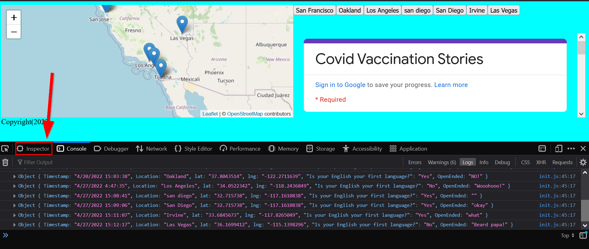{: style="max-width:500px"}

Click on `Layout`:
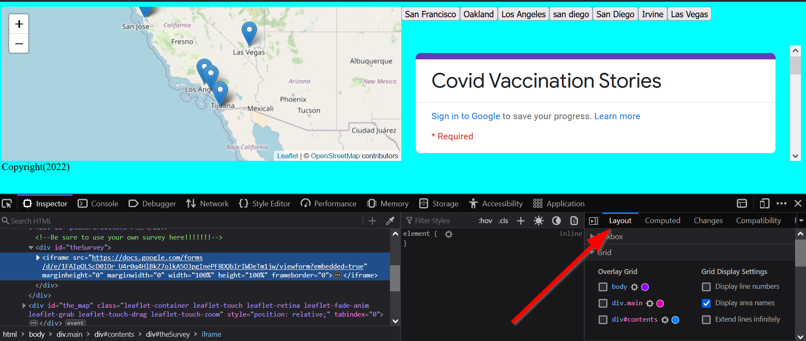{: style="max-width:500px"}

Look for `div#contents`

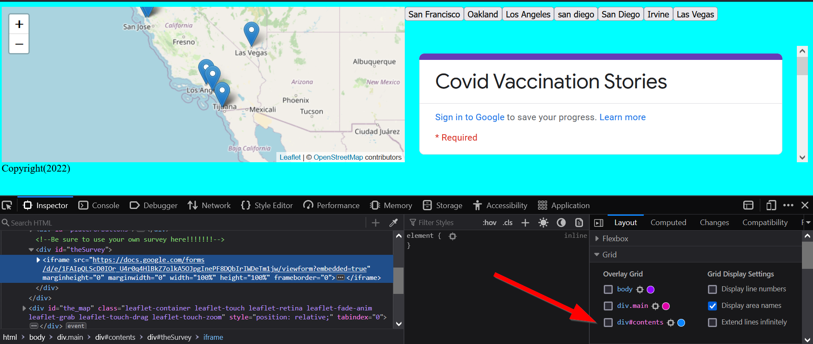{: style="max-width:500px"}

Then make sure `div#contents` and `display area names` are checked:

{: style="max-width:500px"}

You will notice that the names of the `grid areas` will display! Very very helpful when debugging CSS Grid!!!

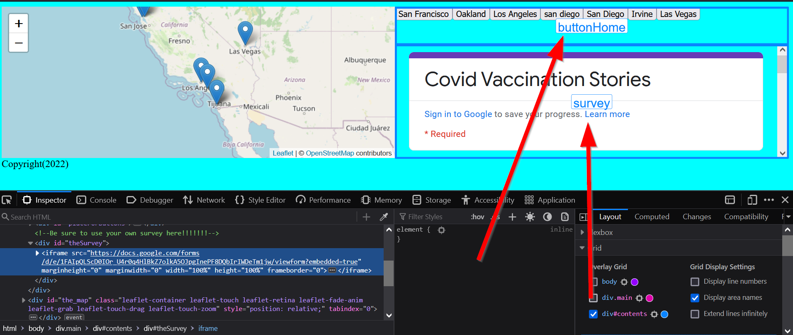{: style="max-width:500px"}

If you check the other `grid` containers like, `div.main`, you can see the multiple grids overlaying each other:

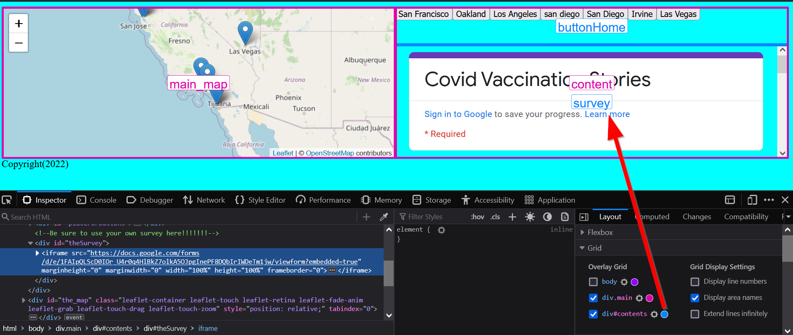{: style="max-width:500px"}

### Playing around with the inspector

If you click on an element with the `inspector` you can directly edit the CSS:

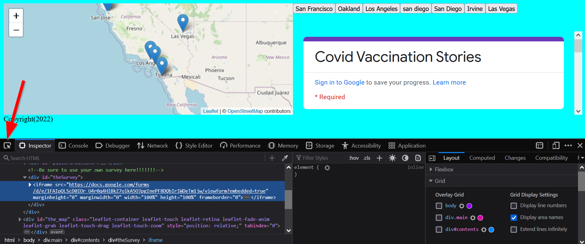{: style="max-width:500px"}

For example, clicking on the `placeForButtons` area allows you to see the CSS styles:
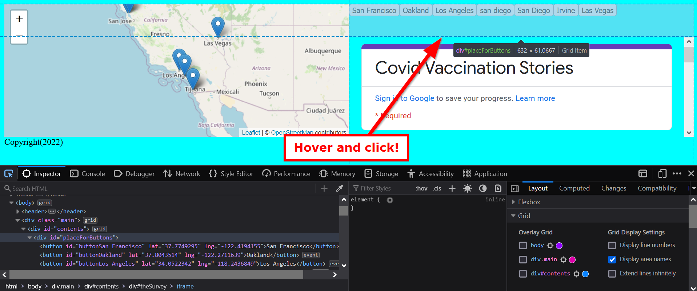{: style="max-width:500px"}

You can also use this to navigate up the HTML tree or find specific elements, like the `contents`:

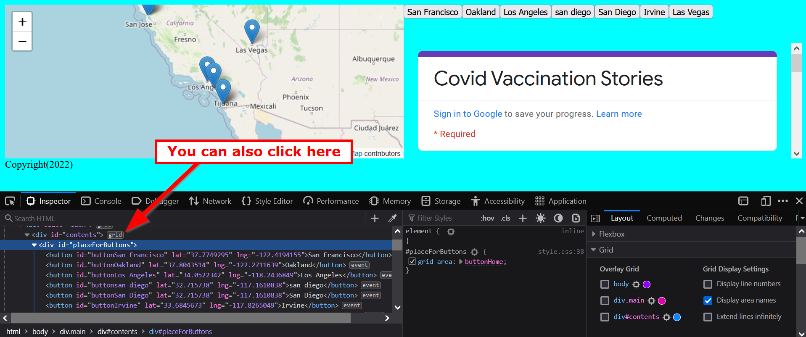{: style="max-width:500px"}

You can change the styles by editing this box:

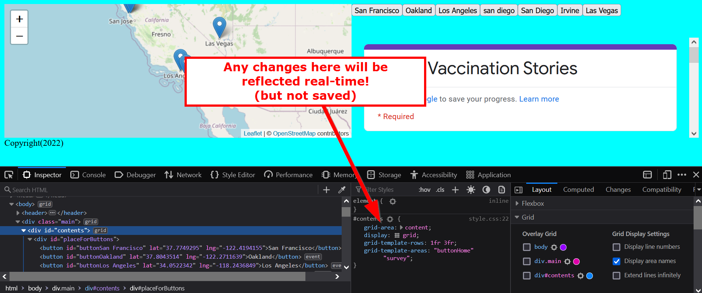{: style="max-width:500px"}

If you want to save these changes, you'll have to `right click` and `copy the rule`:
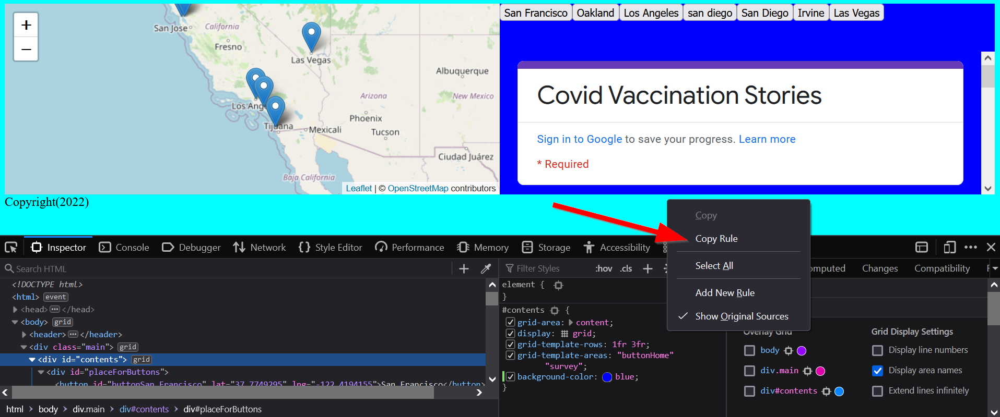{: style="max-width:500px"}

### 🏁Check point

Check to see if your CSS looks correct before moving on:

```css title="styles/style.css" linenums="1" hl_lines="25-27 35-41"
body{
    display: grid;
    grid-auto-rows: auto 1fr;
    grid-template-areas: "header" "main_content" "footer";
    background-color: aqua;
}

header{
    grid-area: header;
}

#footer{
    grid-area: footer;
}

.main{
    grid-area: main_content;
    grid-template-columns: 1fr 1fr;
    grid-template-areas: "main_map content";
    display: grid;
}
    
#contents{
    grid-area: content;
    display: grid;
    grid-template-rows: 1fr 3fr; 
    grid-template-areas: "buttonHome" "survey"
}

#the_map{
    height:80vh;
    grid-area: main_map;
}

#theSurvey{
    grid-area: survey; /* (1)! */
}

#placeForButtons{
    grid-area: buttonHome; /* (2)! */
}
```