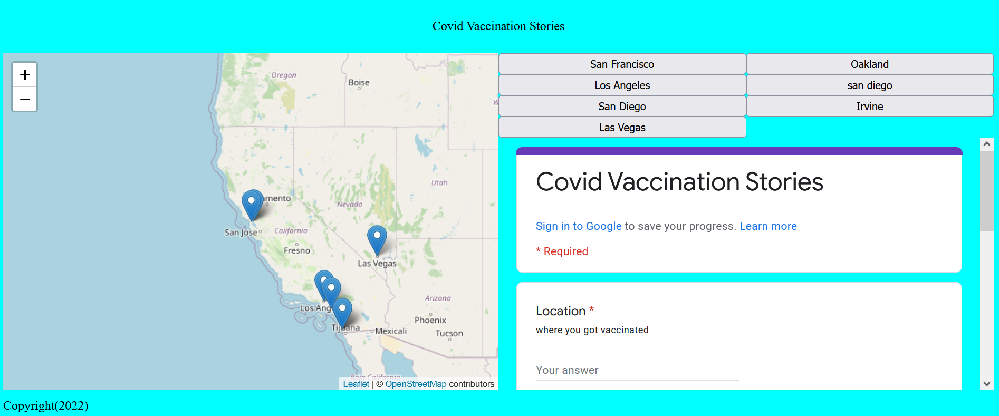

# Design DeCSSions

Adding the data from our survey into our mapplication!

{: style="max-width:300px"}

!!! tldr "Goals"
    - Add content from Google Form into a `div`
    - Use CSS Grid to change page layouts

Today's lab will cover how to put your data in other places besides just the map and work with CSS Grid layouts.

Start by creating a `week6` folder in your lab assignments repo.

!!! done "Get ahead start"
    If you finished `lab 5`, you can also copy the contents of your `week_5` folder and skip the following setup section.

## Starting template code for lab #6

```html title="index.html" linenums="1"
<!DOCTYPE html>
<html>
    <head>
        <title>Lab 6</title>
        <!-- hint: remember to change your page title! -->
        <meta charset="utf-8" />
        <link rel="shortcut icon" href="#">
        <link rel="stylesheet" href="styles/style.css">

        <!-- Leaflet's css-->
        <link rel="stylesheet" href="https://unpkg.com/leaflet@1.7.1/dist/leaflet.css" />

        <!-- Leaflet's JavaScript-->
        <script src="https://unpkg.com/leaflet@1.7.1/dist/leaflet.js"></script>

        <!-- Papa Parse -->
        <script src="https://cdnjs.cloudflare.com/ajax/libs/PapaParse/5.3.0/papaparse.min.js"></script>
    </head>

    <body>
        <header>
            <!-- space for a menu -->
        </header>

        <div class="main">
            <div id="contents">
                <!-- Be sure to use your own survey here!!!!!!! -->
                <iframe src="https://docs.google.com/forms/d/e/1FAIpQLSfcElv5dlXInR7XHQz27_OcYJlWcIUr-GBbc-ocefWlGd1uXg/viewform?embedded=true" width="640" height="475" frameborder="0" marginheight="0" marginwidth="0">Loading…</iframe>

            </div>
            <div id="the_map"></div>
        </div>
        <div id="footer">
            Copyright(2023)
        </div>
        <script src="js/init.js"></script>
    </body>
</html>
```

```js title="js/init.js" linenums="1"
// declare variables
let mapOptions = {'center': [34.0709,-118.444],'zoom':5}

// use the variables
const map = L.map('the_map').setView(mapOptions.center, mapOptions.zoom);

L.tileLayer('https://{s}.tile.openstreetmap.org/{z}/{x}/{y}.png', {
    attribution: '&copy; <a href="https://www.openstreetmap.org/copyright">OpenStreetMap</a> contributors'
}).addTo(map);

// create a function to add markers
function addMarker(lat,lng,title,message){
    console.log(message)
    L.marker([lat,lng]).addTo(map).bindPopup(`<h2>${title}</h2> <h3>${message}</h3>`)
    return message
}

const dataUrl = "https://docs.google.com/spreadsheets/d/e/2PACX-1vSNq8_prhrSwK3CnY2pPptqMyGvc23Ckc5MCuGMMKljW-dDy6yq6j7XAT4m6GG69CISbD6kfBF0-ypS/pub?output=csv"

function loadData(url){
    Papa.parse(url, {
        header: true,
        download: true,
        complete: results => processData(results)
    })
}

function processData(results){
    console.log(results)
    results.data.forEach(data => {
        console.log(data)
        addMarker(data.lat,data.lng,data['Where did you get vaccinated?'],data['Have you been vaccinated?'])
    })
}

loadData(dataUrl)
```

```css title="styles/style.css" linenums="1"
body{
    display: grid;
    grid-auto-rows: auto 1fr;
    grid-template-areas: "header" "main_content" "footer";
    background-color: aqua;
}

header{
    grid-area: header;
}

#footer{
    grid-area: footer;
}

.main{
    grid-area: main_content;
    grid-template-columns: 1fr 1fr;
    grid-template-areas: "main_map content";
    display: grid;
}

#contents{
    grid-area: content;
}

#the_map{
    height:80vh;
    grid-area: main_map;
}
```
