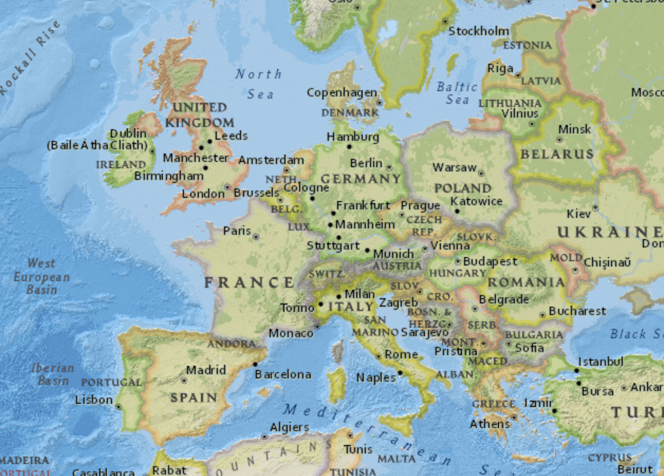
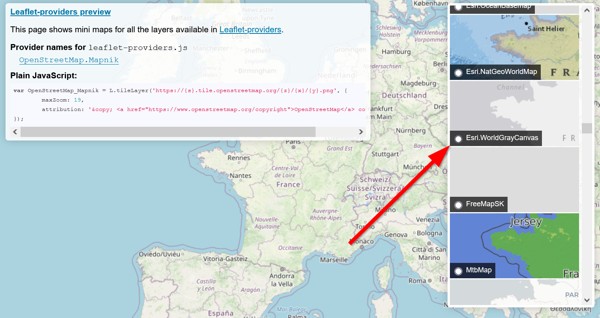

# Changing basemaps

Phew! That was a lot to go over! But now you should take sometime to think about the design choices we have to make as map makers. One important consideration is deciding on which basemap to use.

Recall the code here:

```js
L.tileLayer('https://{s}.tile.openstreetmap.org/{z}/{x}/{y}.png', {
    attribution: '&copy; <a href="https://www.openstreetmap.org/copyright">OpenStreetMap</a> contributors'
}).addTo(map);
```

## Explore basemap options

Go to:

- https://leaflet-extras.github.io/leaflet-providers/preview/

And pick a basemap that you like, a simple basemap with few colors is always preferred over a **busy** basemap:

**Busy**



**Less busy**


!!! danger "API Keys"
    Some may require an API Key and even try to charge you for views, it is recommend to avoid them if they do so, but you can learn more here on how to sign-up and use an API Key for the different Providers: [https://github.com/leaflet-extras/leaflet-providers#providers](https://github.com/leaflet-extras/leaflet-providers#providers)

Click on the basemap you prefer:




### Copy the basemap code

Copy the `Plain JavaScript` in the middle:


## Adding the basemap

And put the code after `#!js const map` delcaration in your `js/init.js` file:

```js title="js/init.js" hl_lines="3-8"
const map = L.map('the_map').setView(mapOptions.center, mapOptions.zoom);

let Esri_WorldGrayCanvas = L.tileLayer('https://server.arcgisonline.com/ArcGIS/rest/services/Canvas/World_Light_Gray_Base/MapServer/tile/{z}/{y}/{x}', {
	attribution: 'Tiles &copy; Esri &mdash; Esri, DeLorme, NAVTEQ',
	maxZoom: 16
});

Esri_WorldGrayCanvas.addTo(map)

// add layer control box
L.control.layers(null,layers).addTo(map)

L.tileLayer('https://{s}.tile.openstreetmap.org/{z}/{x}/{y}.png', {
    attribution: '&copy; <a href="https://www.openstreetmap.org/copyright">OpenStreetMap</a> contributors'
}).addTo(map);

```

Change the `var` to `let` and be sure to add the `variable` to your map, like so:

``` js title="js/init.js" hl_lines="3 13-15"
const map = L.map('the_map').setView(mapOptions.center, mapOptions.zoom);

let Esri_WorldGrayCanvas = L.tileLayer('https://server.arcgisonline.com/ArcGIS/rest/services/Canvas/World_Light_Gray_Base/MapServer/tile/{z}/{y}/{x}', {
	attribution: 'Tiles &copy; Esri &mdash; Esri, DeLorme, NAVTEQ',
	maxZoom: 16
});

Esri_WorldGrayCanvas.addTo(map)

// add layer control box
L.control.layers(null,layers).addTo(map)

// L.tileLayer('https://{s}.tile.openstreetmap.org/{z}/{x}/{y}.png', {
//     attribution: '&copy; <a href="https://www.openstreetmap.org/copyright">OpenStreetMap</a> contributors'
// }).addTo(map);

```

Be sure to delete or comment out the other basemap, as you don't need two basemaps!

## 🏁Final check point

```js title="js/init.js" linenums="1" hl_lines="24-29 34-36"
// declare variables
let mapOptions = {'center': [34.0709,-118.444],'zoom':5}

let vaccinated = L.featureGroup();
let nonVaccinated = L.featureGroup();

let layers = {
	"Vaccinated Respondent": vaccinated,
	"Unvaccinated Respondent": nonVaccinated
}

let circleOptions = {
    radius: 4,
    fillColor: "#ff7800",
    color: "#000",
    weight: 1,
    opacity: 1,
    fillOpacity: 0.8
}

const dataUrl = "https://docs.google.com/spreadsheets/d/e/2PACX-1vS2WyfKTyZJ-_ja3GGrxoAXwranavyDGXYsxeFUO4nvHpCJrkKhChymXQqUEyhdGLnz9VN6BJv5tOjp/pub?gid=1560504149&single=true&output=csv"

// define the leaflet map
const map = L.map('the_map').setView(mapOptions.center, mapOptions.zoom);

// add layer control box
L.control.layers(null,layers).addTo(map)

let Esri_WorldGrayCanvas = L.tileLayer('https://server.arcgisonline.com/ArcGIS/rest/services/Canvas/World_Light_Gray_Base/MapServer/tile/{z}/{y}/{x}', {
	attribution: 'Tiles &copy; Esri &mdash; Esri, DeLorme, NAVTEQ',
	maxZoom: 16
});

Esri_WorldGrayCanvas.addTo(map);

function addMarker(data){
    if(data['Have you been vaccinated?'] == "Yes"){
        circleOptions.fillColor = "red"
        vaccinated.addLayer(L.circleMarker([data.lat,data.lng],circleOptions).bindPopup(`<h2>Vaccinated</h2>`))
        createButtons(data.lat,data.lng,data['Where did you get vaccinated?'])
        }
    else{
        circleOptions.fillColor = "blue"
        nonVaccinated.addLayer(L.circleMarker([data.lat,data.lng],circleOptions).bindPopup(`<h2>Non-Vaccinated</h2>`))
        createButtons(data.lat,data.lng,data['Where did you get vaccinated?'])
    }
    return data
}

function createButtons(lat,lng,title){
    const newButton = document.createElement("button"); // adds a new button
    newButton.id = "button"+title; // gives the button a unique id
    newButton.innerHTML = title; // gives the button a title
    newButton.setAttribute("lat",lat); // sets the latitude 
    newButton.setAttribute("lng",lng); // sets the longitude 
    newButton.addEventListener('click', function(){
        map.flyTo([lat,lng]); //this is the flyTo from Leaflet
    })
    const spaceForButtons = document.getElementById('placeForButtons')
    spaceForButtons.appendChild(newButton);//this adds the button to our page.
}

function loadData(url){
    Papa.parse(url, {
        header: true,
        download: true,
        complete: results => processData(results)
    })
}

function processData(results){
    console.log(results)
    results.data.forEach(data => {
        console.log(data)
        addMarker(data)
    })
    vaccinated.addTo(map) // add our layers after markers have been made
    nonVaccinated.addTo(map) // add our layers after markers have been made  
    let allLayers = L.featureGroup([vaccinated,nonVaccinated]);
    map.fitBounds(allLayers.getBounds());
}

loadData(dataUrl)


```

### Lab Assignment

Alright! Now you should be ready to take on the [lab assignment](../../assignments/week7/lab_assignment.md) for the week!

### Refactor Challenge

If you are up for an extra challenge, try to do the [refactoring challenge](refactor.md)!