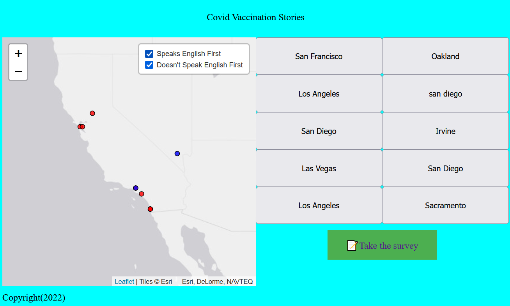

# ConditionALs, Map Layers, and Visual Design

Today we will focus on styling our map through the use of Leaflet [`Feature groups`](https://leafletjs.com/reference.html#featuregroup), which means more JavaScript!

`Feature groups` are like containers that you can use to group your map content. For this lab we will be creating two layers for our survey question of `"Is your English your first language?"`

One group will be for `yes` and another group for `no`.

{: style="max-width:300px"}

!!! tldr "Goals"
    - Use conditional statements to add content into Leaflet `FeatureGroups`
    - Use Leaflet's `circleMarkers` to visualize points
    - Change the basemap for our maps

## Lab outline

1. [Conditional statements in JavaScript](./1.md)
2. [Adding `L.featureGroups()` in our `addMarker()` function](./2.md)
3. [Adding `circleMarkers` to our map](./3.md)
4. [Changing the basemap](./4.md)

Start by creating a `week7` folder in your lab assignments repo.

!!! done "Get ahead start"
    If you finished `lab 6`, you can also copy the contents of your `week_6` folder and skip the following setup section.

## Starting template code for lab #7

```html title="index.html" linenums="1"
<!DOCTYPE html>
<html>
    <head>
        <title>Lab 6</title>
        <!-- hint: remember to change your page title! -->
        <meta charset="utf-8" />
        <link rel="shortcut icon" href="#">
        <link rel="stylesheet" href="styles/style.css">

        <!-- Leaflet's css-->
        <link rel="stylesheet" href="https://unpkg.com/leaflet@1.7.1/dist/leaflet.css" />

        <!-- Leaflet's JavaScript-->
        <script src="https://unpkg.com/leaflet@1.7.1/dist/leaflet.js"></script>

        <!-- Papa Parse -->
        <script src="https://cdnjs.cloudflare.com/ajax/libs/PapaParse/5.3.0/papaparse.min.js"></script>
    </head>

    <body>
        <header>
            Covid Vaccination Stories
        </header>

        <div class="main">
            <div id="contents">
                <div id="placeForButtons"></div>
                <!-- Be sure to use your own survey here!!!!!!! -->
                <div id="theSurvey">
                    <iframe src="https://docs.google.com/forms/d/e/1FAIpQLSfcElv5dlXInR7XHQz27_OcYJlWcIUr-GBbc-ocefWlGd1uXg/viewform?embedded=true" width="100%" height="100%" frameborder="0" marginheight="0" marginwidth="0">Loading…</iframe>
                </div>

            </div>
            <div id="the_map"></div>
        </div>
        <div id="footer">
            Copyright(2023)
        </div>
        <script src="js/init.js"></script>
    </body>
</html>
```

```js title="js/init.js" linenums="1"
// declare variables
let mapOptions = {'center': [34.0709,-118.444],'zoom':5}

// use the variables
const map = L.map('the_map').setView(mapOptions.center, mapOptions.zoom);

L.tileLayer('https://{s}.tile.openstreetmap.org/{z}/{x}/{y}.png', {
    attribution: '&copy; <a href="https://www.openstreetmap.org/copyright">OpenStreetMap</a> contributors'
}).addTo(map);

function addMarker(data){
    // console.log(data)
    // these are the names of our lat/long fields in the google sheets:
    L.marker([data.lat,data.lng]).addTo(map).bindPopup(`<h2>${data['Where did you get vaccinated?']}</h2> <h3>${data['Have you been vaccinated?']}</h3>`)
    createButtons(data.lat,data.lng,data['Where did you get vaccinated?'])
    return
}

function createButtons(lat,lng,title){
    const newButton = document.createElement("button"); // adds a new button
    newButton.id = "button"+title; // gives the button a unique id
    newButton.innerHTML = title; // gives the button a title
    newButton.setAttribute("lat",lat); // sets the latitude 
    newButton.setAttribute("lng",lng); // sets the longitude 
    newButton.addEventListener('click', function(){
        map.flyTo([lat,lng]); //this is the flyTo from Leaflet
    })
    const spaceForButtons = document.getElementById('placeForButtons')
    spaceForButtons.appendChild(newButton);//this adds the button to our page.
}

const dataUrl = "https://docs.google.com/spreadsheets/d/e/2PACX-1vSNq8_prhrSwK3CnY2pPptqMyGvc23Ckc5MCuGMMKljW-dDy6yq6j7XAT4m6GG69CISbD6kfBF0-ypS/pub?output=csv"

function loadData(url){
    Papa.parse(url, {
        header: true,
        download: true,
        complete: results => processData(results)
    })
}

function processData(results){
    console.log(results)
    results.data.forEach(data => {
        console.log(data)
        addMarker(data)
    })
}

loadData(dataUrl)
```

```css title="styles/style.css" linenums="1"
body{
    display: grid;
    grid-template-rows: 50px auto auto;
    grid-template-areas: "header" "main_content" "footer";
    background-color: aqua;
    gap: 10px;
}

header{
    grid-area: header;
    justify-self: center;
    align-self: center;
}

#footer{
    grid-area: footer;
}

.main{
    grid-area: main_content;
    grid-template-columns: 1fr 1fr;
    grid-template-areas: "main_map content";
    display: grid;
}
    
#contents{
    grid-area: content;
    display: grid;
    grid-template-rows: 1fr 3fr; 
    grid-template-areas: "buttonHome" "survey"
}

#the_map{
    height:80vh;
    grid-area: main_map;
}

#theSurvey{
    grid-area: survey;
}

#placeForButtons{
    grid-area: buttonHome;
    display:grid;
    grid-template-columns: repeat(2, 1fr);
}
```