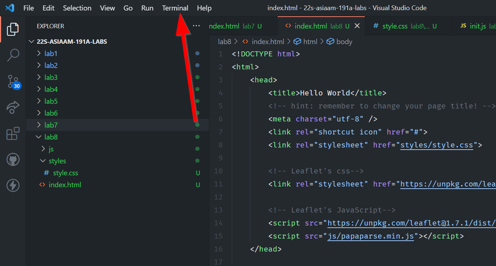

# Clone a new repo

We will be working with the terminal a bit today, so let's open up the terminal by going to the menu bar:



Then clicking on `New Terminal`:


Start by cloning this repo:

```
git clone https://github.com/albertkun/23S-ASIAAM-191A-Git-Practicing.git
```

!!! danger "Watch where you run terminal commands!"
    Make sure to note that where you run the terminal command is where the `git clone` will run and thus copy the folder into. DO NOT run this inside of another repository or you will create a lot of problems and break your git capabilities.
    
!!! note "Navigating the Terminal/Command Prompt"
    - To move up a directory use `cd ..`
    - To see what directory and files type in Mac/Linux: `ls` or Windows: `dir` 
    - To make a directory use `mkdir aNewFolderName`
    - To move into a directory use `cd aNewFolderName`


Here are the basic git commands for adding new changes:

```
git add .
git commit -am "message"
git push
```

These commands are identical to what we do in the source control tab in VS Code:


1. Is the `git add .`
2. Is the `git commit` with a `message`
3. Is the `git push`
