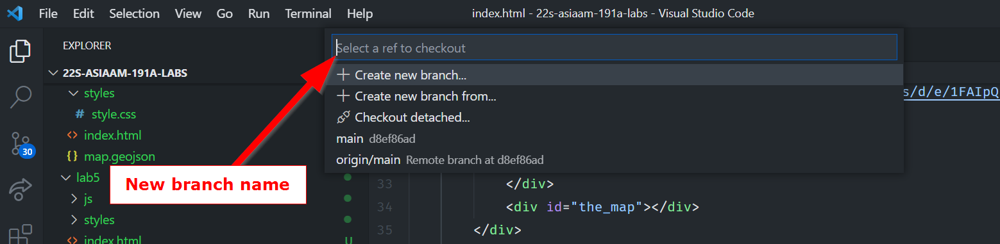

# Working with `branches`
## Making a new branch

```
git checkout -b helloNewBranch
```
This creates a branch called `helloNewBranch` and switches to it!

You can also make a new branch in VS Code by clicking this button:


You can then create a name for it



### `git add .` your changes to the new branch:
Make some changes and add them to the branch:
```
git add .
```

## Add a message to your commit
```
git commit -am "message"
```

## Push your changes to your new branch

This code creates a new branch called `helloNewBranch` on GitHub to push to:

```
git push --set-upstream origin helloNewBranch
```

You only need to run it when the branch DOES NOT exist on GitHub!!! After the branch is on GitHub, use only need to use `git push`:

```
git push
```
## Updating your branch
Sometimes you want to make sure your branch is up to date, so you can use the following command:
``` bash
git merge <branch_you_want_to_merge>
```
For example this command will `merge` content from `main` to the branch I am currently on:
``` bash
git merge main
```

However!!!

What happens when a `git push` affects in a file that was changed locally but someone else edited on GitHub?

[Refer to this medium post to learn more about git merges](https://medium.com/swlh/git-branching-and-merging-made-easy-f7dacd4aa75e)

## Merge Conflicts!!!

A `merge conflict` occurs when one file was changed in two places. For example, Person A edits line 1 of `readme.md` and `Person B` also edits line 1 of `readme.md`. A `git` doesn't know which changes to keep, so a person needs to take a look and manually `merge` them.

First, do a `git pull` which will check if you are behind a commit:

``` bash
git pull
```

When your commit is behind, you may receive this message:

``` bash
error: Your local changes to the following files would be overwritten by merge:
        **SOME FILE(S)**
Please commit your changes or stash them before you merge.
Aborting
Updating 6ac38e2..4dbc13c
```

Do a git commit:

``` bash
git add .
git commit -am "message"
git push
```

After you try to push, this message should pop-up:

``` bash
error: failed to push some refs to 'https://github.com/albertkun/23S-ASIAAM-191A-Git-Practicing.git'
hint: Updates were rejected because the tip of your current branch is behind
hint: its remote counterpart. Integrate the remote changes (e.g.
hint: 'git pull ...') before pushing again.
hint: See the 'Note about fast-forwards' in 'git push --help' for details.```
```

Run another `git pull`

``` bash
git pull
```

If files didn't change at the same time, then auto-merging could take place.

Then proceed to push as normal:

``` bash
git push
```

If files did change at the same time, you have to choose which version to keep:


After choosing an option, you can can push as normal:

```
git push
```

With a better understanding of `branches` and `merge conflicts`, now we can go ahead and test some new features without worrying about blowing up our repository!