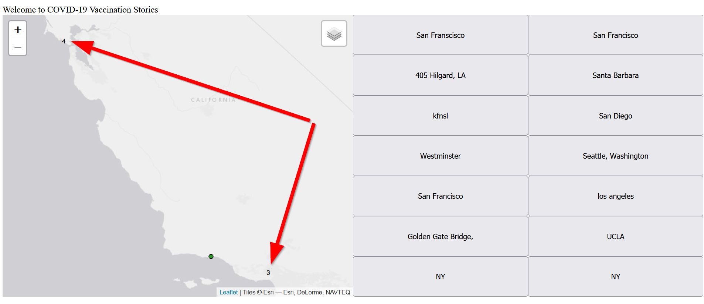
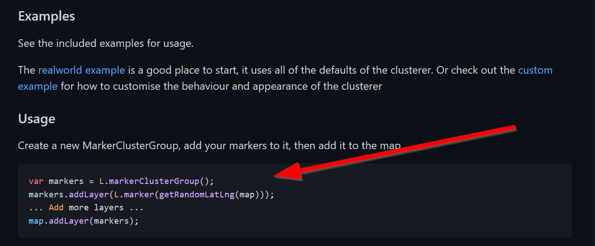

# Adding a new Leaflet JavaScript Plugin

The optional part of the previous lab was to change the basemap. 

Taking that one step further we can add brand-new functionality to our maps.

While the [Leaflet provider](https://leaflet-extras.github.io/leaflet-providers/preview/) is a plug-in of basemaps for Leaflet, there are many plugins that we can use to add extra functionality to our mapplication in JavaScript as well.
Here are some examples:

## Visualizations
- [Turf.js](turfjs.org/)
- [Charts](https://www.chartjs.org/docs/latest/samples/bar/vertical.html)

## Functions
- [Scrollama](https://russellgoldenberg.github.io/scrollama/sticky-side/)

## Leaflet Related
- [Leaflet Plugins](https://leafletjs.com/plugins.html)
- [Leaflet Cluster Markers](https://github.com/Leaflet/Leaflet.markercluster)

To keep things simple, we will add a cluster marker functionality to our Leaflet map. Clustering makes it easier to see when multiple points are in the same area.

With just a few changes our map will look as follows:


As with when we first used Leaflet we need to include the library, so in our html add the following lines:
>index.html
```html
        <!-- Cluster Marker's CSS -->
        <link rel="stylesheet" href="https://unpkg.com/leaflet.markercluster@1.4.1/dist/MarkerCluster.css" />
        <!-- Cluster Marker's JavaScript -->
        <script src="https://unpkg.com/leaflet.markercluster@1.4.1/dist/leaflet.markercluster.js"></script>
```

Next, let's read the documentation on how to use the `cluster maker`:



Judging from this code, we might be able to simply change our group layers for the markers!

Head over to our `init.js` file and find the following lines for our group layers:

```js title="js/init.js" linenums="1"
let vaccinated = L.featureGroup();
let nonVaccinated = L.featureGroup();
```

Change it to:

```js title="js/init.js" linenums="1"
let vaccinated = L.markerClusterGroup();
let nonVaccinated = L.markerClusterGroup();
```

And... wow that's it!

This flexibility is what makes opensource tools and plugins so great! However, be warned that not all plugins will be as simple to plug and play.

Congrats!

After you've made this change the time has come to make a pull request!