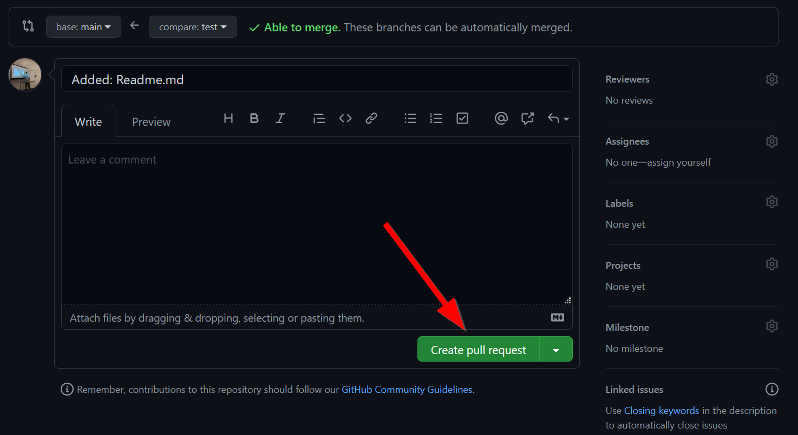
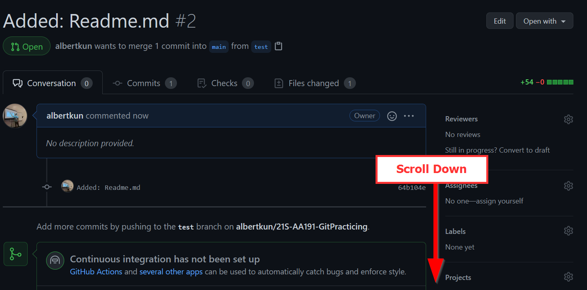
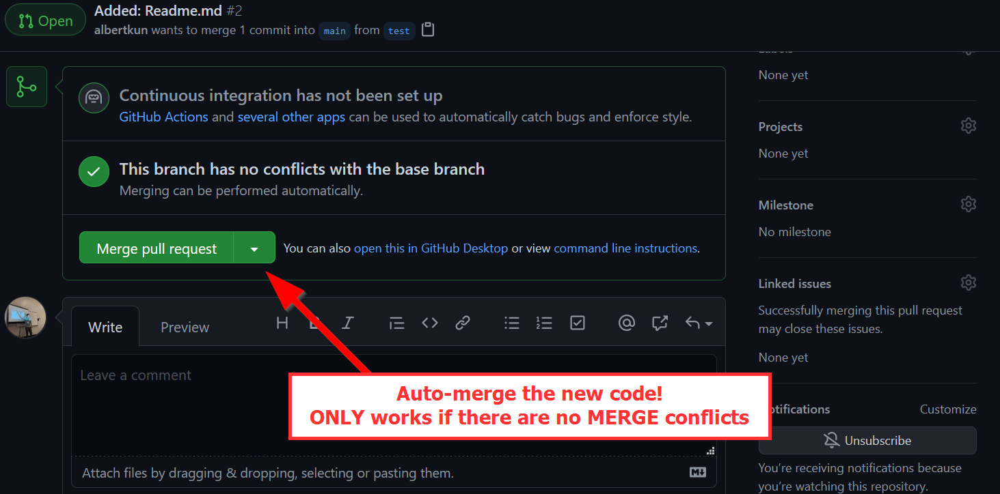
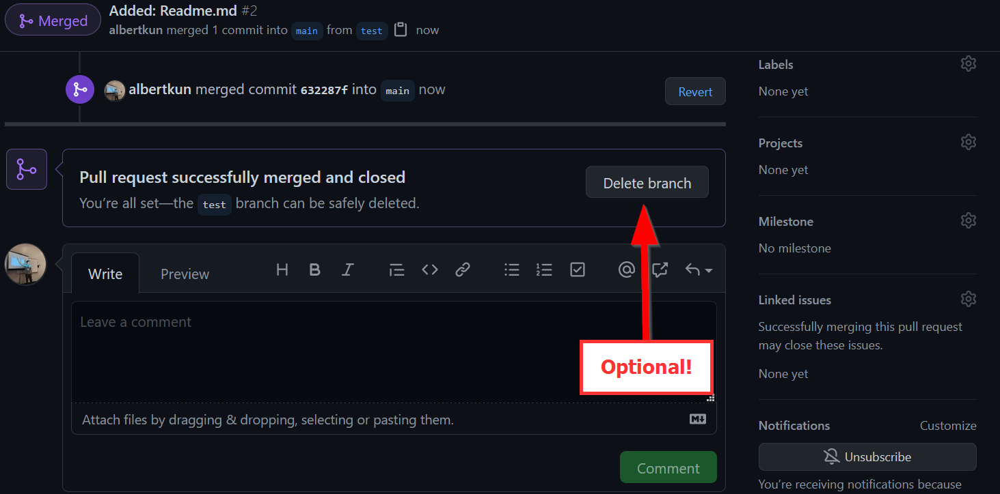
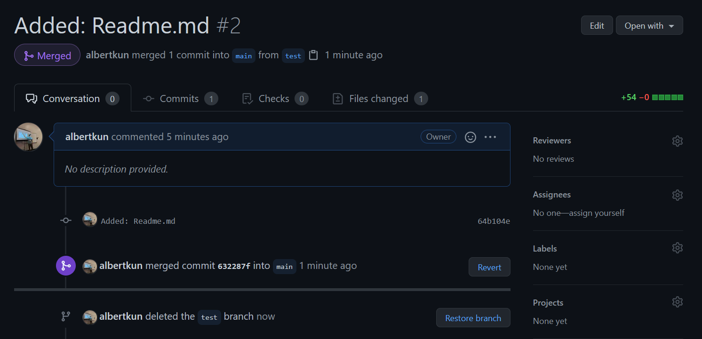

# Pull Requests on GitHub

On GitHub you may have seen this nagging icon a few times by now:

You will then be greeted by a new page where you can title, assign, comment, etc. about the pull request (or PR):

 and most importantly create a `pull request`:

After clicking the button to `create a new pull request` scroll down to the resulting page:

You should be able to click on `merge` if your `pull request` has no `merge conflicts`:

Click to `confirm` the auto merge:

And now you can delete the branch:

## Warning: Merge Conflicts do not allow you to auto-merge a Pull Request!

!!! danger "Warning! Merge Conflicts pvrevent auto-merges of a Pull Request!"
    You will be unable to `auto-merge` if there is a merge conflict, so refer to the `merge-conflict` steps in order to finish the `pull request`.

## Completed Pull Request

Your completed pull request should look like the following:

