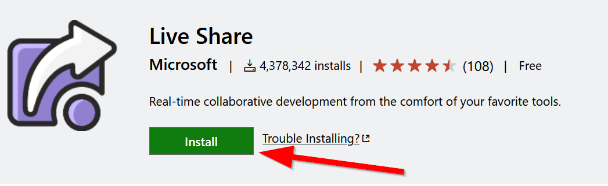
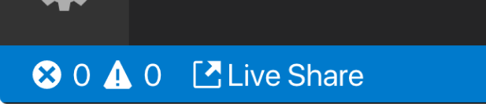

# `Live Share` The VS Code Plugin for Collaboration

Make sure you have installed the Live Share extension by going to the following link and clicking on "Install": 

>[https://marketplace.visualstudio.com/items?itemName=MS-vsliveshare.vsliveshare](https://marketplace.visualstudio.com/items?itemName=MS-vsliveshare.vsliveshare)

You can read the documentation to learn more about Live Share and what it does too:

>[https://docs.microsoft.com/en-us/visualstudio/liveshare/](https://docs.microsoft.com/en-us/visualstudio/liveshare/)

After installing Live Share, you can join a session with these steps:

## Joining a live share session

### 1. Click on the Join url

Click the session URL the **host** sent you, which will open it up in a browser. When prompted, allow your browser to launch VS Code

### 2. Sign in to GitHub

!!! help "Tip"
    This will only need be done once.

Click on the `Live Share` status bar item **or** press `Ctrl+Shift+P` / `Cmd+Shift+P` and select the `Live Share: Sign In With Browser` command.

### 3. Working the session

After you join, you'll be immediately presented with the file that the "host" has open, and can see their cursor and any edits they make.

### 4. Viewing a live server

If the **host** is sharing a live server of their website, you can view it on your local machine by clicking on the live share button:

Then you can click on any server under `Shared Servers`, such as `localhost:8000` to open it: 

## Hosting a live share session

!!! info "Live Server and Live Share"
    To make previewing content easier, always remember to start a `Live Server` before starting a `Live Server` session!

Click the "live share" button to immediately start sharing your coding session.

An invitation link will automatically be copied to your clip board, you can invite anyone to join your session by sharing it. 

You can join your own collaboration session by clicking the link yourself. open it in any browser to join your session.

## Saving Changes

The host can **commit** changes by clicking on the source control tab in VS Code when they are done with the session.

## 🏁Final Checkpoint

1. Make sure you have [live share](https://marketplace.visualstudio.com/items?itemName=MS-vsliveshare.vsliveshare) and [live server](https://marketplace.visualstudio.com/items?itemName=ritwickdey.LiveServer) installed to make collaboration easier.

2. Be sure to have made a pull request to the GitPracticing repo!

Congrats on finishing the lab! There is no assignment, so you can focus on the [Group Assignment #5](../../assignments/week7/group_assignment.md) due next week.