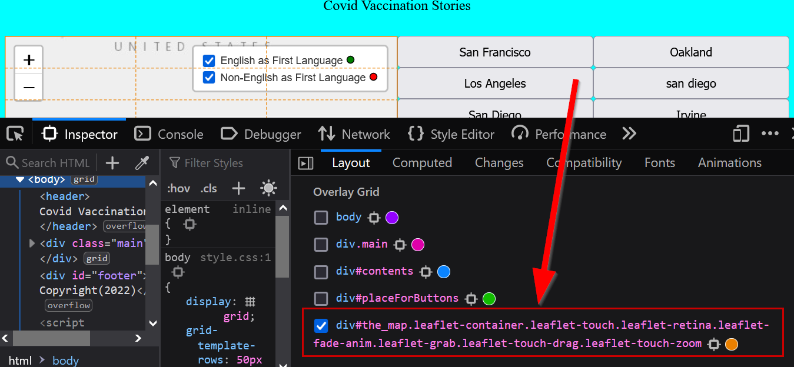
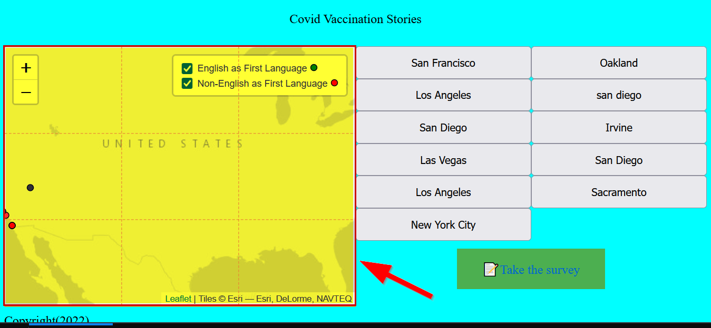

# Revisiting layouts with CSS Grid

Before we get into adding new plugins, CSS Grid is a powerful way to control how functionality relates to each other. Remember that the flexibility of grid helps to make sure that specific `rows` or `columns` are able to be targeted no matter what plugins we use.

Remember, anytime you see a `display: grid` in CSS, like the following:

```css
body{
    display: grid;
}
```

This means a `CSS grid` is in use there.

Anytime you see `grid-area` that means this HTML Element is within a grid container, for example:

```css
#the_map{
    height:80vh;
    grid-area: main_map;
    }
```

At this point, it may help to think of CSS grid as adding grid-lines to a piece of paper, where the piece of paper is our webpage, and grid-area is the content we wish to add to the grid. 

!!! note "`CSS Grid` vs. `flexbox`
    CSS Grid (Grid) is different from flexbox, which is another way to control the layout of content. flexbox only allows you to control "**rows**" or "**columns**" and is good for that. While Grid is good for controlling both "**rows**" and "**columns**". You can read more about the differences here in this 2017 CSS-tricks article: [https://css-tricks.com/css-grid-replace-flexbox/](https://css-tricks.com/css-grid-replace-flexbox/)

In order to put content that fits in our grid-lines we need to make sure the `html content` and `div`s that we want to be aligned are within the areas that the grid covers!

## Creating a CSS Grid Legend

Let's revisit our `index.html` and create a new `div` element on the map layer called with an id of `legend`:

```html title="index.html" linenums="34"
        <div id="the_map">
            <div id="legend">
            </div>
        </div>
```

## Adding our legendary HTML

Instead of using Leaflet to populate the legend HTML we can directly create the same legend in our HTML while using `div`s to make sure the content doesn't overlap:

```html title="index.html"
    <div>
        Vaccinated <svg height='10' width='10'><circle cx='5' cy='5' r='4' stroke='black' stroke-width='1' fill='red' /></svg>
    </div>
    <div>
        Non-Vaccinated <svg height='10' width='10'><circle cx='5' cy='5' r='4' stroke='black' stroke-width='1' fill='blue' /></svg>
    </div>
```

This should all go into the `div` for the `legend` as follows:

```html title="index.html" linenums="36" hl_lines="3-8"
        <div id="the_map"></div>
            <div id="legend">
                <div>
                    Vaccinated <svg height='10' width='10'><circle cx='5' cy='5' r='4' stroke='black' stroke-width='1' fill='red' /></svg>
                </div>
                <div>
                    Non-Vaccinated <svg height='10' width='10'><circle cx='5' cy='5' r='4' stroke='black' stroke-width='1' fill='blue' /></svg>
                </div>
            </div>
        </div>
```

### What Z-heck?

Unfortunately, the Leaflet map has a higher `Z-index` than our **`legend`** div so we need to use CSS to make our `Z-index` higher for the legend. If you think of a webpage as height being y-value, width being x-values, then the stacking of content is controlled by the Z-index. 

Basically, a `**Z-index**` is value that controls which layers are on-top of other layers in a webpage.

We will change this in our style.css and make some other nice tweaks in the process:

```css title="styles/style.css"
#legend{
    z-index: 9999;
    background-color: white;
    padding: 10px;
    position: relative;
}
```

In our `style.css` we will turn the map into a **3 by 3 grid** as follows:

```css title="styles/style.css" linenums="33" hl_lines="4-6"
#the_map{
    height:80vh;
    grid-area: main_map;
    display: grid;
    grid-template-columns: repeat(3, minmax(0, 1fr));
    grid-template-rows: repeat(3, minmax(0, 1fr));
} 
```

### Reminder: `Inspecting` our grid

Remember, in **FireFox** we can right click, choose `Iinspect element` and in `Inspector` go to `Layout` and check our grid to see it:

{: style="max-width:300px"}

When the checkmark is checked, it should look like the following:

{: style="max-width:300px"}

## Why the `minmax(0,1fr)` instead of just `1fr`?

If you do `1fr` then you run the risk of images and other content overflowing and not respecting the grid when it is empty. You can read more about it here:

- https://css-tricks.com/preventing-a-grid-blowout/

## Reminder: Justifying and aligning our content

While in the `#map` lets make sure our content fits in the middle of our grid by using `align-items: center` and `justify-items: center`. Align is used for horizontal alignment and justify is used for vertical adjustments. You can read more about align and justify here:

- https://www.digitalocean.com/community/tutorials/css-align-justify

```css title="styles/style.css"
#the_map{
    height:80vh;
    grid-area: main_map;
    display: grid;
    grid-template-columns: repeat(3, minmax(0, 1fr));
    grid-template-rows: repeat(3, minmax(0, 1fr));
    align-items: center;
    justify-items: center;  
}  
```

### Alternative positions for align/justify!
Sometimes you'd want to change your vertical alignment and horizontal justification of an item in CSS grid, so here is a table describing some of the common possibilities:

|Style|Property|Target|Description|
|-----|--------|------|-----------|
|`align-items:`|`start;`|vertical|**top** align an item in the row|
|`align-items:`|`center;`|vertical|**middle** align an item in the row|
|`align-items:`|`end;`|vertical|**bottom** align an item in the row|
|`justify-items:`|`start;`|horizontal|**left** justify an item in the column|
|`justify-items:`|`left;`|horizontal|**left** justify an item in the column|
|`justify-items:`|`center;`|horizontal|**middle** justify an item in the column|
|`justify-items:`|`end;`|horizontal|**right** justify an item in the column|
|`justify-items:`|`right;`|horizontal|**right** justify an item in the column|

For example, if you want the legend in our `css-grid` to be left aligned, you would need to use the following:

```css title="styles/style.css" hl_lines="8"
#the_map{
    height:80vh;
    grid-area: main_map;
    display: grid;
    grid-template-columns: repeat(3, minmax(0, 1fr));
    grid-template-rows: repeat(3, minmax(0, 1fr));
    align-items: center;
    justify-items: start;  /* "left" can also work here */ 
}  
```

### Positioning our grid HTML elements without `grid-areas`

Instead of **naming areas**  like we have done in the past with `grid-areas` for the `header`, `main_map`, etc.:

```css
#the_map{
    height:80vh;
    grid-area: main_map;
}
```
We can generically specify where HTML elements should go using the **`grid-column` and `grid-row`** CSS attributes.

Let's practice this by adding the legend to the lower right corner of our map 3x3 grid, using the following CSS selector for `#legend`:

```css title="styles/style.css" hl_lines="5-6"
#legend{
    z-index: 9999;
    background-color: white;
    padding: 10px;
    grid-column: 1; /*!(1) */
    grid-row: 3; /*!(2) */
    position: relative;
}
```

1.       `grid-column: 1;` says put this content into the first column!
2.       `grid-row: 3;` says put this content into the 3rd row.

Notice how `grid-column: 1` specifies the first column and `grid-row: 3` specifies the last row in our 3x3 grid layout.

Our legendary style should now look like this:

```css
#legend{
    z-index: 9999;
    background-color: white;
    padding: 10px;    
    grid-column: 1;
    grid-row: 3;
    position: relative;
}
```

To span multiple rows or columns ontop of specifying a number you can do `grid-column: 1 / span 2;` which will make the content span 2 columns from the left to right!

```css title="styles/style.css" hl_lines="5-6"
#legend{
    z-index: 9999;
    background-color: white;
    padding: 10px;
    grid-column: 1 / span 2;
    grid-row: 2;
    position: relative; 
}
```

### ⚽In-class Exercise #1 - Getting CSS-Griddy with it!

Practice using CSS Grid to change the location of the legend to the top right corner where the current Leaflet legend is. Try to make it span more than 1 column or row.

!!! tldr "Tasks"
    1. Move our custom legend to the top right corner of our `#map` div.
    2. Remove the Leaflet Legend in the top right corner
    3. **Bonus:** See if you can right align the legend and make it span 3 columns

??? done "Answer"
    
    ```css title="styles/style.css" hl_lines="15 16"
    #the_map{
        height:80vh;
        grid-area: main_map;
        display: grid;
        grid-template-columns: repeat(3, minmax(0, 1fr));
        grid-template-rows: repeat(3, minmax(0, 1fr));
        align-items: center;
        justify-items: center;  
    }  

    #legend{
        z-index: 9999;
        background-color: white;
        padding: 10px;    
        grid-column: 1;
        grid-row: 3;
        position: relative;
    }
    ```

    ```js title="js/init.js" linenums="33" hl_lines="2"
    // add layer control box
    // L.control.layers(null,layers,{collapsed:false}).addTo(map)
    ```

    **Bonus answer:**
        ```css title="styles/style.css" hl_lines="8 15 16"
        #the_map{
            height:80vh;
            grid-area: main_map;
            display: grid;
            grid-template-columns: repeat(3, minmax(0, 1fr));
            grid-template-rows: repeat(3, minmax(0, 1fr));
            align-items: center;
            justify-items: start;  
        }  

        #legend{
            z-index: 9999;
            background-color: white;
            padding: 10px;    
            grid-column: 1 / span 3;
            grid-row: 1;
            position: relative;
        }
        ```


## Adding an `event listener`

If you want the legend to have the same functionality of turning on and off layers, we will need to add an [event listener](https://developer.mozilla.org/en-US/docs/Web/API/EventTarget/addEventListener) to the legend div with JavaScript.

Remember: an event listener is a function that gets attached to an element when a particular action is done, usually a mouse "click":

```js title="sample event listener"
function aFunFunction(){
    console.log("i did something fun!")
}

const element = document.getElementById("the_map");
element.addEventListener("click", aFunFunction);
```

This event listener will trigger `aFunFunction` each time the map is clicked!

Let's add a useful event listener to each of our legend divs, but first we have to give a unique ID to each legend element:

```html title="index.html" hl_lines="2 5"
            <div id="legend">
                <div id="vaccinatedLegend">
                    Vaccinated <svg height='10' width='10'><circle cx='5' cy='5' r='4' stroke='black' stroke-width='1' fill='red' /></svg>
                </div>
                <div id="nonvaccinatedLegend">
                    Non-Vaccinated <svg height='10' width='10'><circle cx='5' cy='5' r='4' stroke='black' stroke-width='1' fill='blue' /></svg>
                </div>
            </div>
```

#### Optional: Checkbox!

If you want to completely copy the Leaflet legend style with a check box, you can add the following code in front of the div for the legend:

```html
<input type="checkbox" id="vaccinatedCheckbox" checked>
```

!!! note "Checked?"
    We add the `checked` attribute in `<input type="checkbox" id="vaccinatedCheckbox" checked>` to ensure that our check box is checked at the beginning of page load.

The code should look as follows:

```html title="index.html" hl_lines="3 7"
            <div id="legend">
                <div id="vaccinatedLegend">
                    <input type="checkbox" id="vaccinatedCheckbox" checked>
                    Vaccinated <svg height='10' width='10'><circle cx='5' cy='5' r='4' stroke='black' stroke-width='1' fill='red' /></svg>
                </div>
                <div id="nonvaccinatedLegend">
                    <input type="checkbox" id="nonVaccinatedCheckbox">
                    Non-Vaccinated <svg height='10' width='10'><circle cx='5' cy='5' r='4' stroke='black' stroke-width='1' fill='blue' /></svg>
                </div>
            </div>
```

To make the whole text toggle on and off the checkbox you have to wrap our text and svg in a `label` tag and tell it which checkbox it is `for` using the **`for`-attribute**:

```html
    <div id="vaccinatedLegend">
        <input type="checkbox" id="vaccinatedCheckbox">
        <label for="vaccinatedCheckbox">
            Vaccinated <svg height='10' width='10'><circle cx='5' cy='5' r='4' stroke='black' stroke-width='1' fill='red' /></svg>
        </label>
    </div>
    <div id="nonvaccinatedLegend">
        <input type="checkbox" id="nonVaccinatedCheckbox">
        <label for="nonVaccinatedCheckbox">
            Non-Vaccinated <svg height='10' width='10'><circle cx='5' cy='5' r='4' stroke='black' stroke-width='1' fill='blue' /></svg>
        </label>
    </div>
```

Lastly, we need to change our event listener in our JavaScript to target the check box ID instead of the legend ID:

```js title="js/init.js"
const vaccinatedLegendHTML = document.getElementById("vaccinatedCheckbox");
const nonvaccinatedLegendHtml = document.getElementById("nonVaccinatedCheckbox");
```

### Add Layers/Remove Layers

Since we have feature groups, we can use Leaflet to add or remove them from the map using the following:

`map.removeLayer('Layer I want to remove')`

We will add 2 event listeners, one for each layer and the JavaScript should be as follows:

```js title="js/init.js"

// get the legend HTML checkbox 'vaccinatedCheckbox` to target
const vaccinatedLegendHTML = document.getElementById("vaccinatedCheckbox");

// add the event listener for the click
vaccinatedLegendHTML.addEventListener("click",toggleVaccinatedLayer) 

// our function to toggle on/off for english legend's group layer
function toggleVaccinatedLayer(){
    if(map.hasLayer(vaccinated)){
        map.removeLayer(vaccinated)
    }
    else{
        map.addLayer(vaccinated)
    }
}

// target the nonVaccinatedCheckbox div
const nonvaccinatedLegendHtml = document.getElementById("nonVaccinatedCheckbox");

// add the event listener for the click
nonvaccinatedLegendHtml.addEventListener("click",toggleNonVaccinatedLayer) 

// toggle the legend for nonvaccinatedLegend grouplayer
function toggleNonVaccinatedLayer(){
    if(map.hasLayer(nonVaccinated)){
        map.removeLayer(nonVaccinated)
    }
    else{
        map.addLayer(nonVaccinated)
    }
}
```
