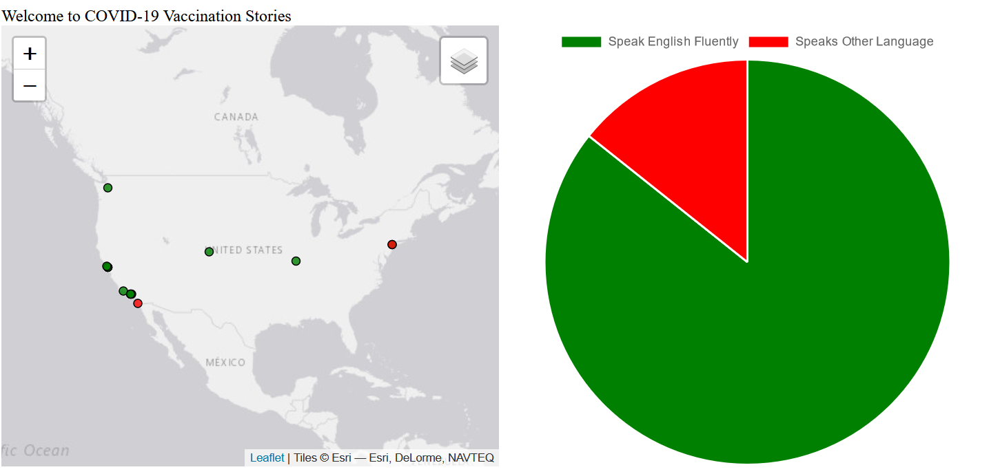
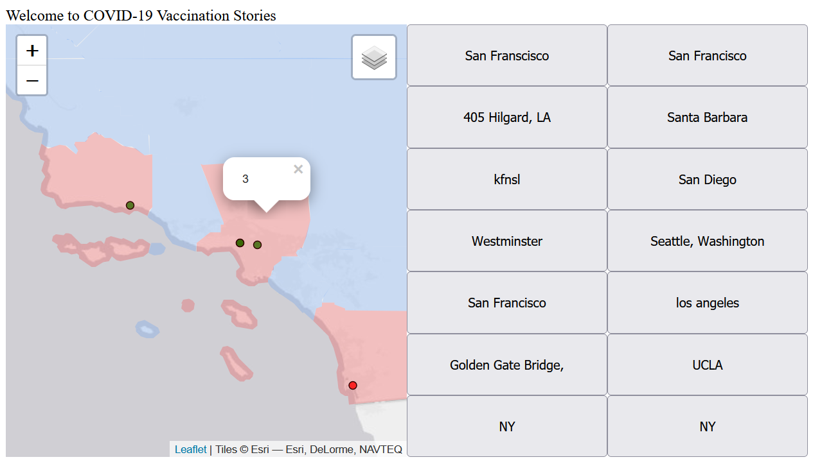
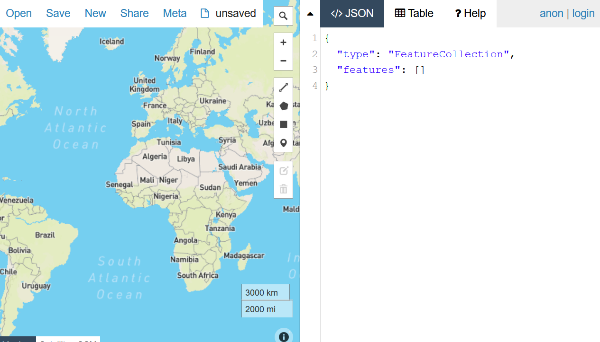

# Final In-class exercise Prep

For the in-class exercise, we will use the `git practicing repo` located here:

- https://github.com/albertkun/23S-ASIAAM-191A-Git-Practicing/

The `git` link to clone is here:

```
https://github.com/albertkun/23S-ASIAAM-191A-Git-Practicing.git
```

This is similar to what you would do for cloning your group projects if you have not done so already.

## Accept the invite to collaborate on the repo

You should have recieved an email to collaborate on the repository already, if not click the link below while logged into your GitHub account:

[https://github.com/albertkun/23S-ASIAAM-191A-Git-Practicing/invitations](https://github.com/albertkun/23S-ASIAAM-191A-Git-Practicing/invitations)

Then click the accept invite button:

{: style="max-width:300px"}

## Updating the repo

Remember to always run `git pull` in the terminal to **update your `git repository`** with what is on GitHub.

```bash
git pull
```


If you don't want to use the terminal, you can also click the following button on VS Code to `push` **AND** pull updates:

{: style="max-width:500px"}

### Update branches

If you have other branches on the repo, you can update branches by typing the following command in the terminal:

```bash
git fetch --all
```



Now that we have a better sense of how to use CSS grid, we can think about how to fit other libraries and tools.

Evaluating the right libraries and tools for the task is an important part of being a web developer that is both ethically minded and able to contribute back to meaningful projects. 

## Turf.js


https://turfjs.org/

Turfjs is useful for running spatial analysis in our mapplications.

Here is my example repo using Turf.js to count the number of points inside a particular boundary:

https://github.com/albertkun/leaflet-tufjs-spatial-join


## Chart.js


https://www.chartjs.org/

[Chartjs](https://www.chartjs.org/) is useful (but complex) library for creating charts in our mapplications.

Below is an example repository demonstrating how to use Chartjs with your Leaflet data:
https://github.com/albertkun/leaflet-chartjs


## GeoJSON.io



http://geojson.io/

Remember this tool? GeoJSON.io is useful for creating, converting, or quickly editing spatial data online.

## MapShaper


https://mapshaper.org/

This online tool helps to reduce file sizes of GeoJSONs and do other geoprocessing of GIS data:

> Main Tip: Choose the right tool for the job!

## W3 Schools for Building Content from scratch


https://www.w3schools.com/howto/default.asp

Similar to [Mozilla Developer Network](https://developer.mozilla.org/) for documentation, W3 schools provides a lot of nice [how-to](https://www.w3schools.com/howto/default.asp) tutorials on how to implement common website features, interfaces, and functions.

## Extending Leaflet with Plugins

Owing to the opensource nature of Leaflet, people have written many reusable tools to help with common tasks. As a matter of fact, if you have written a function for Leaflet that you think is reusable, you can go ahead and submit to their list of plugins too! Ah, the awesomeness of open source!

## Remember! Balance Open Source with an open and ethical mind

Of course, open source has its drawbacks too, learning to customize someone elses poorly written code with poor documentation can be a huge timesink.

Balancing the trade-off between trying to reuse someone's code and creating your own is an important step in becoming a seasoned developer!

Working within and with other projects bring us to our final lab topic of utilizing other people's Leaflet widgets and plugins.
