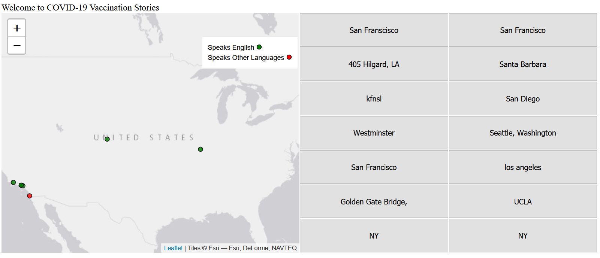

# Final Finishing Touches

The goal of this make-up lab is to get more familiar with coding for your final group projects.

!!! tldr "Goals"
    - Touch up our map with a legend
    - Revisiting legendary CSS Grid
    - Add another new Leaflet plugin

{: style="max-width:300px"}

## Lab outline

1. [Legendary Additions!](./1.md)
2. [Revisiting CSS Grid](./2.md)


## Starting template code for final lab (lab #9)

```html title="index.html" linenums="1"
<!DOCTYPE html>
<html>
    <head>
        <title>Hello World</title>
        <!-- hint: remember to change your page title! -->
        <meta charset="utf-8" />
        <link rel="shortcut icon" href="#">
        <link rel="stylesheet" href="styles/style.css">

        <!-- Leaflet's css-->
        <link rel="stylesheet" href="https://unpkg.com/leaflet@1.7.1/dist/leaflet.css" />

        <!-- Leaflet's JavaScript-->
        <script src="https://unpkg.com/leaflet@1.7.1/dist/leaflet.js"></script>

        <!-- Papa Parse -->
        <script src="https://cdnjs.cloudflare.com/ajax/libs/PapaParse/5.3.0/papaparse.min.js"></script>
    </head>

    <body>
        <header>
            Covid Vaccination Stories
        </header>

        <div class="main">
            <div id="contents">
                <div id="placeForButtons"></div>
                <!-- Be sure to use your own survey here!!!!!!! -->
                <div id="theSurvey">
                    <div id="surveyButton">
                        <a href="https://docs.google.com/forms/d/e/1FAIpQLSfcElv5dlXInR7XHQz27_OcYJlWcIUr-GBbc-ocefWlGd1uXg/viewform">📝Take the survey</a>
                    </div>
                </div>

            </div>
            <div id="the_map"></div>
        </div>
        <div id="footer">
            Copyright(2023)
        </div>
        <script src="js/init.js"></script>
    </body>
</html>
```

```css title="styles/style.css" linenums="1"
body{
    display: grid;
    grid-template-rows: 50px auto auto;
    grid-template-areas: "header" "main_content" "footer";
    background-color: aqua;
    gap: 10px;
}

header{
    grid-area: header;
    justify-self: center;
    align-self: center;
}

#footer{
    grid-area: footer;
}

.main{
    grid-area: main_content;
    grid-template-columns: 1fr 1fr;
    grid-template-areas: "main_map content";
    display: grid;
}
    
#contents{
    grid-area: content;
    display: grid;
    grid-template-rows: 3fr 1fr; 
    grid-template-areas: "buttonHome" "survey"
}

#the_map{
    height:80vh;
    grid-area: main_map;
}

#theSurvey{
    grid-area: survey;
    justify-self: center; /* added this to center the button in the div */
}

/* css for the button */
#surveyButton{
    padding: 15px 32px;
    margin: 10px;
    background-color: #4CAF50;
    cursor: pointer;
}

/* css for button to get rid of the underline */
#surveyButton a{
    text-decoration: none; 
}

#placeForButtons{
    grid-area: buttonHome;
    display:grid;
    grid-template-columns: repeat(2, 1fr);
}
```

```js title="js/init.js" linenums="1"
// declare variables
let mapOptions = {'center': [34.0709,-118.444],'zoom':5}

let vaccinated = L.featureGroup();
let nonVaccinated = L.featureGroup();

let layers = {
	"Vaccinated Respondent": vaccinated,
	"Unvaccinated Respondent": nonVaccinated
}

let circleOptions = {
    radius: 4,
    fillColor: "#ff7800",
    color: "#000",
    weight: 1,
    opacity: 1,
    fillOpacity: 0.8
}

const dataUrl = "https://docs.google.com/spreadsheets/d/e/2PACX-1vSNq8_prhrSwK3CnY2pPptqMyGvc23Ckc5MCuGMMKljW-dDy6yq6j7XAT4m6GG69CISbD6kfBF0-ypS/pub?output=csv"

// define the leaflet map
const map = L.map('the_map').setView(mapOptions.center, mapOptions.zoom);

// add layer control box
L.control.layers(null,layers).addTo(map)

let Esri_WorldGrayCanvas = L.tileLayer('https://server.arcgisonline.com/ArcGIS/rest/services/Canvas/World_Light_Gray_Base/MapServer/tile/{z}/{y}/{x}', {
	attribution: 'Tiles &copy; Esri &mdash; Esri, DeLorme, NAVTEQ',
	maxZoom: 16
});

Esri_WorldGrayCanvas.addTo(map);

function addMarker(data){
    if(data['Have you been vaccinated?'] == "Yes"){
        circleOptions.fillColor = "red"
        vaccinated.addLayer(L.circleMarker([data.lat,data.lng],circleOptions).bindPopup(`<h2>Vaccinated</h2>`))
        createButtons(data.lat,data.lng,data['What zip code do you live in?'])
        }
    else{
        circleOptions.fillColor = "blue"
        nonVaccinated.addLayer(L.circleMarker([data.lat,data.lng],circleOptions).bindPopup(`<h2>Non-Vaccinated</h2>`))
        createButtons(data.lat,data.lng,data['What zip code do you live in?'])
    }
    return data
}

function createButtons(lat,lng,title){
    const newButton = document.createElement("button"); // adds a new button
    newButton.id = "button"+title; // gives the button a unique id
    newButton.innerHTML = title; // gives the button a title
    newButton.setAttribute("lat",lat); // sets the latitude 
    newButton.setAttribute("lng",lng); // sets the longitude 
    newButton.addEventListener('click', function(){
        map.flyTo([lat,lng]); //this is the flyTo from Leaflet
    })
    const spaceForButtons = document.getElementById('placeForButtons')
    spaceForButtons.appendChild(newButton);//this adds the button to our page.
}

function loadData(url){
    Papa.parse(url, {
        header: true,
        download: true,
        complete: results => processData(results)
    })
}

function processData(results){
    console.log(results)
    results.data.forEach(data => {
        console.log(data)
        addMarker(data)
    })
    vaccinated.addTo(map) // add our layers after markers have been made
    nonVaccinated.addTo(map) // add our layers after markers have been made  
    let allLayers = L.featureGroup([vaccinated,nonVaccinated]);
    map.fitBounds(allLayers.getBounds());
}

loadData(dataUrl)
```