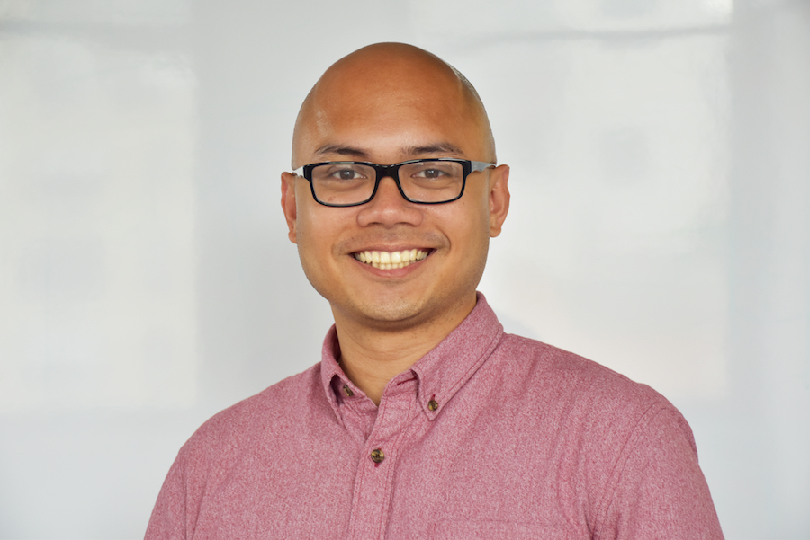

# Week 9 - Connecting activism, technology, and social change

Date|Type|Description|Slides|Recording|
|---|----|-----------|------|---------|
|5/30|Building and Sustaining Connections with Civil Society|Lecture|||
|6/1|Final Finishing Touches|Lab|||

## Lecture

- Building and Sustaining Connections with Civil Society

### Visiting Voice: Rapi Castillo

{: style="max-width:500px"}

[Rapi Castillo](https://www.rapicastillo.com/) is a tech worker, community organizer, and (amateur) baker. He is laser-focused on creating technology that empower people to learn more about the issues and do something impactful. He has worked on projects that have been used by grassroots campaigns like [Alexandria Ocasio Cortez](https://www.ocasio2018.com/), [Bernie Sanders](https://berniesanders.com/), and [others](https://www.rapicastillo.com/projects/). He is also the founder of [Progressive Coders Network](https://www.progcode.org/).

[Contact](mailto:hi@rapicastillo.com)

## Lab

- Final Finishing Touches